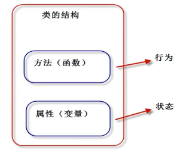
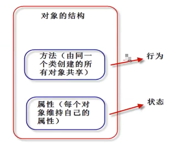
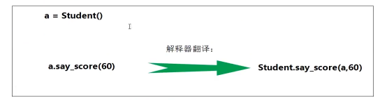
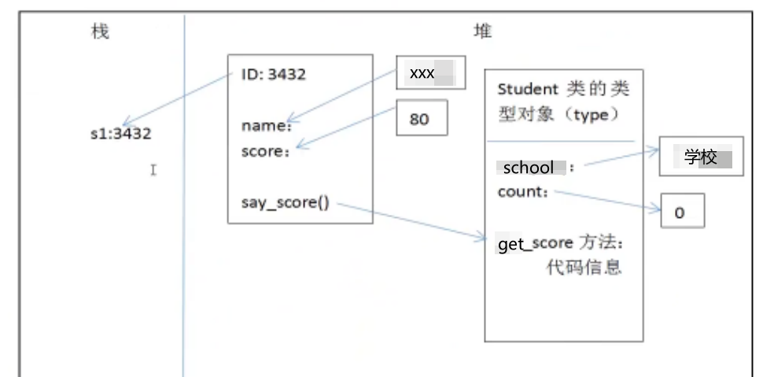
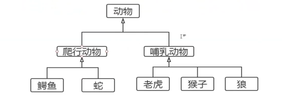
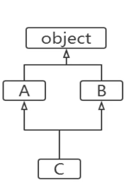
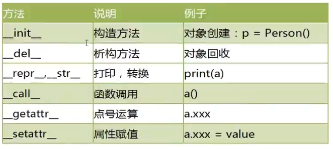
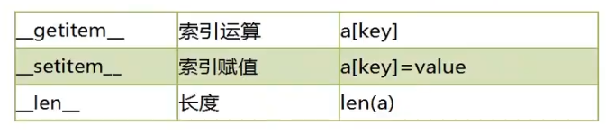
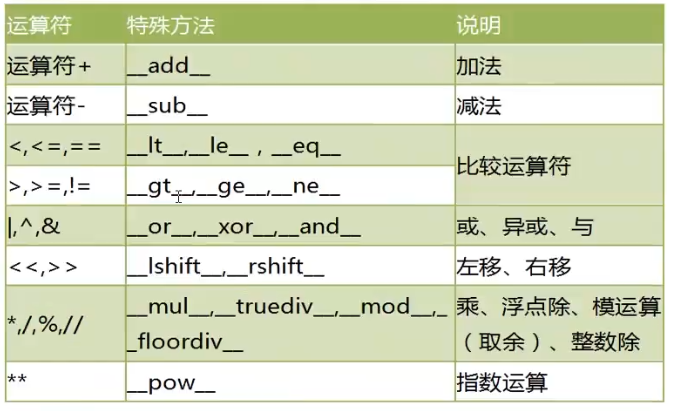
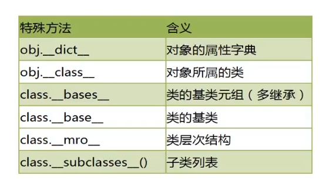

## 面向对象编程

面向对象（Object oriented Programming，OOP）编程的思想主要是针对大型软件设计而来的。面向对象编程使程序的扩展性更强、可读性更好。

面向对象编程将数据和操作数据相关的方法封装到对象中，组织代码和数据的方式更加接近人的思维，大大提高了效率。

Python 采用了面共享对象的思想，完全支持面向对象的基本功能，例如：继承、堕胎、封装等

Python 支持了面向过程、面向对象、函数式编程等

### 面向对象和面向过程的区别

**面向过程（Procedure Oriented）思维：**

面向过程编程更加注重 “程序的逻辑流程”，是一种`执行者`思维，适合编写小规模的程序。

面向过程思想，思考问题时，首先思考 “怎么按步骤实现？”，并一步一步完成。
Ex：如何开车？
 发动车 -- 挂挡 -- 踩油门
面向过程适合简单、不需要协作的事务。

**面向对象（Object Oriented）思维：**

面向对现象更加关注的是 “软件中对象之间的关系” ，以一种 “设计者” 思维，适合编写大规模程序。

面向对象（Object）思想更契合人的思维模式。

总结：

- 都是接问题的思维方式，代码组织的方式
- 解决简单问题可以使用面向过程
- 解决复杂问题：宏观上使用面向对象把握，微观上处理任然是面向过程

### 类的定义

通过类帝国一数据类型的属性（数据）和方法（行为），也就是说，“类将行为和状态打包在一起”。

对象是类的具体实体，一般称为 “类的实例”。 
类看作 “饼干摸具” ，对象就是根据这个摸具制造出来的物品

从一个类创建对象时，每个对象会共享这个类的行为（类中定义的方法），但会有自己的属性值（不共享状态）。具体是：“方法代码是共享的，属性数据不共享”。

Python 中，一切皆对象。类也成为类对象，类的实例也称为“实例对象”

语法格式：

~~~
class 类名：
  类体
~~~

注意事项：

1. 类名必须符合“标识符规则”；一般首字母大写，多个单词使用“驼峰原则”
2. 类体中我们可以定义属性和方法
3. 属性用来描述数据，方法（既函数）用来描述这些数据相关的操作。

【操作】测试

~~~python
class Student:
    # 属性定义到构造方法中（固定写法）: __init__
    def __init__(self,name,score):
        self.name = name
        self.score = score

    def say_score(self):
        print(id(self))  # 2008779276616
        print(self.name,"分数是：",self.score)
s1 = Student("张三",93)
print(id(s1))  # 2008779276616
s1.say_score()
~~~

**类是抽象的模板**

#### 构造函数 `__init__`

类是抽象的，也称之为 “对象的模板” 。我们需要通过类这个模板，创建类的实例对象，然后参能使用类定义的功能。

Python 对象的三个部分：

- Id（identity）识别码
- type（对象类型）
- value（对象的值）

进一步的说法：

1. Id（identity）识别码
2. type（对象类型）
3. value（对象的值）
   1. 属性（attribute）
   2. 方法（method）

创建对象，我们需要定义构造函数 `__init__`() 方法。构造方法用于执行“实例对象的初始化工作”，既对象创建后，初始化当前对象的相关属性，无返回值。

`__init__()` 要点：

1. 名称固定，必须为`__init__()`
2. 第一个参数固定，必须为：self，self指的就是当前创建好的实例对象
3. 构造函数通常用来初始化对象的实例属性
4. 通过 “类名（参数列表）” 用来调用构造函数。调用后，将窗机安好的对象返回给相应的变量
5. `__init__()` 方法：初始化创建好的对象，初始化指的是：给实例属性赋值
6. `__new__()` 方法：用于创建对象，但是一般无序重定义该方法。

注意：

- Python 中的 self 相当于 C++ 中的 self 指针，Java 和 C# 中的this关键字(指当前对象的作用域)。Python 中 self 必须为构造参数的第一个参数，名字可以任意修改，但是一般遵守管理，都叫做 self。

#### 实例属性

实例属性是从属于实例对象的属性，也成为 “实例变量” 。要点：

1. 实例属性一般在 `__init__(self)` 方法中通过一下代码定义
    - slef.实例属性名 = 初始值
2. 在本类的其他实例方法中，也可以通过 self 进行访问：
    - self.实例属性名
3. 创建实例对象后，通过实例对象访问：
    - obj01 = 类名（xx,xxx,xxx） # 实例化对象，调用`__init__()`初始化属性
    - obj01.实例属性名 = 值 # 可以给已有属性赋值，也可以新加

#### 实例方法

实例方法是从属于实例对象的方法。定义格式如下“

~~~
def 方法名（self [,形参列表]）：
    函数体
~~~

方法调用格式如下：

~~~
对象.方法名（[实参列表]）
~~~

注意点：

- 定义实例方法时，第一个参数必须为 self。self 指当前的实例对象
- 调用实例方法是，不需要也不能给 self 传值，self 由解释器自动传参

**函数和方法的区别：**

1. 都是用来完成一个功能的语句块，本质一样。
2. 方法调用时，通过对象来调用。方法从属于特定实例对象，普通函数没有这个特点。
3. 直观上，方法定义时需要传递self，函数不需要

**实例对象的方法调用本质：**

**其他操作：**

1. dir(obj) 可以获取对象的所有属性、方法
2. obj.\_\_dict\_\_ 对象的属性自建
3. pass 空语句
4. isinstance（对象，类型）判断 “对象” 是不是之定类型

#### 类对象

定义类的格式中“class 类名：”实际上当解释器执行 class 语句时，就会创建一个类对象。

【操作】测试

~~~python
class Person:
    pass

print(type(Person))  # <class 'type'> 类型
print(id(Person))  # 1599475085048

stu01 = Person()
# s1 = stu01
print(stu01)  # <__main__.Person object at 0x000002B454EC9E08>
~~~

pass 相当于占位符

#### 类属性

类属性是从属于“类对象”的属性，也成为“类变量”。
由于类属性从属于类对象，可以被所有实例对象使用。

定义方法：

~~~
class 类名：
    类名变量 = 初始值
~~~

在类中或者类外，通过：类名.类名变量 使用。

【操作】测试

~~~python
class Person:

    # 类属性
    school = "中加枫华国际学校"
    tuition = 100000
    count = 0

    # 实例属性
    def __init__(self,name,age,gender):
        self.name = name
        self.age = age
        self.gender = gender
        Person.count = Person.count+1

    # 实例方法
    def get_score(self):
        print("姓名：{0}；年龄：{1}；性别：{2}".format(self.name,self.age,self.gender))

stu1 = Person("sue",22,"male")
stu2 = Person("Jason",22,"male")
stu3 = Person("Allen",22,"female")
stu1.get_score()
stu2.get_score()
stu3.get_score()
print("学校：{0}；学费：{1}".format(Person.school,Person.tuition))
print("创建了{0}次实例".format(Person.count))
~~~

#### 类方法

类方法是从属于“类对象”的方法。类方法通过装饰器`@classmethod`来定义的，格式：

~~~
@classmethod
def 类方法名（cls[,形参列表]）：
    函数体
~~~

注意点：

- `@classmethod` 必须位于方法上面
- 第一个 cls 必须有： cls 指的是 “类对象” 本身
- 调用类方法格式：“类名.类方法名（参数列表）”。参数列表中不与要也不能 cls 传值。
- 类方法中访问实例属性和实例方法会导致错误
- 子类继承父类方法时，传入 cls 是子类对象，而非父类对象

【操作】测试：

~~~python
class Person:

    # 类属性
    school = "中加枫华国际学校"
    tuition = 100000
    count = 0

    # 实例属性
    def __init__(self,name,age,gender):
        self.name = name
        self.age = age
        self.gender = gender
        Person.count = Person.count+1

    @classmethod
    def printSchool(cls):
        print(cls)
        print(cls.school)

    # 实例方法
    def get_score(self):
        print("姓名：{0}；年龄：{1}；性别：{2}".format(self.name,self.age,self.gender))

stu1 = Person("sue", 22, "male")
stu1.get_score()
Person.printSchool()
~~~

**类方法操作类属性，实例方法操作实例属性**

#### 静态方法

Python 中允许定义与 “类对象” 无关的方法，称为“静态方法”

静态方法和模块中定义普通函数没有区别，只不过“静态方法”放到了“类的名字空间中”，需要通过“类调用”

静态方法通过装饰器`@staticmethod`来定义，格式如下：

~~~
@staticmethod
def 静态方法名([形参列表])：
    函数体
~~~

注意点：

1. `@staticmethod` 必须写在方法上面
2. 调用格式：“类名.静态方法名(参数列表)”
3. 静态方法中访问实例属性和实例方法会导致错误

【操作】测试

~~~python
class Person:

    # 类属性
    school = "中加枫华国际学校"
    tuition = 100000
    count = 0

    # 实例属性
    def __init__(self,name,age):
        self.name = name
        self.age = age
        Person.count = Person.count+1

    # 静态实例
    @staticmethod
    def addNum(a,b):
      print("{0}+{1}={2}".format(a,b,a+b))
      return a+b

    # 实例方法
    def get_score(self):
        print("姓名：{0}；年龄：{1}".format(self.name,self.age))

stu1 = Person("sue", 22)
stu1.get_score()
Person.addNum(1,2)
~~~

#### `__del__` 方法（分析函数）和垃圾回收机制

`__del__` 方法称为：“析构方法”，用于实现对象被销毁时所需的操作。Ex：释放对象占用的资源，打开的文件资源、网络连接等。

Python 实现自动的垃圾回收，当对象没有被引用时（引用计数为0），由垃圾回收器调用 `__del__` 方法。

通过使用 del 语句删除对象，从而保证调用 `__del__` 方法
系统会自动提供 `__del__` 方法，一般不需要自定义析构方法

【操作】测试

~~~python
class Person:

    def __del__(self):
        print("销毁对象：{0}".format(self))

p1 = Person()  # 5. 销毁对象：<__main__.Person object at 0x000001DFCD279FC8>
print(id(p1))  # 1. 2060731260872
p2 = Person()  # 3. 销毁对象：<__main__.Person object at 0x000001DFCD284088>
print(id(p2))  # 2. 2060731302024
del p2
print("over")  # 4. over
# print(id(p2))  # name 'p2' is not defined
~~~

#### `__call__` 方法和可调用对象

定义了 `__call__` 方法的对象，称为“可调用的对象”，即该对象可以像函数一样被调用。

该方法的功能类似于在类中重载 () 运算符，使得类实例对象可以像调用普通函数那样，以“对象名()”的形式使用。

【操作】测试

~~~python
class Get_Salary:

    def __call__(self, salary):
        yearSalary = salary*12
        daySalary = salary//22.5
        hourSalary = daySalary//12

        return dict(年薪=yearSalary,月薪=salary,日薪=daySalary,小时工=hourSalary)
p1 = Get_Salary()
print(p1(8000)) # 无需在添加类名来用使用
~~~

#### 方法的重载

在其他语言中，可以定义多个重名的方法，只要保证方法签名唯一即可。方法标签名包括三个部分：方法名、参数数量、参数类型

Python 中，方法的参数没有声明类型（调用时圈定参数的类型），参数的数量可以由可变参数控制。因此，Python 中没有方法的重载。定义一个方法即可有多种调用方式，相当于实现了其他语言中的方法重载。

如果在类中定义了多个重名方法，只有最后一个能生效。

【操作】测试

~~~python
class Person:
    def say_Hi(self):
        print("Hello")

    def say_Hi(self,name):
        print("Hello,{0}".format(name))

p1 = Person()
p1.say_Hi("Js")  # say_Hi() missing 1 required positional argument: 'name'
~~~

#### 方法的动态性

Python 是动态语言，我们可以动态的为类添加新的方法，或者动态的修改类已有的方法。

【操作】测试

~~~python
class Person:
    def hello_world(self):
        print("Hello World")

def say_Hi(name):
    print("Hello,{0}".format(name))

p1 = Person()
# p1.say_Hi("Js")  # 'Person' object has no attribute 'say_Hi'

Person.say = say_Hi
# p1.say("!23")  # say_Hi() takes 1 positional argument but 2 were given
Person.say("he")
~~~

#### 私有属性和私有方法

Python 对于类的成员没有严格的访问控制限制，这与其他面向对象有区别。
注意点：

1. 通常约定，两下划线开头的属性是私有属性（private）。其他的为公共的（public）
2. 类内部可以访问私有属性（方法）
3. 类外部不能直接访问私有属性（方法）
4. 类外部可以通过 “\_类名\_\_私有属性（方法）名” 访问私有属性方法

【注意：】方法本质上也是属性，只不过是通过()执行而已。

【操作】测试私有属性和方法

~~~python
class Employee:

    def __init__(self,name,age):
        self.name = name
        self.__age = age

    def  __work(self):
        print("Good Good Work, Day Day Up")

p1 = Employee("Allen",12)
print(p1.name)  # Allen
# print(p1.age)  # 'Employee' object has no attribute 'age'
print(p1._Employee__age)  # 12
# p1.__work()  # 'Employee' object has no attribute '__work'
p1._Employee__work()  # Good Good Work, Day Day Up
~~~

#### @property 装饰器

@property 可以将一个方法的调用方式变成“属性调用”。

【操作】基本使用

~~~python
class Employee:

    @property
    def money(self):
        print("working...")
        return 20000

p1 = Employee()  # 1. working...
# p1.money()  # 'int' object is not callable
getMoney = p1.money
print(getMoney)  # 2. 20000
print(p1.money)  # 3. working...  4. 20000
~~~

**_get 和 _set**

【操作】设置私人属性并修改薪资

~~~python
class Employee:

    def __init__(self,name,salary):
        self.__name = name
        self.__salary = salary

    def get_salary(self):
        # print("薪水：{0}".format(self.__salary))
        return self.__salary

    def set_salary(self,salary):
        if 10000<salary<50000:
            self.__salary = salary
            print("薪资录入成功")
        else:
            print("薪资录入失败")

p1 = Employee("Eason",30000)
print("{0}薪资：{1}".format(p1._Employee__name, p1.get_salary()))  # Eason薪资：30000
# p1.set_salary(3000) # 薪资录入失败
p1.set_salary(20000)  # 薪资录入成功
print("{0}薪资：{1}".format(p1._Employee__name, p1.get_salary()))  # Eason薪资：20000
~~~

**但是使用@property也可以修改类外部修改私人属性**

【操作】测试

~~~python
class Employee:

    def __init__(self,name,salary):
        self.__name = name
        self.__salary = salary

    @property
    def salary(self):
        # print("薪水：{0}".format(self.__salary))
        return self.__salary

    @salary.setter
    def salary(self,salary):
        if 10000<salary<50000:
            self.__salary = salary
            print("薪资录入成功")
        else:
            print("薪资录入失败")

p1 = Employee("Eason",30000)
print("{0}薪资：{1}".format(p1._Employee__name, p1._Employee__salary))  # Eason薪资：30000
p1.salary = -2000  # 薪资录入失败
p1.salary = 20000  # 薪资录入成功
print("{0}薪资：{1}".format(p1._Employee__name, p1._Employee__salary))  # Eason薪资：20000
~~~

### 面向对象的三大特征

面向对象编程的三大特性：继承、封装（隐藏）、多态

- 封装（隐藏）：
    隐藏对象的属性和实现细节，之对外提供必要的方法。
    通过使用 “私有属性，私有方法”实现封装。
- 继承
    继承可以让子类具有父类的特性，提高代码复用率
    设计上是一种增量进化，原有父类设计不变的情况下，可以新增新的功能，或者改进
- 多态
    指的是同一个方法调用由于对象不同会产生不同的行为。

#### 继承（重点）

继承是面向对象程序设计的重要特征，也是实现“代码复用”的手段

如果一个新类继承自一个设计好的类，就直接具备了已有类的特征，就大大降低工作难度。称其为“父类或者基类”，新的类称为“子类或派生类”

Python 支持多重继承，一个子类可以继承多个父类，语法格式：

~~~
class 子类类名（父类1[,父类2...]）:
    类体
~~~

如果在类定义中没有指定父类，则默认父类是 object 类。

object 是所有类的父类，里面定义了一些所有类共有的默认实现。

定义子类时，必须在其构造函数中调用父类的构造函数。格式：

~~~
父类名.__init__(self,参数列表)：
~~~

【操作】测试

~~~python
class Person:

    def __init__(self,name,age):
        self.name = name
        self.__age = age  # 私有属性

    def say_hi(self):
        print("Hello,Bro!!!")

class Children(Person):

    # 子类继承父类的属性
    def __init__(self,name,age,score):
        Person.__init__(self,name,age)
        self.score = score

print(
    Children.mro()
)  # [<class '__main__.Children'>, <class '__main__.Person'>, <class 'object'>]
c1 = Children("Jason",23,100)
c1.say_hi()  # Hello,Bro!!!  继承了父类的属性方法

# 访问私有属性
# 无法访问通过子类访问父类的私有属性
print(c1._Person__age)  # 23
print(dir(c1)) # ...各种实现
~~~

#### 方法的重写

1. 成员继承：子类继承了父类除构造方法外的所有成员。
2. 方法重写：子类可以重新定义父类的方法，这样就会覆盖父类的方法，也称为“重写”

【操作】重写测试

~~~python
class Person:

    def __init__(self,name,age):
        self.name = name
        self.__age = age

    def say_hi(self):
        print("Hello,Bro!!!")
class Children(Person):

    # 子类继承父类的属性
    def __init__(self,name,age,score):
        Person.__init__(self,name,age)
        self.score = score

    def say_hi(self):
        print("What's Up?")

s1 = Children("Sue",21,100)
s1.say_hi()  # What's Up?
~~~

#### object 根类

object 类是所有类的父类，因此所有的类都有 object 类的属性和方法。

**通过 dir() 查看对象所有属性**

~~~python
print(dir(Person))
~~~

结果：

~~~
['__class__', '__delattr__', '__dict__', '__dir__', '__doc__', '__eq__', '__format__', '__ge__', '__getattribute__', '__gt__', '__hash__', '__init__', '__init_subclass__', '__le__', '__lt__', '__module__', '__ne__', '__new__', '__reduce__', '__reduce_ex__', '__repr__', '__setattr__', '__sizeof__', '__str__', '__subclasshook__', '__weakref__', 'say_hi']
~~~

**通过 mro() 查看继承结构**

~~~python
print(Children.mro())
~~~

结果：

~~~
[<class '__main__.Children'>, <class '__main__.Person'>, <class 'object'>]
~~~

要点：

1. dir() 查看属性会显示所有的属性包括我们自己定义的方法
2. "say_hi" 虽然说是方法，实际上也是属性。

#### 多重继承

Python 支持多重继承，一个子类可以有多个“直接父类”。这样就具备了多个父类的特点。但是这样类的整体层次会变得复杂，尽量避免

【操作】测试多重父类

~~~python
class A:
    def aa(self):
        print("----AA----")

class B:
    def bb(self):
        print("----BB----")

class C(A, B):
    def cc(self):
        print("----CC----")

p1 = C()    
~~~

#### mro() 函数

Python 支持多继承，如果父类中有相同名字的方法，在子类没有指定父类名时，解释器将“从左向右”按顺序搜索

> MRO（Method Resolution Order）：方法解析顺序。通过 mro() 方法获取“类的层次结构”，也按照这个类的层次结构查找。

~~~python
class A:
    def aa(self):
        print("----AA----")

    def say(self):
        print("Hello AAA")

class B:
    def bb(self):
        print("----BB----")

    def say(self):
        print("Hello BBB")

# 从左到右执行，A在前所以会先执行A类中的say.
class C(A, B):
    def cc(self):
        print("----CC----")

p1 = C()
p1.cc()
p1.say()
~~~

【操作】mro() 函数输出的类的层次结构

~~~python
print(
    C.mro()
)  # [<class '__main__.C'>, <class '__main__.A'>, <class '__main__.B'>, <class 'object'>]
~~~

#### Super() 函数获取父类定义

在子类中，获取父类的方法时，可以通过 super() 
super() 代表父类的定义，不是父类对象

~~~python
class A:
    def aa(self):
        print(self)

class B(A):
    def bb(self):
        # 方法一：直接获取
        A.aa(self)  # <__main__.B object at 0x000001D4638F9F88>
        # 方法二：super() 获取
        super().aa()  # <__main__.B object at 0x000001D4638F9F88>
        print(self)  # <__main__.B object at 0x000001D4638F9F88>

b = B()
b.bb()
~~~

#### 多态（重点）

多态（Polymorphism）是指同一个方法调用由于对象不同能产生不同的行为。

要点：

1. 多态时方法的多态，属性没有多态
2. 多态的存在有 2 个必要条件：**继承**、**方法重写**

【操作】测试方法多态

~~~python
class Person:
    def say(self):
        print("你说话啊，你")

class Chinese(Person):
    def say(self):
        print("中文....")

class Japanese(Person):
    def say(self):
        print("日语....")

class Amercian(Person):
    def say(self):
        print("英语....")

def people(x):
    if isinstance(x, Person):
        x.say()
    else:
        print("请说人话")

people(Chinese())
people(Japanese())
people(Amercian())
~~~

**isinstance() 函数来判断一个对象是否是一个已知的类型**

sinstance() 与 type() 区别：

- type() 不会认为子类是一种父类类型，不考虑继承关系。
- isinstance() 会认为子类是一种父类类型，考虑继承关系。

如果要判断两个类型是否相同推荐使用 isinstance()。

#### 特殊方法

常见的特殊方法：

每个运算符也是对应的方法：

#### 特殊属性

Python 对象中包含了很多双下划线开始和结束的属性，这些都是特殊属性，有特殊用法。

### 设计模式

设计模式是面向对象语言特有的内容，是我们在面临某一类问题时固定的做法，设计模式有很多种。

常用的两个模式：

- 工厂模式
- 单列模式

工厂模式实现了创建者和调用者的分离，使用专门的工厂类将先择实现类、创建对象进行统一管理
