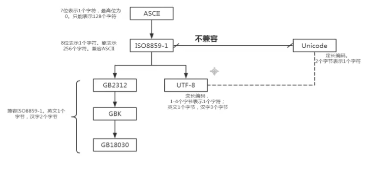

## Python进阶 -- 文件处理（IO技术）

一个完整的程序一般都包括数据的存储和读取；在实际开发中我们常常需要从外部存储介质（硬盘、光盘、U盘等）读取数据，或者将程序产生的数据存储到文件中实现“持久化”保存。

**文本文件和二进制文件**

1. 文本文件
    文本文件存储的是普通“字符”文本，默认为 unicode 字符集，可以使用记事本打开。
2. 二进制文件
    二进制文件把数据内容用“字节”进行存储，无法用记事本打开。必须使用相应的软件解码；如：MP4、Mp3、JPG、doc文档等。

### 文件操作相关模块

|名称|说明|
|-------|---------|
|IO模块|文件流的输入和输出操作|
|OS模块|进本操作系统功能，包括文件操作|
|glob模块|查找特定符合规则的文件路径名|
|fnmatch模块|使用模块来匹配文件路径名|
|fileinput模块|处理多个输入文件|
|filecmp模块|用于文件的比较|
|cvs模块|用于 cvs 文件处理|
|pickle 和 cPickle|用于序列化和反序列化|
|xml 包|用于 XML 数据处理|
|bz2、gzip、zipfile、zlib、tarfile|用于处理压缩和解压缩文件（分别对应不同的算法）|

### 创建文件对象 open()

`open()` 函数用于创建文件对象，基本语法格式：

~~~
open(文件名[，打开方式])
~~~

如果只是文件名，代表在当前目录下的文件。文件名可以录入全路径如：D:\a\b.txt 。

打开方式：

|模式|描述|
|---------|----------|
|r|读模式|
|w|写模式，如果文件不存在则创建；存在则重写新内容|
|a|追加模式。文件不存在则创建反之在文件末尾处追加内容|
|b|二进制模式（可与其他模式组合使用）|
|+|读、写模式（同上）|

### 基本的文件写入和其他操作

三个步骤：

1. 创建文件对象
2. 写入数据
3. 关闭文件对象

【操作】写入数据

~~~python
# 绝对路径
# file = open(
#     "D:/00.study/Study-Python/02.Python 进阶/day02 - Python进阶/code/file.txt",
#     "a",
#     encoding="utf-8")
# a = "芜湖！！！"
# file.write(a)
# file.close()

# 相对路径（需更改vscode配置）
file = open("file.txt", "a", encoding="utf-8")
a = "芜湖！！！"
file.write(a)
file.close()
~~~

#### 常用编码介绍

在操作中文时，会遇到乱码问题。
编码关系：

**中文乱码问题**

window 操作系统默认的编码为 GBK，Linux操作系统默认的编码为 UTF-8。当我们用 `open()` 时，调用的是操作系统打开的文件夹，没默认的编码为 GBK。

#### write() / writeLines() 写入数据

write(a)：把字符串 a 写入到文件中
writelines(b)：把字符串列表写入文件中，不添加换行符(可以自己添加)。

【操作】测试

~~~python
f = open(r"file.txt", "w", encoding="utf-8")
s = ["sue\n", "Jason\n", "Eason\n", "Forrest\n"]
f.writelines(s)
f.close()
~~~

结果：file.txt

~~~txt
sue
Jason
Eason
Forrest
~~~

#### close() 关闭文件流

文件底层是由操作系统控制，所以打开文件对象必须先显示调用 close() 方法关闭文件对象。当调用 close() 方法时，首先会把缓冲区数据写入文件（也可以直接调用 flush() 方法），再关闭文件，释放文件对象。

为了确保打开的文件对象正常关闭，一般结合异常机制的 `finally` 或者 `with` 关键字实现无论何种情况都能关闭打开的文件对象。

【操作】使用异常并结合finally确保文件关闭

~~~python
try:
    file = open(r"file.txt", "a", encoding="utf-8")
    str = "Sue,大帅逼！！！\n"
    file.write(str)
except BaseException as e:
    print(e)
finally:
    file.close()
~~~

#### with 语句（上下文管理）⭐

with 关键字（上下文管理器）可以自动管理上下文资源，不论什么原因跳出 with 模块，都能确保文件正常关闭，并且可以在代码块执行完毕后自动还原进入代码块时的现场。

【操作】测试

~~~python
arr = ["primary\n", "middle\n", "high\n"]
with open(r"file.txt", "a", encoding="utf-8") as file:
    file.writelines(arr)
~~~

**with将开启和关闭操作都执行了一边，无需我们自己再关闭**

#### 文本文件的读取

文件的读取一般使用有三个方法：

1. read([size])
    在文件中读取 size 个字符，并作为结果返回。如果没有 size 参数，则读取整个文件。读取到文件末尾，返回空字符串。
2. readline()
    读取一行内容作为结果返回。读取到文件末尾，返回空字符串。
3. readlines()
    文本文件中，每一行作为一个字符串存入列表中，返回该列表。

【操作】read()方法

~~~python
with open(r"file.txt", "r", encoding="utf-8") as f:
    print(f.read(10)) # sue，Jason，
~~~

【操作】readline()方法

~~~python
with open(r"file.txt", "r", encoding="utf-8") as f:
    print(f.readline())  # sue，Jason，Eason，Forrest，primary，middle，high
~~~

【操作】readlines() 方法

~~~python
with open(r"file.txt", "r", encoding="utf-8") as f:
    print(f.readlines())
    # ['sue，Jason，\n', 'Eason，Forrest，\n', 'primary，middle，\n', 'high\n']
~~~

【操作】练习：

~~~python
with open(r"file.txt", "r", encoding="utf-8") as file:
    lines = file.readlines()
    print(lines)
    lines = [
        line.strip() + "---" + str(index + 1) + "\n"
        for index, line in enumerate(lines)
    ]
    print(lines)

with open(r"file.txt", "w", encoding="utf-8") as file:
    file.writelines(lines)
~~~

### 二进制文件的读取和写入

二进制文件的处理流程和文本文件的流程是一致的。首先还是要创建文件对象，不过需要指定为二进制模式，才能创建出二进制文件对象。

示例：

~~~python
file = open(r"xxx.txt","wb") # 可写、重写模式的二进制文件对象
file = open(r"xxx.txt","ab") # 可写、追加模式的二进制文件对象
file = open(r"xxx.txt","rb") # 可读的二进制文件对象
~~~

创建完成后仍可以使用 write()、read() 实现文件的读写操作

【操作】拷贝一份二进制文件

~~~python
with open(r"cat.gif", "rb") as f:  # 要拷贝的二进制文件
    with open(r"copy_one.gif", "wb") as w:  # 拷贝后的二进制文件
        for line in f.readlines():
            w.write(line)
print("拷贝结束")
~~~

#### 文件对象的常用属性和方法

文件对象封装了文件相关的操作。一下举例说明了常用的属性和方法

**属性:**

|属性|说明|
|---------|----------|
|name|返回文件的名字|
|mode|返回文件的打开模式|
|closed|若文件被关闭则返回True|

**文件对象的打开模式：**

|模式|说明|
|---------|----------|
|r|读说明，文件不存在则抛出异常|
|w|写模式，文件存在则清空原有的|
|x|写模式，创建新文件，如果文件存在则抛出异常|
|a|追加模式，不覆盖文件中原有的内容|
|b|二进制模式（可与其他模式组合）|
|t|文本模式（默认，可省略）|
|+|读写模式（可与其他模式组合）|

**文件对象的常用方法：**

| 文件名 | 说明 |
|----------|------------|
| read([size]) | 从文件中读取 size 个字节或字符的内容返回。若省略size则全部读取 |
| readline() | 从文本文件中读取一行内容 |
| readlines() | 把文本文件中读取每一行都作为独立的字符串对象，并将这些对象放入列表返回 |
| write(str) | 将字符串 str 内容写入文件 |
| writelines(s) | 将字符串**列表** s 写入文件，不添加换行符 |
| seek(offset[,whence]) | 把文件指针移动到新的位置，offset 表示对于 whence 的位置： offset: off 为正往结束方向移动，为负则往开始方向移动 whence 不同的代表不同含义： 0：从文件头开始计算（默认值） 1：从当前位置开始计算 2：从文件尾开始计算 |
| tell() | 返回文件指针的当前位置 |
| flush() | 将缓冲区的内容写入文件，但不关闭文件 |
| close() | 把缓冲区的内容写入文件，同时关闭文件，并释放文件对象 |
| truncate([size]) | 删除当前指针位置到文件末尾的内容。如果指定了 size，则不论指针在什么位置都只留下前 size 个字节，其余删除 |
| writeable() | 测试当前文件是否可写 |
| readable() | 测试当前文件是否可读 |

【操作】测试 seek 方法和 name、mode、closed 属性

~~~python
with open(r"file.txt", "r", encoding="utf-8") as f:
    f.seek(2)  # 索引 --- 指针
    print(f.read())
    # e，---1
    # Jason，---2
    # Eason，---3
    # Forrest，---4
    # primary，---5
    # middle，---6
    # high，---7
    print(f.name)  # file.txt
    print(f.mode)  # r
    print(f.closed)  # False
print(f.closed)  # True
~~~

【操作】测试 truncate、flush方法

~~~python
# -------------flush------------------
file = open(r"file.txt", "r", encoding="utf-8")
file.flush()  # write也并不是直接写入，也会将数据放入缓冲区中
file.close()

# ----------truncate--------------
f = open("file.txt", "a", encoding="utf-8")
f.truncate(20)
f.close()

f = open("file.txt", "r", encoding="utf-8")
print(f.read())
# sue，---1
# Jason，
~~~