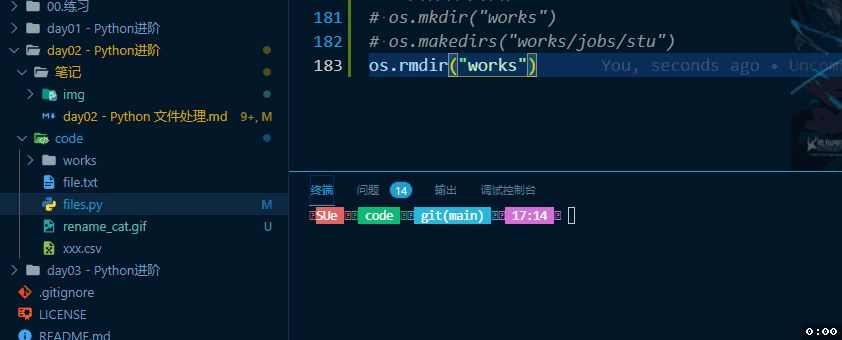
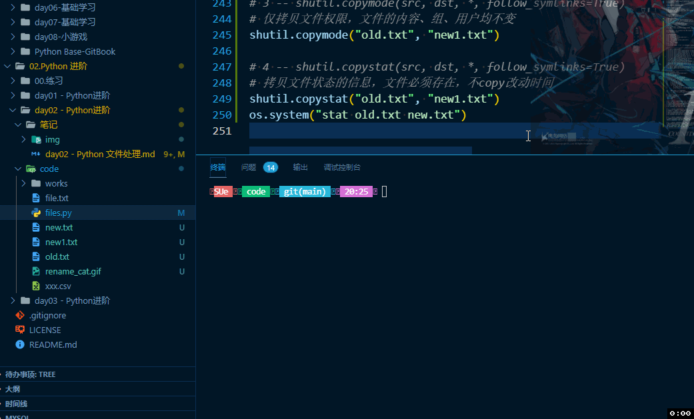

## Python进阶 -- 文件处理（IO技术）

一个完整的程序一般都包括数据的存储和读取；在实际开发中我们常常需要从外部存储介质（硬盘、光盘、U盘等）读取数据，或者将程序产生的数据存储到文件中实现“持久化”保存。

**文本文件和二进制文件**

1. 文本文件
    文本文件存储的是普通“字符”文本，默认为 unicode 字符集，可以使用记事本打开。
2. 二进制文件
    二进制文件把数据内容用“字节”进行存储，无法用记事本打开。必须使用相应的软件解码；如：MP4、Mp3、JPG、doc文档等。

### 文件操作相关模块

|名称|说明|
|-------|---------|
|IO模块|文件流的输入和输出操作|
|OS模块|进本操作系统功能，包括文件操作|
|glob模块|查找特定符合规则的文件路径名|
|fnmatch模块|使用模块来匹配文件路径名|
|fileinput模块|处理多个输入文件|
|filecmp模块|用于文件的比较|
|cvs模块|用于 cvs 文件处理|
|pickle 和 cPickle|用于序列化和反序列化|
|xml 包|用于 XML 数据处理|
|bz2、gzip、zipfile、zlib、tarfile|用于处理压缩和解压缩文件（分别对应不同的算法）|

### 创建文件对象 open()

`open()` 函数用于创建文件对象，基本语法格式：

~~~
open(文件名[，打开方式])
~~~

如果只是文件名，代表在当前目录下的文件。文件名可以录入全路径如：D:\a\b.txt 。

打开方式：

|模式|描述|
|---------|----------|
|r|读模式|
|w|写模式，如果文件不存在则创建；存在则重写新内容|
|a|追加模式。文件不存在则创建反之在文件末尾处追加内容|
|b|二进制模式（可与其他模式组合使用）|
|+|读、写模式（同上）|

### 基本的文件写入和其他操作

三个步骤：

1. 创建文件对象
2. 写入数据
3. 关闭文件对象

【操作】写入数据

~~~python
# 绝对路径
# file = open(
#     "D:/00.study/Study-Python/02.Python 进阶/day02 - Python进阶/code/file.txt",
#     "a",
#     encoding="utf-8")
# a = "芜湖！！！"
# file.write(a)
# file.close()

# 相对路径（需更改vscode配置）
file = open("file.txt", "a", encoding="utf-8")
a = "芜湖！！！"
file.write(a)
file.close()
~~~

#### 常用编码介绍

在操作中文时，会遇到乱码问题。
编码关系：

**中文乱码问题**

window 操作系统默认的编码为 GBK，Linux操作系统默认的编码为 UTF-8。当我们用 `open()` 时，调用的是操作系统打开的文件夹，没默认的编码为 GBK。

#### write() / writeLines() 写入数据

write(a)：把字符串 a 写入到文件中
writelines(b)：把字符串列表写入文件中，不添加换行符(可以自己添加)。

【操作】测试

~~~python
f = open(r"file.txt", "w", encoding="utf-8")
s = ["sue\n", "Jason\n", "Eason\n", "Forrest\n"]
f.writelines(s)
f.close()
~~~

结果：file.txt

~~~txt
sue
Jason
Eason
Forrest
~~~

#### close() 关闭文件流

文件底层是由操作系统控制，所以打开文件对象必须先显示调用 close() 方法关闭文件对象。当调用 close() 方法时，首先会把缓冲区数据写入文件（也可以直接调用 flush() 方法），再关闭文件，释放文件对象。

为了确保打开的文件对象正常关闭，一般结合异常机制的 `finally` 或者 `with` 关键字实现无论何种情况都能关闭打开的文件对象。

【操作】使用异常并结合finally确保文件关闭

~~~python
try:
    file = open(r"file.txt", "a", encoding="utf-8")
    str = "Sue,大帅逼！！！\n"
    file.write(str)
except BaseException as e:
    print(e)
finally:
    file.close()
~~~

#### with 语句（上下文管理）⭐

with 关键字（上下文管理器）可以自动管理上下文资源，不论什么原因跳出 with 模块，都能确保文件正常关闭，并且可以在代码块执行完毕后自动还原进入代码块时的现场。

【操作】测试

~~~python
arr = ["primary\n", "middle\n", "high\n"]
with open(r"file.txt", "a", encoding="utf-8") as file:
    file.writelines(arr)
~~~

**with将开启和关闭操作都执行了一边，无需我们自己再关闭**

#### 文本文件的读取

文件的读取一般使用有三个方法：

1. read([size])
    在文件中读取 size 个字符，并作为结果返回。如果没有 size 参数，则读取整个文件。读取到文件末尾，返回空字符串。
2. readline()
    读取一行内容作为结果返回。读取到文件末尾，返回空字符串。
3. readlines()
    文本文件中，每一行作为一个字符串存入列表中，返回该列表。

【操作】read()方法

~~~python
with open(r"file.txt", "r", encoding="utf-8") as f:
    print(f.read(10)) # sue，Jason，
~~~

【操作】readline()方法

~~~python
with open(r"file.txt", "r", encoding="utf-8") as f:
    print(f.readline())  # sue，Jason，Eason，Forrest，primary，middle，high
~~~

【操作】readlines() 方法

~~~python
with open(r"file.txt", "r", encoding="utf-8") as f:
    print(f.readlines())
    # ['sue，Jason，\n', 'Eason，Forrest，\n', 'primary，middle，\n', 'high\n']
~~~

【操作】练习：

~~~python
with open(r"file.txt", "r", encoding="utf-8") as file:
    lines = file.readlines()
    print(lines)
    lines = [
        line.strip() + "---" + str(index + 1) + "\n"
        for index, line in enumerate(lines)
    ]
    print(lines)

with open(r"file.txt", "w", encoding="utf-8") as file:
    file.writelines(lines)
~~~

### 二进制文件的读取和写入

二进制文件的处理流程和文本文件的流程是一致的。首先还是要创建文件对象，不过需要指定为二进制模式，才能创建出二进制文件对象。

示例：

~~~python
file = open(r"xxx.txt","wb") # 可写、重写模式的二进制文件对象
file = open(r"xxx.txt","ab") # 可写、追加模式的二进制文件对象
file = open(r"xxx.txt","rb") # 可读的二进制文件对象
~~~

创建完成后仍可以使用 write()、read() 实现文件的读写操作

【操作】拷贝一份二进制文件

~~~python
with open(r"cat.gif", "rb") as f:  # 要拷贝的二进制文件
    with open(r"copy_one.gif", "wb") as w:  # 拷贝后的二进制文件
        for line in f.readlines():
            w.write(line)
print("拷贝结束")
~~~

#### 文件对象的常用属性和方法

文件对象封装了文件相关的操作。一下举例说明了常用的属性和方法

**属性:**

|属性|说明|
|---------|----------|
|name|返回文件的名字|
|mode|返回文件的打开模式|
|closed|若文件被关闭则返回True|

**文件对象的打开模式：**

|模式|说明|
|---------|----------|
|r|读说明，文件不存在则抛出异常|
|w|写模式，文件存在则清空原有的|
|x|写模式，创建新文件，如果文件存在则抛出异常|
|a|追加模式，不覆盖文件中原有的内容|
|b|二进制模式（可与其他模式组合）|
|t|文本模式（默认，可省略）|
|+|读写模式（可与其他模式组合）|

**文件对象的常用方法：**

| 文件名 | 说明 |
|----------|------------|
| read([size]) | 从文件中读取 size 个字节或字符的内容返回。若省略size则全部读取 |
| readline() | 从文本文件中读取一行内容 |
| readlines() | 把文本文件中读取每一行都作为独立的字符串对象，并将这些对象放入列表返回 |
| write(str) | 将字符串 str 内容写入文件 |
| writelines(s) | 将字符串**列表** s 写入文件，不添加换行符 |
| seek(offset[,whence]) | 把文件指针移动到新的位置，offset 表示对于 whence 的位置： offset: off 为正往结束方向移动，为负则往开始方向移动 whence 不同的代表不同含义： 0：从文件头开始计算（默认值） 1：从当前位置开始计算 2：从文件尾开始计算 |
| tell() | 返回文件指针的当前位置 |
| flush() | 将缓冲区的内容写入文件，但不关闭文件 |
| close() | 把缓冲区的内容写入文件，同时关闭文件，并释放文件对象 |
| truncate([size]) | 删除当前指针位置到文件末尾的内容。如果指定了 size，则不论指针在什么位置都只留下前 size 个字节，其余删除 |
| writeable() | 测试当前文件是否可写 |
| readable() | 测试当前文件是否可读 |

【操作】测试 seek 方法和 name、mode、closed 属性

~~~python
with open(r"file.txt", "r", encoding="utf-8") as f:
    f.seek(2)  # 索引 --- 指针
    print(f.read())
    # e，---1
    # Jason，---2
    # Eason，---3
    # Forrest，---4
    # primary，---5
    # middle，---6
    # high，---7
    print(f.name)  # file.txt
    print(f.mode)  # r
    print(f.closed)  # False
print(f.closed)  # True
~~~

【操作】测试 truncate、flush方法

~~~python
# -------------flush------------------
file = open(r"file.txt", "r", encoding="utf-8")
file.flush()  # write也并不是直接写入，也会将数据放入缓冲区中
file.close()

# ----------truncate--------------
f = open("file.txt", "a", encoding="utf-8")
f.truncate(20)
f.close()

f = open("file.txt", "r", encoding="utf-8")
print(f.read())
# sue，---1
# Jason，
~~~

### pickle 序列化

Python中，对象的本质就是一个 “存储数据内存块” 。当我们需要把内存块中的数据保存到硬盘，或通过网络传输到其他电脑上时。我们就需要“对象的序列化和反序列化”。序列化机制管饭的应用在分布式、并行系统上。

可以实现内存中的对象与方便持久化在磁盘中或在网络中进行交互的数据格式（str、bites)之间的相互转换。这种机制就叫序列化与发序列化

序列化：将内存中的不可持久化和传输对象转换为可方便持久化和传输对象的过程。

反序列化：将可持久化和传输对象转换为不可持久化和传输对象的过程。

pickle模块的dumps()、dump()、loads()、load()是个函数按功能划分可以分为两组：
**序列化：dumps()、dump()**
**反序列化：loads()、load()**

语法格式：

~~~python
pickle.dump(obj,file)  # obj就是要被序列化的对象，file指的是存储文件
pickle.load(file) # 从 file 读取数据，反序列化成对象。
~~~

【操作】将对象序列化到文件中

~~~python
import pickle
with open(r"file.txt", "wb") as f:
    name = "Dantes"
    age = 18
    arr = [1, 2, 3, 4, 5, 6, 7]

    pickle.dump(name, f)
    pickle.dump(age, f)
    pickle.dump(arr, f)
~~~

【操作】将获得到的数据反序列化

~~~python
with open(r"file.txt", "rb") as f:
    a1 = pickle.load(f)
    a2 = pickle.load(f)
    a3 = pickle.load(f)
    print(a1) # Dantes
    print(a2) # 18
    print(a3) # [1, 2, 3, 4, 5, 6, 7]
~~~

### CSV 文件操作

`CSV（Cooma Separated Values）` 是逗号分隔符文本格式，常用于数据交换、Excel文件和数据库数据的导入和导出。与 Excel 文件不同，在 CSV 文件中：

- 值没有类型，所有值都是字符串
- 不能指定字体颜色和样式
- 不能指定单元格的宽高，不能合并单元格
- 没有多个工作表
- 不能嵌入图像图表

Excel 表格中建立的表格为：

另存为“csv”格式的，打开后的内容为以下：

#### CSV 文件的读取和写入

1. `CSV` 文件的读取

在使用前记得需要引入 csv 包

~~~python
import csv
with open(r"xxx.csv", "r") as f:
    after_read = csv.reader(f)
    # print(after_read)  # <_csv.reader object at 0x000001B7C5F1DAC8>
    print(list(after_read))
~~~

通过 csv.reader() 函数建立一个读入数据的对象

2. `CSV` 文件的写入

~~~python
a1 = [5, "jj", 21, "doctor"]
a2 = [6, "gg", 25, "runner"]
a3 = [7, "kk", 31, "player"]

with open(r"xxx.csv", "w") as f:
    write_csv = csv.writer(f)
    write_csv.writerow(a1)
    write_csv.writerow(a2)
    write_csv.writerow(a3)
~~~

### OS 模块(⭐)

OS 模块可以让我们直接对操作系统进行控制。直接调用操作系统的可执行文件、命令，操作文件、目录等。是系统运维的核心基础

#### OS 调用操作系统文件和命令

- `os.system` system函数可以将字符串转化成命令在服务器上运行；其原理是每一条system函数执行时，其会创建一个子进程在系统上执行命令行，子进程的执行结果无法影响主进程；

【操作】打开记事本

~~~python
import os
os.system("notepad.exe")
~~~

【操作】调用系统的 ping 命令

~~~python
os.system("ping www.google.com")
# Pinging www.google.com [157.240.12.35] with 32 bytes of data:
# Request timed out. ...
~~~

【操作】打开 cmd 和 powershell

~~~python
os.system("cmd")
os.system("powershell")
~~~

- `os.startfile` 可以根据文件的根目录代开该文件

~~~python
os.startfile(r"D:/WeChat/WeChat.exe")
~~~

#### OS 模块 - 文件和目录操作

如果需要对文件和目录做其他操作，可以使用 `os` 和 `os.path` 模块

**os 模块的常用文件操作：**

| 方法名 | 描述 |
|--------|-----|
| remove(path) | 删除指定的文件 |
| rename(src,dest) | 重命名文件或目录 |
| stat(path) | 返回文件的所有属性 |
| listdir(path) | 返回 path 目录下的文件和目录列表 |

使用：

~~~python
os.rename("./cat.gif", "rename_cat.gif")
~~~

~~~python
os.remove("./file1.txt")
~~~

~~~python
file_pro = os.stat("file.txt")
print(file_pro)  
# os.stat_result(st_mode=33206, st_ino=3659174697668209, st_dev=1986293374, st_nlink=1, st_uid=0, st_gid=0, st_size=43, st_atime=1633682811, st_mtime=1633607574, st_ctime=1633508935)
~~~

~~~python
file_list = os.listdir("D:/00.study/")
print(file_list)
# ['Basic-Study', 'Full-Stack-Study', 'hooks-app', 'Study-C And C++', 'Study-Deep-JavaScript', 'Study-JavaScript-Deeper', 'Study-Python', 'vue-manage-system-master', '作业', '复习文档']
print(os.name)  # nt --> windows; linux&unix -->posix
~~~

**os 模块下关于目录操作的相关方法：**

| 方法名 | 描述 |
|-------|------|
| mkdir(path) | 创建目录 |
| makedirs(path1/path2/...) | 创建多级目录 |
| rmdir(path) | 删除目录 |
| removedirs(path1/path2/...) | 删除多级目录 |
| getcwd() | 返回当前工作目录：current work dir |
| chdir(path) | 把 path 设为当前工作目录 |
| walk() | 遍历目录树 |
| sep | 当前操作系统所使用的路径分隔符 |

使用：

~~~python
os.mkdir("works")
~~~

~~~python
os.makedirs("works/jobs/stu")
~~~

~~~python
os.rmdir("works")
~~~

~~~python
os.removedirs("works/jobs/stu")
~~~

~~~python
os.getcwd()
os.chdir("xxx")
os.walk()
~~~

#### os.path 模块 - 目录操作

os.path 模块提供了目录相关(路径判断、路径切分、路径链接、文件夹遍历)的操作

| 方法 | 描述 |
|-----|------|
| isabs(path) | 判断 path 是否为绝对路径 |
| isdir(path) | 判断 path 是否为目录 |
| sifile(path) | 判断 path 是否为文件 |
| exists(path) | 判断指定路径的文件是否存在 |
| getsize(filename) | 返回文件大小 |
| abspath(path) | 返回绝对路径 |
| dirname(path) | 返回目录的路径 |
| getatime(filename) | 返回文件的最后访问时间 |
| getmtime(filename) | 返回文件的最后修改时间 |
| walk(top,func,arg) | 递归方法遍历目录 |
| join(path,*paths) | 连接多个 path |
| split(path) | 对路径进行分割，以列表形式返回 |
| splitext(path) | 从路径中分割文件的扩展名 |

~~~python
print(os.path.isabs("file.txt"))  # False
print(os.path.isdir("file.txt"))  # False
print(os.path.isfile("file.txt"))  # True
print(os.path.exists("file.txt"))  # True
print(os.path.getsize("file.txt"))  # 43
print(os.path.abspath("file.txt"))
# D:\00.study\Study-Python\02.Python 进阶\day02 - Python进阶\code\file.txt
print(os.path.dirname(__file__))
# d:\00.study\Study-Python\02.Python 进阶\day02 - Python进阶\code
print(os.path.getatime("file.txt"))  # 1633682811.951791
print(os.path.getmtime("file.txt"))  # 1633607574.351463
# print(os.path.join())
print(os.path.split("file.txt"))  # ('', 'file.txt')
print(os.path.splitext("file.txt"))  # ('file', '.txt')
~~~

#### walk() 递归遍历所有文件

os.walk() 方法：

返回一个 3 个元素的元组。（dirpath，dirnames、filenames）：

- dirpath：列出指定目录的路径
- dirnames：目录喜爱的所有文件夹
- filenames：目录下的所有文件

用于通过在目录树中游走输出在目录中的文件名，向上或者向下。
一个简单易用的文件、目录遍历器，可以帮助我们高效的处理文件、目录方面的事情。

walk()方法语法格式如下：

~~~python
os.walk(top[, topdown=True[, onerror=None[, followlinks=False]]])
~~~

**参数:**

- **top** -- 是你所要遍历的目录的地址, 返回的是一个三元组(root,dirs,files)。
  - **root** 所指的是当前正在遍历的这个文件夹的本身的地址
  - **dirs** 是一个 list ，内容是该文件夹中所有的目录的名字(不包括子目录)
  - files 同样是 list , 内容是该文件夹中所有的文件(不包括子目录)
- **topdown** --可选，为 True，则优先遍历 top 目录，否则优先遍历 top 的子目录(默认为开启)。如果 topdown 参数为 True，walk 会遍历top文件夹，与top 文件夹中每一个子目录。
- **onerror**-- 可选，需要一个 callable 对象，当 walk 需要异常时，会调用。
- **followlinks** -- 可选，如果为 True，则会遍历目录下的快捷方式(linux 下是软连接 symbolic link )实际所指的目录(默认关闭)，如果为 False，则优先遍历 top 的子目录。

使用：

~~~python
# os.makedirs("works/some/www")
path = os.getcwd()
# print(path)
file_lists = os.walk(path)
# print(list(file_lists))
for dirpaths, dirnames, filenames in file_lists:
    # print(dirpaths)
    # print(dirnames)
    # print(filenames)
    for dirP in dirnames:
        # print(dirP)
        print(os.path.join(dirpaths, dirP))

    for names in filenames:
        print(os.path.join(dirpaths, names))
~~~

#### shutil 模块（拷贝和压缩）

shutil 模块是 python 标准库中提供的，主要又来做文件和文件夹的拷贝
移动、删除等；还可以做文件和文件夹的压缩、解压缩操作。

os 模块提供了对目录或文件的一般操作，shutil模块作为补充，提供了移动、复制、压缩、解压等操作

| 方法 | 描述 |
|-----|------|
| copyfileobj(src, dst) | 循环读取old.txt文件内容并写入到new.txt文件当中 |
| shutil.copyfile(src, dct) | 从源src复制到dst中去。当然前提是目标地址是具备可写权限。抛出的异常信息为IOException. 如果当前的dst已存在的话就会被覆盖掉 |
| shutil.copymode(src, dst) | 只是会复制其权限其他的东西是不会被复制的 |
| shutil.copystat(src, dst) | 复制权限、最后访问时间、最后修改时间 |
| shutil.copy( src, dst) | 复制一个文件到一个文件或一个目录 |
| shutil.copy2( src, dst) | 在copy上的基础上再复制文件最后访问时间与修改时间也复制过来了，类似于cp –p的东西 |
| shutil.copy2( src, dst) | 如果两个位置的文件系统是一样的话相当于是rename操作，只是改名；如果是不在相同的文件系统的话就是做move操作 |
| shutil.copytree( olddir, newdir, True/Flase) | 把olddir拷贝一份newdir，如果第3个参数是True，则复制目录时将保持文件夹下的符号连接，如果第3个参数是False，则将在复制的目录下生成物理副本来替代符号连接 |
| shutil.rmtree( src ) | 递归删除一个目录以及目录内的所有内容 |
| shutil.ignore_patterns(*patterns) | 忽略哪个文件，有选择性的拷贝 |
| shutil.make_archive(base_name, format[, root_dir[, base_dir[, verbose[, dry_run[, owner[, group[, logger]]]]]]]) | 创建压缩包并返回文件路径，例如：zip、tar |

使用：

**shutil.copyfileobj(src, dst)：**

~~~python
shutil.copyfileobj(open("old.txt", "r"), open("new.txt", "w"))
os.system("cat old.txt new.txt")
~~~

> 须以 open("xxxx","x") 的方式打开文件后写入，否则报错
> copyfileobj方法只会拷贝文件内容

**shutil.copyfile(src, dct)：**

~~~python
shutil.copyfile("old.txt", "new1.txt")
os.system("cat old.txt new.txt")
~~~

> 从源src复制到dst中去。当然前提是目标地址是具备可写权限。抛出的异常信息为IOException. 如果当前的dst已存在的话就会被覆盖掉
> 如果有文件则会覆盖文件中的内容，没有则创建

**shutil.copymode(src, dst, *, follow_symlinks=True)：**

~~~python
shutil.copymode("old.txt", "new1.txt")
~~~

> 仅拷贝文件权限，文件的内容、组、用户均不变

**shutil.copystat(src, dst, *, follow_symlinks=True)：**

~~~python
shutil.copystat("old.txt", "new1.txt")
os.system("stat old.txt new.txt")
~~~

> 拷贝文件状态的信息，文件必须存在，不copy改动时间

**shutil.copy(src, dst, *, follow_symlinks=True)：**

~~~python
shutil.copy("old.txt", "new2.txt")
os.system("stat old.txt new2.txt")
~~~

> 拷贝文件和状态信息，同样不copy改动时间

**shutil.copy2(src,dct)：**

~~~python
shutil.copy("old.txt", "new2.txt")
os.system("stat old.txt new2.txt")
~~~

> 拷贝文件和状态信息

**shutil.copytree(src, dst, symlinks=False, ignore=None)：**

~~~python
os.system("tree works")
shutil.copytree(
    "works",
    "works2",
    symlinks=True,
)
os.system("tree works2")
~~~

> 递归的去拷贝文件夹
> works2目录必须不存在，symlinks=True只copy链接文件，如果等于False就copy源文件，ignore等于不copy的文件或者目录

**shutil.rmtree(path, ignore_errors=False, onerror=None)：**

~~~python
os.system("ls -d works2")
shutil.rmtree("works2")
os.system("ls -d works2")  # ls: works2: No such file or directory
~~~

**shutil.move(src, dst, copy_function=copy2)：**

~~~python
os.system("ls -ld works")
# drwxr-xr-x 3 SUe Administrators 0 Oct  8 17:59 works

shutil.move("works", "works2")

os.system("ls -ld works")
# ls: works: No such file or directory

os.system("ls -ld works2")
# drwxr-xr-x 3 SUe Administrators 0 Oct  8 17:59 works2
~~~

> 递归的去移动文件，它类似mv命令，其实就是重命名

**shutil.make_archive(base_name, format[, root_dir[, base_dir[, verbose[, dry_run[, owner[, group[, logger]]]]]]])：**

> base_name： 压缩包的文件名，也可以是压缩包的路径。只是文件名时，则保存至当前目录，否则保存至指定路径， 如：   tar_name  =>保存至当前路径 如：/Users/a6/tar_name =>保存至/Users/a6/
> format： 压缩包种类，“zip”, “tar”, “bztar”，“gztar”
> root_dir： 要压缩的文件夹路径（默认当前目录）
> owner： 用户，默认当前用户
> group： 组，默认当前组
> logger： 用于记录日志，通常是logging.Logger对象

#### zipFile 模块（解压缩）

`zipfile`是 python 里用来做zip格式编码的压缩和解压缩的，由于是很常见的zip格式，所以这个模块使用频率也是比较高的。

常用方法：

| 方法 | 描述 |
|------|-----|
| is_zipfile(文件) | 测试filename的文件，看它是否是个有效的zipfile |
| ZipFile(filename[,mode[,compression[,allowZip64]]]) | - filename：文件对象 - mode：可选r、w、a代表不同文件的的开放式；r只读；w重写；a添加 - compression：指出这个zipfile用什么压缩方法，默认为：ZIP_STORED,另一种选择是：ZIP_DEFLATED - allowZip64：是个 bool 型变量，当设置为 True 时就是说可以用来出创建大小大于2G的zip文件，默认为：True |
| close() | 关闭zip文件，结束后必须写 |
| extract(member,path=None,pwd=None) | 从 zip 中提取一个文件 |
| extractall(path[,pwd]) | 将文件按照 namelist 中的目录结构从当前 zip 中提取出来并放到指定目录下；这两个extract的path若不存在都会自动创建出来的，且这个path必须是个目录，解压时一定是把一个文件，包含其相对zip包路径的所有目录一起解压出来。 |
| namelist() | 返回一个列表，内容是zip文件中所有子文件的path（相对于zip文件包而言的）。相当于是一个保存了zip内部目录结构的列表 |
| infolist() | 回一个列表，内容是每个zip文件中子文件的ZipInfo对象，这个对象有上文中提到的那些字段 |
| printdir() | 将zip文件的目录结构打印到stdout上，包括每个文件的path，修改时间和大小 |
| open(name[,mode[,pwd]]) | 获取一个子文件的文件对象，可以将其用来read,readline,write等等操作 |
| setpassword(psw) | 设置zip文件的密码 |
| testzip() | 读取zip中的所有文件，验证他们的CRC校验和。返回第一个损坏文件的名称，如果所有文件都是完整的就返回None |
| write(filename[,arcname[,compression_type]]) | 将zip外的文件filename写入到名为arcname的子文件中（当然arcname也是带有相对zip包的路径的），compression_type指定了压缩格式，也是ZIP_STORED或ZIP_DEFLATED。z的打开方式一定要是w或者a才能顺利写入文件 |

操作使用：

~~~python
# zipFile 模块的使用
import zipfile

# 1. is_zipfile 检查文件是否是一个 zip 文件
print(zipfile.is_zipfile("works2.zip"))  # True
print(zipfile.is_zipfile("works2"))  # False

# 2. ZipFile(filename[,mode[,compression[,allowZip64]]])
print(zipfile.ZipFile("works2.zip", "r"))
# <zipfile.ZipFile filename='works2.zip' mode='r'>

# 3. close() 关闭文件，结束时必须要有
z = zipfile.ZipFile("works2.zip", "r")
z.close()
print(z)  # <zipfile.ZipFile [closed]>

# 4. extract(member,path=None,pwd=None) 从 zip 中提取一个文件
print(z.extract("works2/s.txt", path=None, pwd=None))

# 5. extractall(path[,pwd]) 将文件按照 namelist 中的目录结构从当前 zip 中提取出来并放到指定目录下
z.extractall("works2")
z.close()

# 6. namelist() 返回一个列表，内容是 zip 文件中所有子文件的path
print(z.namelist())  # ['works2/', 'works2/some/', 'works2/some/www/']
z.close()

# 7. infolist() 返回一个列表，内容是每个 zip 文件中子文件的 ZipInfo 对象
print(z.infolist())
# [<ZipInfo filename='works2/' external_attr=0x10>, <ZipInfo filename='works2/some/' external_attr=0x10>, <ZipInfo filename='works2/some/www/' external_attr=0x10>]
z.close()

# 8. printdir() 将 zip 文件的目录结构打印到 stdout 上，包括了 path，修改时间和大小
print(z.printdir())
# File Name                                             Modified             Size
# works2/                                        2021-10-08 17:59:50            0
# works2/some/                                   2021-10-08 17:59:50            0
# works2/some/www/                               2021-10-08 17:59:50            0
z.close()

9. open(name[,mode[,pwd]]),获取一个子文件的文件对象，可以将其用来read、readline、write等操作

# 10. setpassword(psw)，设置zip文件的密码
z.setpassword(123456)

# 11. testzip() 读取 zip 中所有文件
a = z.testzip()
print(a is None)

# 12. write(filename[,arcname[,compression_type]]) 将其与文件写入 zip 中
z = zipfile.ZipFile("works2.zip", "w")
z.write("files.py")
z.write("os.py")
z.write("shutil.py")
z.close()
~~~

**一些使用方法：**

1. 解压文件并读取

~~~python
import zipfile

z = zipfile.ZipFile(filename, 'r') # 这里的第二个参数用r表示是读取zip文件，w是创建一个zip文件

for f in z.namelist():
    print(f)
~~~

2. 压缩进文件写入

~~~python
import zipfile, os

z = zipfile.ZipFile(filename, 'w') # 注意这里的第二个参数是w，这里的filename是压缩包的名字

#假设要把一个叫testdir中的文件全部添加到压缩包里（这里只添加一级子目录中的文件）：
if os.path.isdir(testdir):
    for d in os.listdir(testdir):
        z.write(testdir+os.sep+d)#os.sep是文件分隔符"//"
# close() 是必须调用的！
z.close()
~~~

**一键压缩功能：**

~~~python
# 导入压缩所需要的包
import zipfile
# 导入 os 模块
import os
# 导入 os.path 模块
import os.path

# 1. 创建类
class ZFile(object):
    # 2. 初始化数据 filename-文件名；mode-方式；basedir-绝对路径
    def __init__(self, filename, mode="r", basedir=""):
        self.filename = filename
        self.mode = mode
        # 如果写入的方式为 w-写入，a-追加
        if self.mode in ("w", "a"):
            # 读取zip文件并设置
            self.zfile = zipfile.ZipFile(filename,
                                         self.mode,
                                         compression=zipfile.ZIP_DEFLATED)
        else:
            # 如果没有，默认
            self.zfile = zipfile.ZipFile(filename, self.mode)
        # 绝对路径
        self.basedir = basedir
        # 如果没写，则使用os.path.dirname自动补全
        if not self.basedir:
            self.basedir = os.path.dirname(filename)

    # 添加单个文件
    def addfile(self, path, arcname=None):
        # 路径移除 // , /
        path = path.replace("//", "/")
        #
        if not arcname:
            if path.startswith(self.basedir):
                arcname = path[len(self.basedir):]
            else:
                arcname = ''
        self.zfile.write(path, arcname)

    # 是否添加多个文件
    def addfiles(self, paths):
        for path in paths:
            if isinstance(path, tuple):
                self.addfile(*path)
            else:
                self.addfile(path)

    # 关闭
    def close(self):
        self.zfile.close()

    def extract_to(self, path):
        for p in self.zfile.namelist():
            self.extract(p, path)

    def extract(self, filename, path):
        if not filename.endswith("/"):
            f = os.path.join(path, filename)
            dir = os.path.dirname(f)
            if not os.path.exists(dir):
                os.makedirs(dir)
            self.zfile(f, "wb").write(self.zfile.read(filename))

def create(zfile, files):
    z = ZFile(zfile, 'w')
    z.addfiles(files)
    z.close()

def extract(zfile, path):
    z = ZFile(zfile)
    z.extract_to(path)
    z.close()
~~~

### 递归算法原理

递归，是一种常见的解决问题的方法，即把问题逐渐简单化。

其思想就是 “自己调用自己” 一个使用递归技术的方法会直接或间接的调用自己。

**递归结构分为两部分：**

- **定义递归头：**没有头则会进入死循环，这也是递归的结束条件
- **递归体：**调用自身的方法

【操作】求 n!

~~~python
def factorial(n):
    if n == 1:
        return n
    else:
        return n * factorial(n - 1)

print(factorial(10))    
~~~

【操作】输出目录树

~~~python
import os

allFiles = []

def get_all_files(path, level):
    childFiles = os.listdir(path)
    for file in childFiles:
        filepath = os.path.join(path, file)
        if os.path.isdir(filepath):
            get_all_files(filepath, level + 1)
        allFiles.append("\t" * level + filepath)

get_all_files("works2", 0)
for f in reversed(allFiles):
    print(f)
~~~

