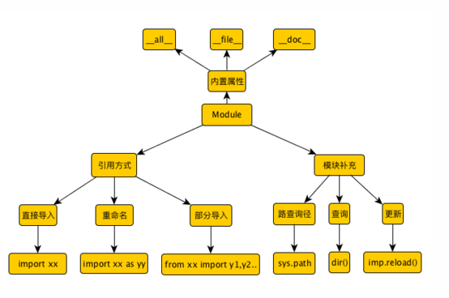
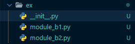
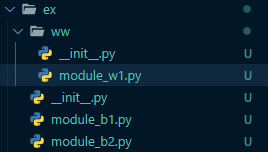

## Python进阶 -- 模块

**模块化（module）程序设计理念：**

“**变量引起质变**”是哲学中一个重要理论。本质上理解，随着数量增加，管理方式会发生本质的变化；旧的管理方式完全不适合，需要新的方式。

程序越是复杂，语句就越多。所以在管理时我们会将实现同一个功能的语句封装到函数中，统一管理和调用。

程序更加复杂，函数和变量更多了。同样的思想，我们将类型对象的“数据和行为”，也就是变量和函数放到一起统一管理和调用，于是产生了“类和对象”。

程序再复杂起来，那么我们将实现类似功能的函数和类统一管理，放到一个模块中。

1. Python 程序由模块组成，一个模块对应 python 源文件，一般后缀名是：.py
2. 模块由语句组成。运行 Python 程序时，按照模块中语句的顺序依次执行。
3. 语句是 Python 程序的构造单元，用于创建对象、变量赋值、调用函数、控制语句等

**标准库模块（standard library）**

与函数库类似，模块也分为标准模块和自定义模块。

Python 标准库提供了操作系统功能、网络通信、文本处理、文件处理、数学运算等基本的功能。比如：random（随机数）、math（数学运算）、time（事件处理）、file（文件处理）、os（操作系统交互）、sys（解释器交互）

另外，Python 还提供了其他第三方模块，使用方法和标准库类似。功能覆盖了很多领域。如：科学计算、WEB开发、大数据、人工智能、图新系统..

**为什么需要模块化编程：**

模块（module）对应于 Python 源代码文件（.py）。模块中可以定义变量、函数、类、普通语句。便于后期复用。

模块化编程（Modular Programminng）将一个任务分解成多个模块。每个模块负责一种功能，然后总和到一起。

**优势：**

1. 协同开发时，将一个任务分解为多个模块，便于大规模编程
2. 代码的复用
3. 可维护性高

### 模块化编程的流程

1. 设计 API，进行功能描述
2. 编码实现 API 中描述的功能
3. 在模块中编写测试代码，并消除全局代码
4. 使用私有函数实现不被外部用户调用的模块函数。

**模块API和功能描述要点：**

API（Application Programming Interface，应用程序编程接口）是用于描述模块中提供的函数和类的功能描述和使用方法的描述

模块化编程中，首先设计的就是模块的 API（要实现的功能描述），然后开始是实现功能，最后在模块中导入并调试。

也可以通过 help(模块名)查看模块的API，先导入。

### 模块的导入

模块化设计的好处之一就是 “代码复用性高”。 可以重复调用。模板的导入就是在自身模块中使用其他模块。

**import 语句导入：**

import语法格式：

~~~python
import 模块名  # 导入一个
import 模块1，模块2...  # 导入多个
import 模块名 as 模块别名  # 导入并使用新名字
~~~

**加载的模块分为四个通用类别：**

- 使用 python 编写的代码（.py文件）
- 已被编译为共享库或 DLL 的 C 或 C++ 扩展
- 包好一组模块的包
- 使用 C 编写并链接到 python 解释器的内置模块

一般通过 import 语句实现模块的导入和使用，import 本质上是使用了内置函数 \_\_import\_\_()

当我们使用 import 导入一个模块时，python 解释器进行执行，最终会生成一个对象，这个对象就是代表了被加载的模块。

~~~python
import math

print(type(math))  # <class 'module'>
print(id(math))  # 2334588745912
print(math.pi)  # 3.141592653589793
~~~

**from...import 导入：**

语法格式：

~~~python
from 模块名 import 成员1，成员2...
~~~

如果要导入一个模块的所有成员：

~~~python
from 模块名 import * 
~~~

> 尽量避免 “``from 模块名 import *``” 写法， '*'号戴白哦导入模块中所有的不是以下划线开肉的名字，可能会覆盖掉一些别的方法。

**区别：**

import 导入的是一个模块，而 from...import 导入的是一个模块中的一个函数或类

**\_\_import\_\_() 动态导入**

import 语句本质上就是调用内部函数\_\_import\_\_()，通过它实现动态导入。给它传入不同的参数，就能导入不同模块

~~~python
m = "math"
i = __import__(m)
print(i.pi)
~~~

动态导入一般使用 `importlib` 模块

~~~python
import importlib
a = importlib.import_module("math")
print(a.pi)
~~~

**模块加载问题：**

> 一个模块无论导入多少次，这个模块在整个解释器进程内有且仅有一个实例对象。

### 包的概念

**概念与结构：**

当一个项目中有很多模块时，需要在进行组织。我们功能类似的模块放在一起，形成 “包”。本质上，“包”必须有一个 \_\_init\_\_.py 文件。结构如下：

包的小面可以包含模块，也可以再包含“子包（subpackage）”。如：

> **每个包中必须要包含 \_\_init\_\_.py 文件**

#### 导入包操作和本质

如果要导入 module_w1.py 格式：

1. `import ex.ww.module_w1`
2. `from ex.ww import module_w1`

导入包的本质就是导入了 `\_\_init\_\_.py` 文件。这样，可以在 `\_\_init\_\_.py` 中批量导入我们需要的模块。

**核心作用：**

- 作为包的标识，不能删除
- 用来实现模糊导入
- 导入包实质是执行 `\_\_init\_\_.py` 文件，可以在 `\_\_init\_\_.py` 文件中做这个包的初始虎啊、以及统一执行代码。

#### * 号导入详解

import * 这样的语句理论上是希望文件系统找出包中的所有子模块，然后导入。这会花费较长的时间。 Python 解决方案提供了一个明确的包索引。

这个索引由` \_\_init\_\_.py` 定义 \_\_all\_\_ 变脸，该变量为列表。

这意味着 * 号导出的只能是在 all 中放入的子模块。

from .. import xxx   ---->   代表上级目录
from . import xxx   ---->   代表同级目录

#### `sys.path` 和 模块搜索路径

当我们导入某个模块时，只有找到这个文件才能读取、装载运行该模块文件。一般都是按照顺序寻找：

1. 内置模块
2. 当前模块
3. 程序的主目录
4. `pathonpath` 目录
5. 标准链接库目录
6. 第三方库目录
7. `.pth` 文件内容
8. `sys.path.append()`临时添加的目录

当任何一个 python 程序启动时，就会将以上搜索路径进行执行，放到 sys 模块的 path 属性中。

