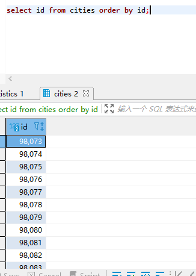
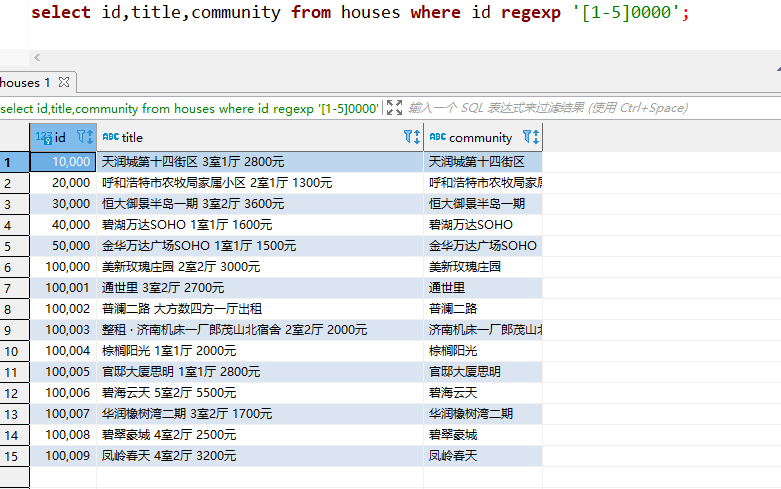
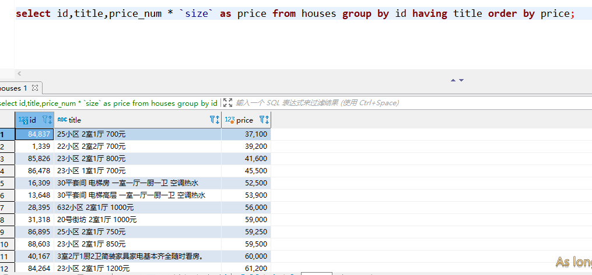

## Mysql 应掌握知识点

### 第一章： 查看数据库和表

#### 查看数据库

~~~mysql
SHOW DATABASES;
~~~

SHOW DATABASES;返回可用数据库的一个列表。包含在这个列表中的可能是MySQL内部使用的数据库（如例子中的mysql和information_schema）。

#### 使用数据库

~~~mysql
use 数据库名;
~~~

进入某个数据库中

#### 查看表

~~~mysql
show tables;
~~~

返回当前选择的数据库内可用表的列表。

#### 查看表下的所有列

~~~mysql
show columns from cities;
~~~

SHOW COLUMNS 要求给出一个表名（这个例子中的 FROM customers），它对每个字段返回一行，行中包含字段名、数据类型、是否允许NULL、键信息、默认值以及其他信息（如字段cust_id的auto_increment）。

#### 其他语法：

~~~mysql
-- 用于显示广泛的服务器状态信息
SHOW STATUS;

-- 分别用来显示创建特定的数据库或表的MYSQL语句
SHOW CREATE DATABASE;
SHOW CREATE TABLE;

-- 用来显示授予用户（所有用户或特定用户）的安全权限
SHOW GRANTS;

-- 用来显示服务器或者警告信息
SHOW ERRORS;
SHOW WARNINGS;
~~~

### 第二章： 检索语句 SELECT

`SELECT` 语句用于检索表的数据
语法格式：

~~~mysql
select xxx from 表名
~~~

#### 检索单个列表数据

~~~mysql
select 列名 from 表名;
~~~

利用 `SELECT` 语句从 cities 表中检索一个名为：`name` 的列。所需的列名在 `SELECT` 关键字之后给出， FROM 关键在指出从中检索数据的表名。

#### 检索多个列表数据

~~~mysql
select 列名1，列名2... from 表名;
~~~

通过给定的多个 列名... 进行检索

#### 检索所有列表数据

~~~mysql
select * from 表名;
~~~

如果给定一个通配符（*），则返回表中所有列。列的顺序一般是列在表定义中出现的顺序。但有时候并不是这样的，表的模式的变化（如添加或删除列）可能会导致顺序的变化。

#### 检索不同的行数据（去重）

当我们需要查看表中不同的数据，将重复的值去除的话 可以使用 `DISTINCT` 关键字。

~~~mysql
select type from cities;
~~~

上图我们发现了有许多重复的数据，这是我们不想要看到的

~~~
select distinct type from cities;
~~~

DISTINCT关键字应用于所有列而不仅是前置它的列。如果给出SELECT DISTINCT type, code，除非指定的两个列都不同，否则所有行都将被
检索出来。

#### 使用完全限定的表名

~~~mysql
select 表名.列名 from 数据库名.表名
~~~

将语法限定在只用**该数据库下的这个表中的列才能获取**

### 第三章： 排序检索数据 SELECT ... ORDER BY ...

其实，检索出来的数据并不是以纯粹的随即顺序显示的。如果不排序，数据一般将以它的底层表中出现的顺序显示。这可以是数据最初添加到表中的顺序。但是，如果数据后来进行过更新或删除，则此顺序将会受到 `MySQL` 重用回收存储空间的影响。因此，如果不明确控制的话，不能（也不应该）依赖该排序顺序。关系数据库设计理论认为，如果不明确规定排序顺序，则不应该假定检索出的数据的顺序有意义。

**子句（clause）：** SQL 语句由子句构成，有些子句是必要的，有的是可选的。一个字句通常由一个关键字和所提供的数据组成。

其中 `ORDER BY` 子句，取一个或者多个列的名字，根据列输出对应序列的排序。

#### 排序数据

~~~mysql
select 列名 from 表名 order by 表名
~~~

#### 多列排序

按不止一个列进行数据排序。

为了按多个列排序，只要指定列名，列名之间用逗号分开即可（就像选择多个列时所做的那样）。

~~~mysql
select 列名1，列名2... from 表名 order by 列名1，列名2...;
~~~

#### 按照指定顺序排序 DESC、ASC、LIMIT

DESC：使列表降序排列
ASC：使列表升序排列（默认即为升序）
LIMIT：限制显示的数量（必须位于ORDER BY之后）

~~~mysql
-- 语法
select 列名1，列名2... from 表名 order by 列名1，列名2... limit 数量;

-- 检索
select id,name,code from cities order by name desc limit 10;
~~~

### 第四章： 过滤数据 WHERE

数据库表一般包含大量的数据，很少需要检索表中所有行。通常只会根据特定操作或报告的需要提取表数据的子集。只检索所需数据需要指定搜索条件（search criteria），搜索条件也称为过滤条件（filter condition）。

> **数据根据WHERE子句中指定的搜索条件进行过滤。WHERE子句在表名（FROM子句）之后给出**

数据也可以在应用层过滤。为此目的，SQL的SELECT语句为了客户机应用检索出超过实际所需数据，然后客户机代码对返回数据进行循环，以提取出需要
的行。

通常，这种实现并不令人满意。因此，对数据库进行了优化，以便快速有效地对数据进行过滤。让客户机应用（或开发语言）处理数据库的工作将会极大地影响应用的性能，并且使所创建的应用完全不具备可伸缩性。此外，如果在客户机上过滤数据，服务器不得不通过网络发送多余的数据，这将导致网络带宽的浪费。

**在同时使用`ORDER BY`和`WHERE`子句时，应该让`ORDER BY`位于`WHERE`之后，否则将会产生错误**

| WHERE 子句操作符 | 描述 |
|-----------------|------|
| = | 等于 |
| <> | 不等于 |
| != | 不等于 |
| < | 小于 |
| <= | 小于等于 |
| > | 大于 |
| >= | 大于等于 |
| BETWEEN ... AND ... | 在指定的两个值之间 |

#### 检查单个值

~~~mysql
SELECT XXX FROM XXX WHERE 列名 操作符 值
~~~

#### 不匹配检查

~~~mysql
SELECT XXX FROM XXX WHERE 列名 <> 值
~~~

> 所查到的数据中没有了 id 为 330 的数据

如果仔细观察上述WHERE子句中使用的条件，会看到有的值括在单引号内（如前面使用的'fuses'），而有的值未括起来。单引号用来限定字符串。如果将值与串类型的列进行比较，则需要限定引号。用来与数值列进行比较的值不用引号。

#### 范围检查

查询值在某个范围内部

~~~mysql
SELECT XXX FROM XXX WHERE 列名 BETWEEN 值 AND 值;
~~~

在使用BETWEEN时，必须指定两个值——所需范围的低端值和高端值。这两个值必须用AND关键字分隔。BETWEEN匹配范围中所有的值，包括指定的开始值和结束值。

#### 空值检测

检查对应的值是否为空

> NULL 无值（no value），它与字段包含0、空字符串或仅仅包含空格不同。

~~~mysql
SELECT XXX FROM XXX WHERE 列名 IS NULL;
~~~

在通过过滤选择出不具有特定值的行时，你可能希望返回具有NULL值的行。但是，不行。因为未知具有特殊的含义，数据库不知道它们是否匹配，所以在匹配过滤或不匹配过滤时不返回它们。 

因此，在过滤数据时，一定要验证返回数据中确实给出了被过滤列具有NULL的行。

### 第五章： 数据过滤

之前所有WHERE子句在过滤数据时使用的都是单一的条件。为了进行更强的过滤控制，MySQL允许给出多个WHERE子句。这些子句可以两种方式使用：以AND子句的方式或OR子句的方式使用。

**操作符（operator）** 用来联结或改变WHERE子句中的子句的关键字。也称为**逻辑操作符（logical operator）**。

#### AND 操作符

使用 `AND` 操作符，查询出来的数据必须符合两个判断条件的要求才会显示。

还可以添加多个过滤条件，每添加一条就要使用一个AND。

~~~mysql
SELECT XXX FROM XXX WHERE 列名1 操作符 值1 AND 列名2 操作符 值2;
~~~

#### OR 操作符

检索匹配任一条件的行。

~~~mysql
SELECT XXX FROM XXX WHERE 列名1 操作符 值1 OR 列名2 操作符 值2;
~~~

只要由符合这两个过滤条件的数据都会进行展会。

#### 计算顺序

WHERE可包含任意数目的AND和OR操作符。允许两者结合以进行复杂和高级的过滤。

~~~mysql
select * from houses where id = 330 or price_num = 3600 and entire = 1;
~~~

> SQL（像多数语言一样）在处理OR操作符前，优先处理AND操作符。

解决方法：

~~~mysql
select * from houses where (id = 330 or price_num = 3600) and entire = 1;
~~~

这条SELECT语句与前一条的唯一差别是，这条语句中，前两个条件用圆括号括了起来。因为圆括号具有较AND或OR操作符高的计算次序，DBMS首先过滤圆括号内的OR条件。

> 任何时候使用具有AND和OR操作符的WHERE子句，都应该使用圆括号明确地分组操作符。不要过分依赖默认计算次序，即使它确实是你想要的东西也是如此。使用圆括号没有什么坏处，它能消除歧义。

#### IN 操作符

IN操作符用来指定条件范围，范围中的每个条件都可以进行匹配。IN取合法值的由逗号分隔的清单，全都括在圆括号中。

~~~mysql
SELECT XXX FROM XXX WHERE 列名 操作符 值 IN 列名 (xxx);
~~~

**优点：**

- 在使用长的合法选项清单时，IN操作符的语法更清楚且更直观。
- 在使用IN时，计算的次序更容易管理（因为使用的操作符更少）
- IN操作符一般比OR操作符清单执行更快。
- IN的最大优点是可以包含其他SELECT语句，使得能够更动态地建立WHERE子句。

**功能与OR相当**

#### NOT 操作符

否定它之后所跟的任何条件。

~~~mysql
SELECT XXX FROM XXX WHERE 列名 操作符 值 NOT IN 列名 (xxx);
~~~

对于简单的WHERE子句，使用NOT确实没有什么优势。但在更复杂的子句中，NOT是非常有用的。例如，在与IN操作符联合使用时，NOT使找出与条件列表不匹配的行非常简单。

### 第六章： 通配符过滤

以上的所有操作符都是针对已知值进行过滤的。不管是匹配一个还是多个值，测试大于还是小于已知值，或者检查某个范围的值，共同点是过滤中使用的值都是已知的。但是，这种过滤方法并不是任何时候都好用。

所以可以使用通配符进行过滤搜索，通配符可创建比较特定数据的搜索模式。

**通配符（wildcard）** 用来匹配值的一部分的特殊字符。

**搜索模式（search pattern）** 由字面值、通配符或两者组合构成的搜索条件。

> 通配符本身实际是SQL的WHERE子句中有特殊含义的字符
> 为在搜索子句中使用通配符，必须使用LIKE操作符。
> LIKE指示MySQL，后跟的搜索模式利用通配符匹配而不是直接相等匹配进行比较。

#### 百分号（%）通配符

最常使用的通配符是百分号（%）。在搜索串中，%表示任何字符出现任意次数。

~~~mysql
SELECT xxx FROM xxx WHERE xxx LIKE "xx%";
~~~

匹配以‘xx’开头的字段信息

通配符可在搜索模式中任意位置使用，并且可以使用多个通配符。下面的例子使用两个通配符，它们位于模式的两端：

~~~mysql
SELECT xxx FROM xxx WHERE xxx LIKE "%xx%";
~~~

表示匹配任何位置包含文本“xx”的值，而不论它之前或之后出现什么字符

通配符也可以出现在搜索模式的中间，虽然这样做不太有用：

~~~mysql
SELECT xxx FROM xxx WHERE xxx LIKE "x%x";
~~~

表示匹配在x1和x2之间包含任意是数据

> 重要的是要注意到，除了一个或多个字符外，%还能匹配0个字符。%代表搜索模式中给定位置的0个、1个或多个字符。
> 尾空格可能会干扰通配符匹配。
> 虽然似乎%通配符可以匹配任何东西，但有一个例外，即NULL。即使是WHERE prod_name LIKE '%'也不能匹配用值NULL作为产品名的行。

#### 下划线（_）通配符

下划线的用途与%一样，但下划线只匹配单个字符而不是多个字符。

~~~mysql
SELECT xxx FROM xxx WHERE xxx LIKE "x_x";
~~~

注意：（ _ ）只能匹配一个字符，使用技巧和（ % ）一样。

#### 使用技巧

- 不要过度使用通配符。如果其他操作符能达到相同的目的，应该使用其他操作符。
- 在确实需要使用通配符时，除非绝对有必要，否则不要把它们用在搜索模式的开始处。把通配符置于搜索模式的开始处，搜索起来是最慢的。
- 仔细注意通配符的位置。如果放错地方，可能不会返回想要的数据。

### 第七章： 正则表达式搜索

过滤例子允许用匹配、比较和通配操作符寻找数据。对于基本的过滤（或者甚至是某些不那么基本的过滤），这样就足够了。但随着过滤条件的复杂性的增加，WHERE子句本身的复杂性也有必要增加。

这也就是正则表达式变得有用的地方。正则表达式是用来匹配文本的特殊的串（字符集合）。

所有种类的程序设计语言、文本编辑器、操作系统等都支持正则表达式。

**使用正则匹配的关键词为：REGEXP**

#### 基本字符匹配

~~~mysql
select id,title,community from houses where id regexp 330;
~~~

类似于 LIKE 匹配。找出了所有包含了 330 的 id。

~~~mysql
select id,title,community from houses where  id regexp .0;
~~~

使用了正则表达式.0。.是正则表达式语言中一个特殊的字符。它表示匹配任意一个字符

LIKE匹配整个列。如果被匹配的文本在列值中出现，LIKE将不会找到它，相应的行也不被返回（除非使用通配符）。而REGEXP在列值内进行匹配，如果被匹配的文本在列值中出现，REGEXP将会找到它，相应的行将被返回。这是一个非常重要的差别。

#### OR 匹配

~~~mysql
select id,title,community from houses where  id regexp '1000|2000';
~~~

匹配了 id 中包含了 1000或2000 的数据，| 为正则表达式的OR操作符。它表示匹配其中之一。

#### 匹配几个字符之一

~~~mysql
select id,title,community from houses where  id regexp '[123]000';
-- 或
select id,title,community from houses where  id regexp '[1|2|3]000';
~~~

匹配特定的字符：通过指定一组用[和]括起来的字符来完成

[]是另一种形式的OR语句。事实上，正则表达式 `[123]000` 为 `[1|2|3]000` 的缩写，也可以使用后者。

#### 匹配范围

**使用-来定义一个范围**

[0-9] 匹配的范围在 0 到 9 之间的所有数字
[a-z] 匹配的范围在 a 到 z 之间的所有字符
[A-Z] 匹配的范围在 A 到 Z 之间的所有字符

~~~mysql
select id,title,community from houses where id regexp '[1-5]0000';
~~~

#### 匹配特殊字符

匹配特殊字符，必须用 `\\` 为前导。`\\`-表示查找-，`\\`.表示查找.。

| 元字符 | 描述 |
|-------|------|
| `\\f` | 换页 |
| `\\n` | 换行 |
| `\\r` | 回车 |
| `\\t` | 制表 |
| `\\v` | 纵向制表 |

~~~mysql
select id,title,community from houses where title regexp '\\·';
~~~

查询了数据中带有 · 的数据。

> 为了匹配反斜杠（\）字符本身，需要使用`\\\`
> 多数正则表达式实现使用单个反斜杠转义特殊字符，以便能使用这些字符本身。但MySQL要求两个反斜杠（MySQL自己解释一个，正则表达式库解释另一个）。

#### 匹配字符类

存在找出你自己经常使用的数字、所有字母字符或所有数字字母字符等的匹配。为更方便工作，可以使用预定义的字符集，称为字符类（character class）。

| 字符类 | 描述 |
|-------|------|
| `[:alnum:]` | 任意字母和数字（同`[a-zA-Z0-9]`） |
| `[:alpha:]` | 任意字符（同`[a-zA-Z]`） |
| `[:blank:]` | 空格和制表（同`[\\t]`） |
| `[:cntrl:]` | ASCII控制字符`（ASCII 0到31和127）` |
| `[:digit:]` | 任意数字（同`[0-9]`） |
| `[:graph:]` | 与`[:print:]`相同，但不包括空格 |
| `[:lower:]` | 任意小写字母（同`[a-z]）` |
| `[:print:]` | 任意可打印字符 |
| `[:punct:]` | 既不在`[:alnum:]`又不在`[:cntrl:]`中的任意字符 |
| `[:space:]` | 包括空格在内的任意空白字符（同`[\\f\\n\\r\\t\\v]`） |
| `[:upper:]` | 任意大写字母（同`[A-Z]`） |
| `[:xdigit:]` | 任意十六进制数字（同`[a-fA-F0-9]`） |

使用：

~~~mysql
select id,title,community from houses where title regexp '[:alnum:]';
select id,title,community from houses where description regexp '[:alpha:]';
select id,title,community from houses where title regexp '[:blank:]';
select id,title,community from houses where roomTypeID regexp '[:cntrl:]';
select id,title,community from houses where title regexp '[:digit:]';
select id,title,community from houses where title regexp '[:graph:]';
select id,title,community from houses where houseCode regexp '[:lower:]';
select id,title,community from houses where title regexp '[:print:]';
select id,title,community from houses where title regexp '[:punct:]';
select id,title,community from houses where title regexp '[:space:]';
select id,title,community from houses where roomTypeID regexp '[:upper:]';
select id,title,community from houses where title regexp '[:xdigit:]';
~~~

#### 匹配多个实例

如果存在一个匹配，该行被检索出来，如果不存在，检索不出任何行。但有时需要对匹配的数目进行更强的控制。

| 元字符 | 描述 |
|-------|------|
| * | 0个或者多个匹配 |
| + | 1个或者多个匹配（等于{1，}） |
| ? | 0个或者1个匹配（等于{0，1}） |
| {n} | 指定数目的匹配 |
| {n，} | 不少于指定数目的匹配 |
| {n，m} | 匹配数目的范围（m不超过255） |

#### 定位符

匹配特定位置的文本。

| 定位符 | 描述 |
|-------|------|
| ^ | 文本的开始 |
| $ | 文本的结束 |
| [[:<:]] | 词的开始 |
| [[:>:]] | 词的结束 |

~~~mysql
-- 查询描述中带有0-9的数字并且包含数字
select * from houses where description regexp '^[0-9\\.]'
~~~

`^[0-9\\.]` 只在.或任意数字为串中第一个字符时才匹配它们。

^有两种用法。在集合中（用[和]定义），用它来否定该集合，否则，用来指串的开始处。

`LIKE`和`REGEXP`的不同在于，`LIKE`匹配整个串而`REGEXP`匹配子串。利用定位符，通过用^开始每个表达式，用$结束每个表达式，可以使REGEXP的作用与LIKE一样。

### 第八章： 创建计算字段

#### 计算字段

存储在数据库表中的数据一般不是应用程序所需要的格式。下面举几个例子。

- 如果想在一个字段中既显示公司名，又显示公司的地址，但这两个信息一般包含在不同的表列中。
- 城市、州和邮政编码存储在不同的列中（应该这样），但邮件标签打印程序却需要把它们作为一个恰当格式的字段检索出来。
- 列数据是大小写混合的，但报表程序需要把所有数据按大写表示出来。

存储在表中的数据都不是应用程序所需要的。我们需要直接从数据库中检索出转换、计算或格式化过的数据；而不是检索出数据，然后再在客户机应用程序或报告程序中重新格式化。

**字段（field）** 基本上与`列（column）`的意思相同，经常互换使用，不过数据库列一般称为列，而术语字段通常用在计算字段的连接上。

**客户机与服务器的格式:** 可在SQL语句内完成的许多转换和格式化工作都可以直接在客户机应用程序内完成。但一般来说，在数据库服务器上完成这些操作比在客户机中完成要快得多，因为DBMS是设计来快速有效地完成这种处理的。

#### 字段拼接

**拼接（concatenate）** 将值联结到一起构成单个值。

MySQL的不同之处： 多数DBMS使用+或||来实现拼接，MySQL则使用Concat()函数来实现。当把SQL语句转换成MySQL语句时一定要把这个区别铭记在心。

~~~mysql
select concat(id,"--",title) from houses; 
~~~

**Trim函数**： MySQL除了支持RTrim()（正如刚才所见，它去掉串右边的空格），还支持LTrim()（去掉串左边的空格）以及Trim()（去掉串左右两边的空格）。

#### 使用别名

别名（alias）是一个字段或值的替换名。别名用AS关键字赋予。

~~~mysql
select concat(id,"--",title) as "房价" from houses; 
~~~

**别名的其他用途**: 别名还有其他用途。常见的用途包括在实际的表列名包含不符合规定的字符（如空格）时重新命名它，在原来的名字含混或容易误解时扩充它，等等。

#### 执行算数运算

| 运算符 | 描述 |
|--------|-----|
| + | 加 |
| - | 减 |
| * | 乘 |
| / | 除 |

~~~mysql
select price_num*`size` as "房价" from  houses;
~~~

### 第九章： 使用数据处理函数

**一般又在 where 之后的函数。**
#### 函数

与其他大多数计算机语言一样，SQL支持利用函数来处理数据。函数一般是在数据上执行的，它给数据的转换和处理提供了方便。

#### 使用函数场景

大多数SQL实现支持以下类型的函数：

- 用于处理文本串（如删除或填充值，转换值为大写或小写）的文本函数。
- 用于在数值数据上进行算术操作（如返回绝对值，进行代数运算）的数值函数。
- 用于处理日期和时间值并从这些值中提取特定成分（例如，返回两个日期之差，检查日期有效性等）的日期和时间函数。
- 返回DBMS正使用的特殊信息（如返回用户登录信息，检查版本细节）的系统函数。

#### 文本处理函数

| 函数 | 描述 |
|------|-----|
| left() | 返回字符串左边的字符 |
| length() | 返回字符串长度 |
| locate() | 找出字符串的子串 |
| lower() | 将字符串转换为小写 |
| Ltrim() | 去掉字符串左边空格 |
| Right() | 返回字符串右边的字符 |
| Rtrim() | 去掉字符串右边的空格 |
| soundex() | 返回字符串的 SOUNDEX 值 |
| substring() | 返回子串的字符 |
| upper() | 将字符串转换为大写 |

其中的 `SOUNDEX` 函数其意思为发音相似的值，当我们要获取值的时候写错了对应的值，但是发音和其类似，同样可以搜索到。

~~~mysql
select upper(houseCode) from houses where length(title) = 13;
~~~

#### 日期和时间处理函数

| 函数 | 描述 |
|------|-----|
| AddDate() | 增加一个日期（天、周等） |
| AddTime() | 增加一个时间（时、分等） |
| CurDate() | 返回当前日期 |
| CurTime() | 返回当前时间 |
| Date() | 返回日期时间的日期部分 |
| DateDiff() | 计算两个日期之差 |
| Date_Add() | 高度灵活的日期运算函数 |
| Date_Format() | 返回一个格式化的日期或者时间串 |
| Day() | 返回一个日期的天数部分 |
| DayOfWeek() | 对于一个日期，返回对应的星期几 |
| Hour() | 返回一个时间的小时部分 |
| Minute() | 返回一个时间的分钟部分 |
| Month() | 返回一个日期的月份部分 |
| Now() | 返回当前日期时间 |
| Second() | 返回一个时间的秒部分 |
| Time() | 返回一个日期时间的时间部分 |
| Year() | 返回一个日期的年份部分 |

如果要的是日期，请使用Date() 如果你想要的仅是日期，则使用Date()是一个良好的习惯，即使你知道相应的列只包含日期也是如此。这样，如果由于某种原因表中以后有日期和时间值，你的SQL代码也不用改变。当然，也存在一个Time()函数，在你只想要时间时应该使用它。 

Date()和Time()都是在MySQL 4.1.1中第一次引入的。

~~~mysql
select str_to_date('20211018154706','%Y%m%d%H%i%s');

select date_format(date('2017-04-22 15:47:06'),'%m-%Y-%d'); 
~~~

#### 数值处理函数

| 函数 | 描述 |
|------|-----|
| Abs() | 返回一个数的绝对值 |
| Cos() | 返回一个角度的余弦 |
| Exp() | 返回一个数的指数值 |
| Mod() | 返回除操作的余数 |
| Pi() | 返回圆周率 |
| Rand() | 返回一个随机数 |
| Sin() | 返回一个角度的正弦 |
| Sqrt() | 返回一个数的平方根 |
| Tan() | 返回一个角度的正切 |

这些函数一般主要用于代数、三角或几何运算，因此没有串或日期—时间处理函数的使用那么频繁。

在主要DBMS的函数中，数值函数是最一致最统一的函数。

~~~mysql
select abs(-100) as "数值";
select Cos(60) as "余弦";
select Exp(60) as "指数";
select rand()*(10-1+1)+1 as "随机数";
select Sin(60) as "正弦";
select Cos(60) as "正切";
~~~

### 第十章： 汇总数据

汇总数据而不用把它们实际检索出来，为此MySQL提供了专门的函数。使用这些函数，MySQL查询可用于检索数据，以便分析和报表生成。这种类型的检索例子有以下几种。

- 确定表中行数（或者满足某个条件或包含某个特定值的行数）。
- 获得表中行组的和。 
- 找出表列（或所有行或某些特定的行）的最大值、最小值和平均值。

因此，返回实际表数据是对时间和处理资源的一种浪费（更不用说带宽了）。重复一遍，实际想要的是汇总信息。

> 所以，Mysql 给我们提供了5个聚集函数

**聚集函数（aggregate function）**： 运行在行组上，计算和返回单个值的函数。

| 函数 | 描述 |
|------|-----|
| AVG() | 返回某列的平均值 |
| COUNT() | 返回某列的行数 |
| MAX() | 返回某列的最大值 |
| MIN() | 返回某列的最小值 |
| SUM() | 返回某列值之和 |

#### AVG() 函数

AVG()通过对表中行数计数并计算特定列值之和，求得该列的平均值。AVG()可用来返回所有列的平均值，也可以用来返回特定列或行的平均值。

~~~mysql
select avg(price_num*`size`) from houses; 
~~~

**只用于单个列**： AVG()只能用来确定特定数值列的平均值，而且列名必须作为函数参数给出。为了获得多个列的平均值，必须使用多个AVG()函数。

**NULL值**： AVG()函数忽略列值为NULL的行。

#### COUNT() 函数

COUNT()函数进行计数。可利用COUNT()确定表中行的数目或符合特定条件的行的数目。

COUNT()函数有两种使用方式：

- 使用COUNT(*)对表中行的数目进行计数，不管表列中包含的是空值（NULL）还是非空值。
- 使用COUNT(column)对特定列中具有值的行进行计数，忽略NULL值。

~~~mysql
select count(*) from houses;
~~~

> 利用COUNT(*)对所有行计数，不管行中各列有什么值。

~~~mysql
select count(entire) from houses where entire = 0;
~~~

**NULL值**: 如果指定列名，则指定列的值为空的行被COUNT()函数忽略，但如果COUNT()函数中用的是星号（*），则不忽略。

#### MAX()函数

MAX()返回指定列中的最大值。

~~~mysql
select max(`size`) from houses;
~~~

**对非数值数据使用MAX()** 虽然MAX()一般用来找出最大的数值或日期值，但MySQL允许将它用来返回任意列中的最大值，包括返回文本列中的最大值。在用于文本数据时，如果数据按相应的列排序，则MAX()返回最后一行。

**NULL值** MAX()函数忽略列值为NULL的行。

#### MIN()函数

MIN()的功能正好与MAX()功能相反，它返回指定列的最小值。

~~~mysql
select min(`size`) from houses;
~~~

**对非数值数据使用MIN()** MIN()函数与MAX()函数类似，MySQL允许将它用来返回任意列中的最小值，包括返回文本列中的最小值。在用于文本数据时，如果数据按相应的列排序，则MIN()返回最前面的行。

**NULL值** MIN()函数忽略列值为NULL的行。

#### SUM() 函数

SUM()用来返回指定列值的和（总计）

~~~mysql
select sum(`size`) from houses; 
~~~

**在多个列上进行计算**： 如本例所示，利用标准的算术操作符，所有聚集函数都可用来执行多个列上的计算

**NULL值** SUM()函数忽略列值为NULL的行

### 第十一章： 汇总数据

本章将介绍如何分组数据，以便能汇总表内容的子集。这涉及两个新SELECT语句子句，分别是GROUP BY子句和HAVING子句。

#### 数据分组

目前为止的所有计算都是在表的所有数据或匹配特定的WHERE子句的数据上进行的。

分组允许把数据分为多个逻辑组，以便能对每个组进行聚集计算

#### 创建分组数据

分组是在SELECT语句的`GROUP BY`子句中建立的。

~~~mysql
select title,count(*) as production from houses group by title;
~~~

~~~mysql
select entire ,count(*) as production from houses group by entire;
~~~

将拥有相同值的数据总和到一起。

因为使用了GROUP BY，就不必指定要计算和估值的每个组了。系统会自动完成。GROUP BY子句指示MySQL分组数据，然后对每个组而不是整个结果集进行聚集。

在具体使用GROUP BY子句前，需要知道一些重要的规定。

- GROUP BY子句可以包含任意数目的列。这使得能对分组进行嵌套，为数据分组提供更细致的控制。
- 如果在GROUP BY子句中嵌套了分组，数据将在最后规定的分组上进行汇总。换句话说，在建立分组时，指定的所有列都一起计算（所以不能从个别的列取回数据）。 
- GROUP BY子句中列出的每个列都必须是检索列或有效的表达式（但不能是聚集函数）。如果在SELECT中使用表达式，则必须在GROUP BY子句中指定相同的表达式。不能使用别名。
- 除聚集计算语句外，SELECT语句中的每个列都必须在GROUP BY子句中给出。
- 如果分组列中具有NULL值，则NULL将作为一个分组返回。如果列中有多行NULL值，它们将分为一组。
- GROUP BY子句必须出现在WHERE子句之后，ORDER BY子句之前。

> **使用ROLLUP**: 使用`WITH ROLLUP`关键字，可以得到每个分组以及每个分组汇总级别（针对每个分组）的值.

~~~mysql
select entire ,count(*) as production from houses group by entire with rollup;
~~~

#### 过滤分组

除了能用GROUP BY分组数据外，MySQL还允许过滤分组，规定包括哪些分组，排除哪些分组。

**HAVING支持所有WHERE操作符** 我们学习了WHERE子句的条件（包括通配符条件和带多个操作符的子句）。所学过的有关WHERE的所有这些技术和选项都适用于HAVING。它们的句法是相同的，只是关键字有差别。

~~~mysql
select entire ,count(*) as production from houses group by entire having count(*)>5000;
~~~

**HAVING和WHERE的差别**： 这里有另一种理解方法，WHERE在数据分组前进行过滤，HAVING在数据分组后进行过滤。这是一个重要的区别，WHERE排除的行不包括在分组中。这可能会改变计算值，从而影响HAVING子句中基于这些值过滤掉的分组。

~~~mysql
select price_num,count(*) as production from houses where entire = 1 group by price_num having count(*)>100;
~~~

首先， `where` 过滤了所有 `entrie` 为 0 的数据， `group by` 将拥有相同价格的数据累加， `having` 将排列完的数据进一步的筛选

#### 分组和排序

虽然GROUP BY和ORDER BY经常完成相同的工作，但它们是非常不同的。

| ORDER BY | GROUP BY |
|----------|----------|
| 排序产生的输出 | 分组行。但输出可能不是分组的顺序 |
| 任意列都可以使用（甚至非选择的列也可以） | 只能使用选择列或表达式列，而且必须使用每个选项列表达式 |
| 不一定需要 | 如果与聚集函数一起使用（或表达式）则必须使用 |

不要忘记 `ORDER BY` 一般在使用`GROUP BY`子句时，应该也给出`ORDER BY`子句。这是保证数据正确排序的唯一方法。千万不要仅依赖`GROUP BY`排序数据。

~~~mysql
select id,title,price_num * `size` as price from houses group by id having title order by price; 
~~~

#### SELECT 子句顺序

SELECT语句中使用时必须遵循的次序，列出迄今为止所学过的子句。

SELECT子句及顺序

| 子句 | 描述 | 是否必须使用 |
|------|------|------------|
| SELECT | 要返回的列或表达式 | 是 |
| FROM | 从中检索数据的表 | 仅在从表选择数据时使用 |
| WHERE | 行级过滤 | 否 |
| GROUP BY | 分组说明 | 仅在从表选择数据时使用 |
| HAVING | 组级过滤 | 否 |
| ORDER BY | 输出顺序排序 | 否 |
| LIMIT | 要检索的行数 | 否 |

### 第十二章： 子查询

**版本要求**: MySQL 4.1引入了对子查询的支持，所以要想使用本章描述的SQL，必须使用MySQL 4.1或更高级的版本。

**查询（query）**: 任何SQL语句都是查询。但此术语一般指SELECT语句。

SQL还允许创建子查询（subquery），即嵌套在其他查询中的查询。

#### 利用子查询进行过滤

订单存储在两个表中。对于包含订单号、客户ID、订单日期的每个订单，orders表存储一行。各订单的物品存储在相关的orderitems表中。orders表不存储客户信息。它只存储客户的ID。实际的客户信息存储在customers表中。

假如需要列出订购物品TNT2的所有客户，如何检索呢

步骤如下：

(1) 检索包含物品TNT2的所有订单的编号。
(2) 检索具有前一步骤列出的订单编号的所有客户的ID。
(3) 检索前一步骤返回的所有客户ID的客户信息。

将3个查询语句合成一个。

第一条SELECT语句的含义很明确，对于prod_id为TNT2的所有订单物品，它检索其order_num列。

~~~mysql
SELECT order_num FROM orderitems WHERE prod_id = 'TNT2';
~~~

下一步，查询具有订单20005和20007的客户ID。使用 IN 子句

~~~mysql
SELECT cust_id FROM orders WHERE order_num IN (20005,20007);
~~~

现在，把第一个查询（返回订单号的那一个）变为子查询组合两个查询。

~~~mysql
SELECT cust_id FROM orders WHERE order_num IN (
	SELECT order_num FROM orderitems WHERE prod_id = "TNT2"
);
~~~

首先，它执行下面的查询：

~~~mysql
SELECT order_num FROM orderitems WHERE prod_id = 'TNT2';
~~~

此查询返回两个订单号：20005和20007。
然后，这两个值以IN操作符要求的逗号分隔的格式传递给外部查询的WHERE子句。外部查询变成：

~~~mysql
SELECT cust_id FROM orders WHERE order_num IN (20005,20007);
~~~

可以看到，输出是正确的并且与前面硬编码WHERE子句所返回的值相同。

> **格式化SQL**: 包含子查询的SELECT语句难以阅读和调试，特别是它们较为复杂时更是如此。如上所示把子查询分解为多行并且适当地进行缩进，能极大地简化子查询的使用。

现在得到了订购物品TNT2的所有客户的ID。下一步是检索这些客户ID的客户信息。

分解法：

~~~mysql
SELECT order_num FROM orderitems WHERE prod_id ="TNT2";
SELECT cust_id FROM orders WHERE order_num IN (20005,20007);
SELECT cust_name,cust_contact FROM customers WHERE cust_id IN (10001,10004);
~~~

合成后：

~~~mysql
SELECT cust_name,cust_contact FROM customers WHERE cust_id IN (
	SELECT cust_id FROM orders WHERE order_num IN (
		SELECT order_num FROM orderitems WHERE prod_id ="TNT2"	
	)
);
~~~

可见，在WHERE子句中使用子查询能够编写出功能很强并且很灵活的SQL语句。对于能嵌套的子查询的数目没有限制，不过在实际使用时由于性能的限制，不能嵌套太多的子查询。

**列必须匹配** 在WHERE子句中使用子查询（如这里所示），应该保证SELECT语句具有与WHERE子句中相同数目的列。通常，子查询将返回单个列并且与单个列匹配，但如果需要也可以使用多个列。

虽然子查询一般与IN操作符结合使用，但也可以用于测试等于（=）、不等于（<>）等。

**子查询和性能** 这里给出的代码有效并获得所需的结果。但是，使用子查询并不总是执行这种类型的数据检索的最有效的方法。

#### 作为计算字段使用子查询

使用子查询的另一方法是创建计算字段。假如需要显示customers表中每个客户的订单总数。订单与相应的客户ID存储在orders表中。

为了执行这个操作，遵循下面的步骤。

(1) 从customers表中检索客户列表。
(2) 对于检索出的每个客户，统计其在orders表中的订单数目。

Ex：
下面的代码对客户10001的订单进行计数：

~~~mysql
SELECT count(*) FROM orders WHERE cust_id = "10001";
~~~

为了对每个客户执行COUNT(\*)计算，应该将COUNT(\*)作为一个子查询。

~~~mysql
-- 筛选用户名
SELECT cust_name,cust_contact, (
	-- 筛选两表之间相同id的用户购买了多少的商品	
	SELECT count(*) FROM orders WHERE orders.cust_id = customers.cust_id 
) AS orders FROM customers ORDER BY cust_name;
~~~

**相关子查询（correlated subquery）**: 涉及外部查询的子查询。

**逐渐增加子查询来建立查询**: 用子查询测试和调试查询很有技巧性，特别是在这些语句的复杂性不断增加的情况下更是如此。用子查询建立（和测试）查询的最可靠的方法是逐渐进行，这与MySQL处理它们的方法非常相同。首先，建立和测试最内层的查询。然后，用硬编码数据建立和测试外层查询，并且仅在确认它正常后才嵌入子查询。这时，再次测试它。对于要增加的每个查询，重复这些步骤。这样做仅给构造查询增加了一点点时间，但节省了以后（找出查询为什么不正常）的大量时间，并且极大地提高了查询一开始就正常工作的可能性。

### 第十三章： 联结表

SQL最强大的功能之一就是能在数据检索查询的执行中联结（join）表。联结是利用SQL的SELECT能执行的最重要的操作。

在能够有效地使用联结前，必须了解关系表以及关系数据库设计的一些基础知识。

#### 关系表

假如有一个包含产品目录的数据库表，其中每种类别的物品占一行。对于每种物品要存储的信息包括产品描述和价格，以及生产该产品的供应商信息。

现在，假如有由同一供应商生产的多种物品，那么在何处存储供应商信息（如，供应商名、地址、联系方法等）呢？将这些数据与产品信息分开存储的理由如下。

- 因为同一供应商生产的每个产品的供应商信息都是相同的，对每个产品重复此信息既浪费时间又浪费存储空间。
- 如果供应商信息改变（例如，供应商搬家或电话号码变动），只需改动一次即可。
- 如果有重复数据（即每种产品都存储供应商信息），很难保证每次输入该数据的方式都相同。不一致的数据在报表中很难利用。

关键是，相同数据出现多次决不是一件好事，此因素是关系数据库设计的基础。

关系表的设计就是要保证把信息分解成多个表，一类数据一个表。各表通过某些常用的值（即关系设计中的关系（relational））互相关联。

在这个例子中，可建立两个表，一个存储供应商信息，另一个存储产品信息。vendors表包含所有供应商信息，每个供应商占一行，每个供应商具有唯一的标识。此标识称为主键（primary key），可以是供应商ID或任何其他唯一值。

products表只存储产品信息，它除了存储供应商ID（vendors表的主键）外不存储其他供应商信息。vendors表的主键又叫作products的外键，它将vendors表与products表关联，利用供应商ID能从vendors表中找出相应供应商的详细信息。

**外键（foreign key）** 外键为某个表中的一列，它包含另一个表的主键值，定义了两个表之间的关系。

好处：

- 供应商信息不重复，从而不浪费时间和空间；
- 如果供应商信息变动，可以只更新vendors表中的单个记录，相关表中的数据不用改动；
- 由于数据无重复，显然数据是一致的，这使得处理数据更简单。

**可伸缩性（scale）** 能够适应不断增加的工作量而不失败。设计良好的数据库或应用程序称之为可伸缩性好（scale well）。

#### 为什么使用联结

分解数据为多个表能更有效地存储，更方便地处理，并且具有更大的可伸缩性。但这些好处是有代价的。

如果数据存储在多个表中，怎样用单条SELECT语句检索出数据？

答案是使用联结。简单地说，联结是一种机制，用来在一条SELECT语句中关联表，因此称之为联结。使用特殊的语法，可以联结多个表返回一组输出，联结在运行时关联表中正确的行。

#### 创建联结（⭐）

~~~mysql
SELECT vend_name AS "供应商",prod_name AS "商品名",prod_price AS "商品价格"
FROM vendors, products
WHERE vendors.vend_id = products.vend_id 
ORDER BY vend_name,prod_name
~~~

可以看到要匹配的两个列以 vendors.vend_id 和 products. vend_id指定。这里需要这种完全限定列名，因为如果只给出vend_id， 则MySQL不知道指的是哪一个（它们有两个，每个表中一个）。

> **完全限定列名**：在引用的列可能出现二义性时，必须使用完全限定列名（用一个点分隔的表名和列名）。如果引用一个没有用表名限制的具有二义性的列名，MySQL将返回错误。

#### WHERE 语句的作用

上文我们使用 `WHERE` 关键字将两个表之间创建了联结，WHERE子句作为过滤条件，它只包含那些匹配给定条件（这里是联结条件）的行。

如果没有WHERE子句，第一个表中的每个行将与第二个表中的每个行配对，而不管它们逻辑上是否可以配在一起，会造成笛卡尔积。

**笛卡儿积（cartesian product）** 由没有联结条件的表关系返回的结果为笛卡儿积。检索出的行的数目将是第一个表中的行数乘以第二个表中的行数。

**不要忘了WHERE子句** 应该保证所有联结都有WHERE子句，否则MySQL将返回比想要的数据多得多的数据。同理，应该保证WHERE子句的正确性。不正确的过滤条件将导致MySQL返回不正确的数据。

**叉联结** 有时我们会听到返回称为叉联结（cross join）的笛卡儿积的联结类型。

#### 内部联结

**INNER JOIN（内连接,或等值连接）ON**：获取两个表中字段匹配关系的记录。

目前为止所用的联结称为等值联结（equijoin），它基于两个表之间的相等测试。这种联结也称为内部联结。其实，对于这种联结可以使用稍微不同的语法来明确指定联结的类型。

~~~mysql
SELECT vend_name AS "供应商",prod_name AS "商品名",prod_price AS "商品价格"
FROM vendors 
INNER JOIN products
ON vendors.vend_id = products.vend_id;
~~~

这里，两个表之间的关系是FROM子句的组成部分，以INNER JOIN指定。在使用这种语法时，联结条件用特定的ON子句而不是WHERE子句给出。传递给ON的实际条件与传递给WHERE的相同。

**LEFT JOIN（左连接）**：获取左表所有记录，即使右表没有对应匹配的记录。

**RIGHT JOIN（右连接）：** 与 LEFT JOIN 相反，用于获取右表所有记录，即使左表没有对应匹配的记录。

**使用哪种语法**： ANSI SQL规范首选INNER JOIN语法。此外，尽管使用WHERE子句定义联结的确比较简单，但是使用明确的联结语法能够确保不会忘记联结条件，有时候这样做也能影响性能。

#### 联结多个表

SQL对一条SELECT语句中可以联结的表的数目没有限制。
创建联结的基本规则也相同：首先列出所有表，然后定义表之间的关系。

~~~mysql
SELECT prod_name AS "商品名",vend_name AS "供应商",prod_price AS "商品价格",quantity AS "数量"
FROM products,vendors,orderitems
WHERE products.vend_id = vendors.vend_id 
AND products.prod_id = orderitems.prod_id 
AND orderitems.order_num = 20005;
~~~

这里的FROM子句列出了3个表，而WHERE子句定义了这两个联结条件，而第三个联结条件用来过滤出订单20005中的物品。

**性能考虑** MySQL在运行时关联指定的每个表以处理联结。这种处理可能是非常耗费资源的，因此应该仔细，不要联结不必要的表。联结的表越多，性能下降越厉害。

### 创建高级联结
