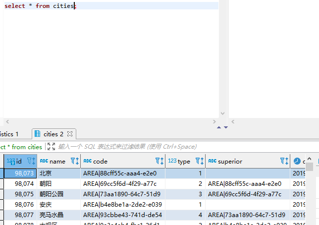
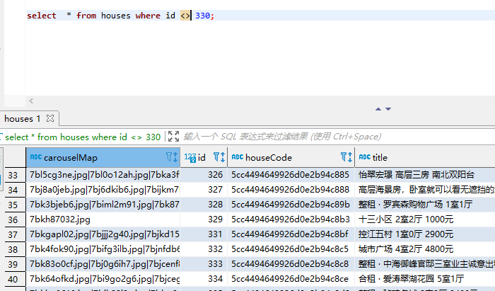
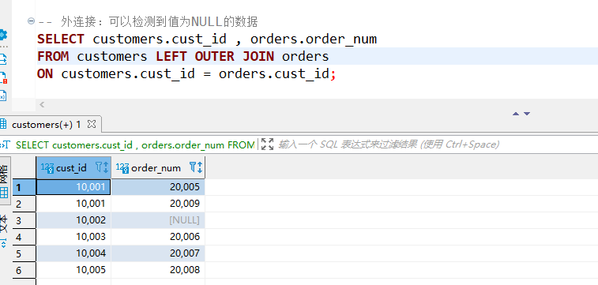
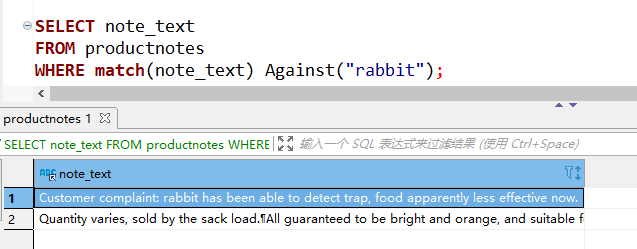
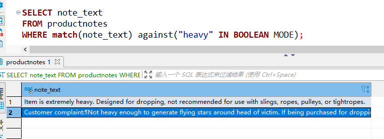
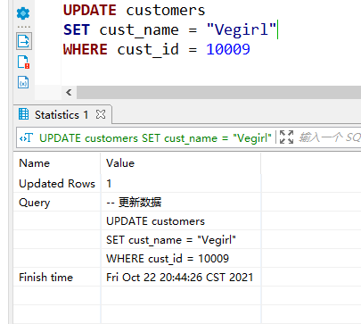

## Mysql 应掌握知识点

### 第一章： 查看数据库和表

#### 查看数据库

~~~mysql
SHOW DATABASES;
~~~

SHOW DATABASES;返回可用数据库的一个列表。包含在这个列表中的可能是MySQL内部使用的数据库（如例子中的mysql和information_schema）。

#### 使用数据库

~~~mysql
use 数据库名;
~~~

进入某个数据库中

#### 查看表

~~~mysql
show tables;
~~~

返回当前选择的数据库内可用表的列表。

#### 查看表下的所有列

~~~mysql
show columns from cities;
~~~

SHOW COLUMNS 要求给出一个表名（这个例子中的 FROM customers），它对每个字段返回一行，行中包含字段名、数据类型、是否允许NULL、键信息、默认值以及其他信息（如字段cust_id的auto_increment）。

#### 其他语法：

~~~mysql
-- 用于显示广泛的服务器状态信息
SHOW STATUS;

-- 分别用来显示创建特定的数据库或表的MYSQL语句
SHOW CREATE DATABASE;
SHOW CREATE TABLE;

-- 用来显示授予用户（所有用户或特定用户）的安全权限
SHOW GRANTS;

-- 用来显示服务器或者警告信息
SHOW ERRORS;
SHOW WARNINGS;
~~~

### 第二章： 检索语句 SELECT

`SELECT` 语句用于检索表的数据
语法格式：

~~~mysql
select xxx from 表名
~~~

#### 检索单个列表数据

~~~mysql
select 列名 from 表名;
~~~

利用 `SELECT` 语句从 cities 表中检索一个名为：`name` 的列。所需的列名在 `SELECT` 关键字之后给出， FROM 关键在指出从中检索数据的表名。

#### 检索多个列表数据

~~~mysql
select 列名1，列名2... from 表名;
~~~

通过给定的多个 列名... 进行检索

#### 检索所有列表数据

~~~mysql
select * from 表名;
~~~

如果给定一个通配符（*），则返回表中所有列。列的顺序一般是列在表定义中出现的顺序。但有时候并不是这样的，表的模式的变化（如添加或删除列）可能会导致顺序的变化。

#### 检索不同的行数据（去重）

当我们需要查看表中不同的数据，将重复的值去除的话 可以使用 `DISTINCT` 关键字。

~~~mysql
select type from cities;
~~~

上图我们发现了有许多重复的数据，这是我们不想要看到的

~~~
select distinct type from cities;
~~~

DISTINCT关键字应用于所有列而不仅是前置它的列。如果给出SELECT DISTINCT type, code，除非指定的两个列都不同，否则所有行都将被
检索出来。

#### 使用完全限定的表名

~~~mysql
select 表名.列名 from 数据库名.表名
~~~

将语法限定在只用**该数据库下的这个表中的列才能获取**

### 第三章： 排序检索数据 SELECT ... ORDER BY ...

其实，检索出来的数据并不是以纯粹的随即顺序显示的。如果不排序，数据一般将以它的底层表中出现的顺序显示。这可以是数据最初添加到表中的顺序。但是，如果数据后来进行过更新或删除，则此顺序将会受到 `MySQL` 重用回收存储空间的影响。因此，如果不明确控制的话，不能（也不应该）依赖该排序顺序。关系数据库设计理论认为，如果不明确规定排序顺序，则不应该假定检索出的数据的顺序有意义。

**子句（clause）：** SQL 语句由子句构成，有些子句是必要的，有的是可选的。一个字句通常由一个关键字和所提供的数据组成。

其中 `ORDER BY` 子句，取一个或者多个列的名字，根据列输出对应序列的排序。

#### 排序数据

~~~mysql
select 列名 from 表名 order by 表名
~~~

#### 多列排序

按不止一个列进行数据排序。

为了按多个列排序，只要指定列名，列名之间用逗号分开即可（就像选择多个列时所做的那样）。

~~~mysql
select 列名1，列名2... from 表名 order by 列名1，列名2...;
~~~

#### 按照指定顺序排序 DESC、ASC、LIMIT

DESC：使列表降序排列
ASC：使列表升序排列（默认即为升序）
LIMIT：限制显示的数量（必须位于ORDER BY之后）

~~~mysql
-- 语法
select 列名1，列名2... from 表名 order by 列名1，列名2... limit 数量;

-- 检索
select id,name,code from cities order by name desc limit 10;
~~~

### 第四章： 过滤数据 WHERE

数据库表一般包含大量的数据，很少需要检索表中所有行。通常只会根据特定操作或报告的需要提取表数据的子集。只检索所需数据需要指定搜索条件（search criteria），搜索条件也称为过滤条件（filter condition）。

> **数据根据WHERE子句中指定的搜索条件进行过滤。WHERE子句在表名（FROM子句）之后给出**

数据也可以在应用层过滤。为此目的，SQL的SELECT语句为了客户机应用检索出超过实际所需数据，然后客户机代码对返回数据进行循环，以提取出需要
的行。

通常，这种实现并不令人满意。因此，对数据库进行了优化，以便快速有效地对数据进行过滤。让客户机应用（或开发语言）处理数据库的工作将会极大地影响应用的性能，并且使所创建的应用完全不具备可伸缩性。此外，如果在客户机上过滤数据，服务器不得不通过网络发送多余的数据，这将导致网络带宽的浪费。

**在同时使用`ORDER BY`和`WHERE`子句时，应该让`ORDER BY`位于`WHERE`之后，否则将会产生错误**

| WHERE 子句操作符 | 描述 |
|-----------------|------|
| = | 等于 |
| <> | 不等于 |
| != | 不等于 |
| < | 小于 |
| <= | 小于等于 |
| > | 大于 |
| >= | 大于等于 |
| BETWEEN ... AND ... | 在指定的两个值之间 |

#### 检查单个值

~~~mysql
SELECT XXX FROM XXX WHERE 列名 操作符 值
~~~

#### 不匹配检查

~~~mysql
SELECT XXX FROM XXX WHERE 列名 <> 值
~~~

> 所查到的数据中没有了 id 为 330 的数据

如果仔细观察上述WHERE子句中使用的条件，会看到有的值括在单引号内（如前面使用的'fuses'），而有的值未括起来。单引号用来限定字符串。如果将值与串类型的列进行比较，则需要限定引号。用来与数值列进行比较的值不用引号。

#### 范围检查

查询值在某个范围内部

~~~mysql
SELECT XXX FROM XXX WHERE 列名 BETWEEN 值 AND 值;
~~~

在使用BETWEEN时，必须指定两个值——所需范围的低端值和高端值。这两个值必须用AND关键字分隔。BETWEEN匹配范围中所有的值，包括指定的开始值和结束值。

#### 空值检测

检查对应的值是否为空

> NULL 无值（no value），它与字段包含0、空字符串或仅仅包含空格不同。

~~~mysql
SELECT XXX FROM XXX WHERE 列名 IS NULL;
~~~

在通过过滤选择出不具有特定值的行时，你可能希望返回具有NULL值的行。但是，不行。因为未知具有特殊的含义，数据库不知道它们是否匹配，所以在匹配过滤或不匹配过滤时不返回它们。 

因此，在过滤数据时，一定要验证返回数据中确实给出了被过滤列具有NULL的行。

### 第五章： 数据过滤

之前所有WHERE子句在过滤数据时使用的都是单一的条件。为了进行更强的过滤控制，MySQL允许给出多个WHERE子句。这些子句可以两种方式使用：以AND子句的方式或OR子句的方式使用。

**操作符（operator）** 用来联结或改变WHERE子句中的子句的关键字。也称为**逻辑操作符（logical operator）**。

#### AND 操作符

使用 `AND` 操作符，查询出来的数据必须符合两个判断条件的要求才会显示。

还可以添加多个过滤条件，每添加一条就要使用一个AND。

~~~mysql
SELECT XXX FROM XXX WHERE 列名1 操作符 值1 AND 列名2 操作符 值2;
~~~

#### OR 操作符

检索匹配任一条件的行。

~~~mysql
SELECT XXX FROM XXX WHERE 列名1 操作符 值1 OR 列名2 操作符 值2;
~~~

只要由符合这两个过滤条件的数据都会进行展会。

#### 计算顺序

WHERE可包含任意数目的AND和OR操作符。允许两者结合以进行复杂和高级的过滤。

~~~mysql
select * from houses where id = 330 or price_num = 3600 and entire = 1;
~~~

> SQL（像多数语言一样）在处理OR操作符前，优先处理AND操作符。

解决方法：

~~~mysql
select * from houses where (id = 330 or price_num = 3600) and entire = 1;
~~~

这条SELECT语句与前一条的唯一差别是，这条语句中，前两个条件用圆括号括了起来。因为圆括号具有较AND或OR操作符高的计算次序，DBMS首先过滤圆括号内的OR条件。

> 任何时候使用具有AND和OR操作符的WHERE子句，都应该使用圆括号明确地分组操作符。不要过分依赖默认计算次序，即使它确实是你想要的东西也是如此。使用圆括号没有什么坏处，它能消除歧义。

#### IN 操作符

IN操作符用来指定条件范围，范围中的每个条件都可以进行匹配。IN取合法值的由逗号分隔的清单，全都括在圆括号中。

~~~mysql
SELECT XXX FROM XXX WHERE 列名 操作符 值 IN 列名 (xxx);
~~~

**优点：**

- 在使用长的合法选项清单时，IN操作符的语法更清楚且更直观。
- 在使用IN时，计算的次序更容易管理（因为使用的操作符更少）
- IN操作符一般比OR操作符清单执行更快。
- IN的最大优点是可以包含其他SELECT语句，使得能够更动态地建立WHERE子句。

**功能与OR相当**

#### NOT 操作符

否定它之后所跟的任何条件。

~~~mysql
SELECT XXX FROM XXX WHERE 列名 操作符 值 NOT IN 列名 (xxx);
~~~

对于简单的WHERE子句，使用NOT确实没有什么优势。但在更复杂的子句中，NOT是非常有用的。例如，在与IN操作符联合使用时，NOT使找出与条件列表不匹配的行非常简单。

### 第六章： 通配符过滤

以上的所有操作符都是针对已知值进行过滤的。不管是匹配一个还是多个值，测试大于还是小于已知值，或者检查某个范围的值，共同点是过滤中使用的值都是已知的。但是，这种过滤方法并不是任何时候都好用。

所以可以使用通配符进行过滤搜索，通配符可创建比较特定数据的搜索模式。

**通配符（wildcard）** 用来匹配值的一部分的特殊字符。

**搜索模式（search pattern）** 由字面值、通配符或两者组合构成的搜索条件。

> 通配符本身实际是SQL的WHERE子句中有特殊含义的字符
> 为在搜索子句中使用通配符，必须使用LIKE操作符。
> LIKE指示MySQL，后跟的搜索模式利用通配符匹配而不是直接相等匹配进行比较。

#### 百分号（%）通配符

最常使用的通配符是百分号（%）。在搜索串中，%表示任何字符出现任意次数。

~~~mysql
SELECT xxx FROM xxx WHERE xxx LIKE "xx%";
~~~

匹配以‘xx’开头的字段信息

通配符可在搜索模式中任意位置使用，并且可以使用多个通配符。下面的例子使用两个通配符，它们位于模式的两端：

~~~mysql
SELECT xxx FROM xxx WHERE xxx LIKE "%xx%";
~~~

表示匹配任何位置包含文本“xx”的值，而不论它之前或之后出现什么字符

通配符也可以出现在搜索模式的中间，虽然这样做不太有用：

~~~mysql
SELECT xxx FROM xxx WHERE xxx LIKE "x%x";
~~~

表示匹配在x1和x2之间包含任意是数据

> 重要的是要注意到，除了一个或多个字符外，%还能匹配0个字符。%代表搜索模式中给定位置的0个、1个或多个字符。
> 尾空格可能会干扰通配符匹配。
> 虽然似乎%通配符可以匹配任何东西，但有一个例外，即NULL。即使是WHERE prod_name LIKE '%'也不能匹配用值NULL作为产品名的行。

#### 下划线（_）通配符

下划线的用途与%一样，但下划线只匹配单个字符而不是多个字符。

~~~mysql
SELECT xxx FROM xxx WHERE xxx LIKE "x_x";
~~~

注意：（ _ ）只能匹配一个字符，使用技巧和（ % ）一样。

#### 使用技巧

- 不要过度使用通配符。如果其他操作符能达到相同的目的，应该使用其他操作符。
- 在确实需要使用通配符时，除非绝对有必要，否则不要把它们用在搜索模式的开始处。把通配符置于搜索模式的开始处，搜索起来是最慢的。
- 仔细注意通配符的位置。如果放错地方，可能不会返回想要的数据。

### 第七章： 正则表达式搜索

过滤例子允许用匹配、比较和通配操作符寻找数据。对于基本的过滤（或者甚至是某些不那么基本的过滤），这样就足够了。但随着过滤条件的复杂性的增加，WHERE子句本身的复杂性也有必要增加。

这也就是正则表达式变得有用的地方。正则表达式是用来匹配文本的特殊的串（字符集合）。

所有种类的程序设计语言、文本编辑器、操作系统等都支持正则表达式。

**使用正则匹配的关键词为：REGEXP**

#### 基本字符匹配

~~~mysql
select id,title,community from houses where id regexp 330;
~~~

类似于 LIKE 匹配。找出了所有包含了 330 的 id。

~~~mysql
select id,title,community from houses where  id regexp .0;
~~~

使用了正则表达式.0。.是正则表达式语言中一个特殊的字符。它表示匹配任意一个字符

LIKE匹配整个列。如果被匹配的文本在列值中出现，LIKE将不会找到它，相应的行也不被返回（除非使用通配符）。而REGEXP在列值内进行匹配，如果被匹配的文本在列值中出现，REGEXP将会找到它，相应的行将被返回。这是一个非常重要的差别。

#### OR 匹配

~~~mysql
select id,title,community from houses where  id regexp '1000|2000';
~~~

匹配了 id 中包含了 1000或2000 的数据，| 为正则表达式的OR操作符。它表示匹配其中之一。

#### 匹配几个字符之一

~~~mysql
select id,title,community from houses where  id regexp '[123]000';
-- 或
select id,title,community from houses where  id regexp '[1|2|3]000';
~~~

匹配特定的字符：通过指定一组用[和]括起来的字符来完成

[]是另一种形式的OR语句。事实上，正则表达式 `[123]000` 为 `[1|2|3]000` 的缩写，也可以使用后者。

#### 匹配范围

**使用-来定义一个范围**

[0-9] 匹配的范围在 0 到 9 之间的所有数字
[a-z] 匹配的范围在 a 到 z 之间的所有字符
[A-Z] 匹配的范围在 A 到 Z 之间的所有字符

~~~mysql
select id,title,community from houses where id regexp '[1-5]0000';
~~~

#### 匹配特殊字符

匹配特殊字符，必须用 `\\` 为前导。`\\`-表示查找-，`\\`.表示查找.。

| 元字符 | 描述 |
|-------|------|
| `\\f` | 换页 |
| `\\n` | 换行 |
| `\\r` | 回车 |
| `\\t` | 制表 |
| `\\v` | 纵向制表 |

~~~mysql
select id,title,community from houses where title regexp '\\·';
~~~

查询了数据中带有 · 的数据。

> 为了匹配反斜杠（\）字符本身，需要使用`\\\`
> 多数正则表达式实现使用单个反斜杠转义特殊字符，以便能使用这些字符本身。但MySQL要求两个反斜杠（MySQL自己解释一个，正则表达式库解释另一个）。

#### 匹配字符类

存在找出你自己经常使用的数字、所有字母字符或所有数字字母字符等的匹配。为更方便工作，可以使用预定义的字符集，称为字符类（character class）。

| 字符类 | 描述 |
|-------|------|
| `[:alnum:]` | 任意字母和数字（同`[a-zA-Z0-9]`） |
| `[:alpha:]` | 任意字符（同`[a-zA-Z]`） |
| `[:blank:]` | 空格和制表（同`[\\t]`） |
| `[:cntrl:]` | ASCII控制字符`（ASCII 0到31和127）` |
| `[:digit:]` | 任意数字（同`[0-9]`） |
| `[:graph:]` | 与`[:print:]`相同，但不包括空格 |
| `[:lower:]` | 任意小写字母（同`[a-z]）` |
| `[:print:]` | 任意可打印字符 |
| `[:punct:]` | 既不在`[:alnum:]`又不在`[:cntrl:]`中的任意字符 |
| `[:space:]` | 包括空格在内的任意空白字符（同`[\\f\\n\\r\\t\\v]`） |
| `[:upper:]` | 任意大写字母（同`[A-Z]`） |
| `[:xdigit:]` | 任意十六进制数字（同`[a-fA-F0-9]`） |

使用：

~~~mysql
select id,title,community from houses where title regexp '[:alnum:]';
select id,title,community from houses where description regexp '[:alpha:]';
select id,title,community from houses where title regexp '[:blank:]';
select id,title,community from houses where roomTypeID regexp '[:cntrl:]';
select id,title,community from houses where title regexp '[:digit:]';
select id,title,community from houses where title regexp '[:graph:]';
select id,title,community from houses where houseCode regexp '[:lower:]';
select id,title,community from houses where title regexp '[:print:]';
select id,title,community from houses where title regexp '[:punct:]';
select id,title,community from houses where title regexp '[:space:]';
select id,title,community from houses where roomTypeID regexp '[:upper:]';
select id,title,community from houses where title regexp '[:xdigit:]';
~~~

#### 匹配多个实例

如果存在一个匹配，该行被检索出来，如果不存在，检索不出任何行。但有时需要对匹配的数目进行更强的控制。

| 元字符 | 描述 |
|-------|------|
| * | 0个或者多个匹配 |
| + | 1个或者多个匹配（等于{1，}） |
| ? | 0个或者1个匹配（等于{0，1}） |
| {n} | 指定数目的匹配 |
| {n，} | 不少于指定数目的匹配 |
| {n，m} | 匹配数目的范围（m不超过255） |

#### 定位符

匹配特定位置的文本。

| 定位符 | 描述 |
|-------|------|
| ^ | 文本的开始 |
| $ | 文本的结束 |
| [[:<:]] | 词的开始 |
| [[:>:]] | 词的结束 |

~~~mysql
-- 查询描述中带有0-9的数字并且包含数字
select * from houses where description regexp '^[0-9\\.]'
~~~

`^[0-9\\.]` 只在.或任意数字为串中第一个字符时才匹配它们。

^有两种用法。在集合中（用[和]定义），用它来否定该集合，否则，用来指串的开始处。

`LIKE`和`REGEXP`的不同在于，`LIKE`匹配整个串而`REGEXP`匹配子串。利用定位符，通过用^开始每个表达式，用$结束每个表达式，可以使REGEXP的作用与LIKE一样。

### 第八章： 创建计算字段

#### 计算字段

存储在数据库表中的数据一般不是应用程序所需要的格式。下面举几个例子。

- 如果想在一个字段中既显示公司名，又显示公司的地址，但这两个信息一般包含在不同的表列中。
- 城市、州和邮政编码存储在不同的列中（应该这样），但邮件标签打印程序却需要把它们作为一个恰当格式的字段检索出来。
- 列数据是大小写混合的，但报表程序需要把所有数据按大写表示出来。

存储在表中的数据都不是应用程序所需要的。我们需要直接从数据库中检索出转换、计算或格式化过的数据；而不是检索出数据，然后再在客户机应用程序或报告程序中重新格式化。

**字段（field）** 基本上与`列（column）`的意思相同，经常互换使用，不过数据库列一般称为列，而术语字段通常用在计算字段的连接上。

**客户机与服务器的格式:** 可在SQL语句内完成的许多转换和格式化工作都可以直接在客户机应用程序内完成。但一般来说，在数据库服务器上完成这些操作比在客户机中完成要快得多，因为DBMS是设计来快速有效地完成这种处理的。

#### 字段拼接

**拼接（concatenate）** 将值联结到一起构成单个值。

MySQL的不同之处： 多数DBMS使用+或||来实现拼接，MySQL则使用Concat()函数来实现。当把SQL语句转换成MySQL语句时一定要把这个区别铭记在心。

~~~mysql
select concat(id,"--",title) from houses; 
~~~

**Trim函数**： MySQL除了支持RTrim()（正如刚才所见，它去掉串右边的空格），还支持LTrim()（去掉串左边的空格）以及Trim()（去掉串左右两边的空格）。

#### 使用别名

别名（alias）是一个字段或值的替换名。别名用AS关键字赋予。

~~~mysql
select concat(id,"--",title) as "房价" from houses; 
~~~

**别名的其他用途**: 别名还有其他用途。常见的用途包括在实际的表列名包含不符合规定的字符（如空格）时重新命名它，在原来的名字含混或容易误解时扩充它，等等。

#### 执行算数运算

| 运算符 | 描述 |
|--------|-----|
| + | 加 |
| - | 减 |
| * | 乘 |
| / | 除 |

~~~mysql
select price_num*`size` as "房价" from  houses;
~~~

### 第九章： 使用数据处理函数

**一般又在 where 之后的函数。**
#### 函数

与其他大多数计算机语言一样，SQL支持利用函数来处理数据。函数一般是在数据上执行的，它给数据的转换和处理提供了方便。

#### 使用函数场景

大多数SQL实现支持以下类型的函数：

- 用于处理文本串（如删除或填充值，转换值为大写或小写）的文本函数。
- 用于在数值数据上进行算术操作（如返回绝对值，进行代数运算）的数值函数。
- 用于处理日期和时间值并从这些值中提取特定成分（例如，返回两个日期之差，检查日期有效性等）的日期和时间函数。
- 返回DBMS正使用的特殊信息（如返回用户登录信息，检查版本细节）的系统函数。

#### 文本处理函数

| 函数 | 描述 |
|------|-----|
| left() | 返回字符串左边的字符 |
| length() | 返回字符串长度 |
| locate() | 找出字符串的子串 |
| lower() | 将字符串转换为小写 |
| Ltrim() | 去掉字符串左边空格 |
| Right() | 返回字符串右边的字符 |
| Rtrim() | 去掉字符串右边的空格 |
| soundex() | 返回字符串的 SOUNDEX 值 |
| substring() | 返回子串的字符 |
| upper() | 将字符串转换为大写 |

其中的 `SOUNDEX` 函数其意思为发音相似的值，当我们要获取值的时候写错了对应的值，但是发音和其类似，同样可以搜索到。

~~~mysql
select upper(houseCode) from houses where length(title) = 13;
~~~

#### 日期和时间处理函数

| 函数 | 描述 |
|------|-----|
| AddDate() | 增加一个日期（天、周等） |
| AddTime() | 增加一个时间（时、分等） |
| CurDate() | 返回当前日期 |
| CurTime() | 返回当前时间 |
| Date() | 返回日期时间的日期部分 |
| DateDiff() | 计算两个日期之差 |
| Date_Add() | 高度灵活的日期运算函数 |
| Date_Format() | 返回一个格式化的日期或者时间串 |
| Day() | 返回一个日期的天数部分 |
| DayOfWeek() | 对于一个日期，返回对应的星期几 |
| Hour() | 返回一个时间的小时部分 |
| Minute() | 返回一个时间的分钟部分 |
| Month() | 返回一个日期的月份部分 |
| Now() | 返回当前日期时间 |
| Second() | 返回一个时间的秒部分 |
| Time() | 返回一个日期时间的时间部分 |
| Year() | 返回一个日期的年份部分 |

如果要的是日期，请使用Date() 如果你想要的仅是日期，则使用Date()是一个良好的习惯，即使你知道相应的列只包含日期也是如此。这样，如果由于某种原因表中以后有日期和时间值，你的SQL代码也不用改变。当然，也存在一个Time()函数，在你只想要时间时应该使用它。 

Date()和Time()都是在MySQL 4.1.1中第一次引入的。

~~~mysql
select str_to_date('20211018154706','%Y%m%d%H%i%s');

select date_format(date('2017-04-22 15:47:06'),'%m-%Y-%d'); 
~~~

#### 数值处理函数

| 函数 | 描述 |
|------|-----|
| Abs() | 返回一个数的绝对值 |
| Cos() | 返回一个角度的余弦 |
| Exp() | 返回一个数的指数值 |
| Mod() | 返回除操作的余数 |
| Pi() | 返回圆周率 |
| Rand() | 返回一个随机数 |
| Sin() | 返回一个角度的正弦 |
| Sqrt() | 返回一个数的平方根 |
| Tan() | 返回一个角度的正切 |

这些函数一般主要用于代数、三角或几何运算，因此没有串或日期—时间处理函数的使用那么频繁。

在主要DBMS的函数中，数值函数是最一致最统一的函数。

~~~mysql
select abs(-100) as "数值";
select Cos(60) as "余弦";
select Exp(60) as "指数";
select rand()*(10-1+1)+1 as "随机数";
select Sin(60) as "正弦";
select Cos(60) as "正切";
~~~

### 第十章： 汇总数据

汇总数据而不用把它们实际检索出来，为此MySQL提供了专门的函数。使用这些函数，MySQL查询可用于检索数据，以便分析和报表生成。这种类型的检索例子有以下几种。

- 确定表中行数（或者满足某个条件或包含某个特定值的行数）。
- 获得表中行组的和。 
- 找出表列（或所有行或某些特定的行）的最大值、最小值和平均值。

因此，返回实际表数据是对时间和处理资源的一种浪费（更不用说带宽了）。重复一遍，实际想要的是汇总信息。

> 所以，Mysql 给我们提供了5个聚集函数

**聚集函数（aggregate function）**： 运行在行组上，计算和返回单个值的函数。

| 函数 | 描述 |
|------|-----|
| AVG() | 返回某列的平均值 |
| COUNT() | 返回某列的行数 |
| MAX() | 返回某列的最大值 |
| MIN() | 返回某列的最小值 |
| SUM() | 返回某列值之和 |

#### AVG() 函数

AVG()通过对表中行数计数并计算特定列值之和，求得该列的平均值。AVG()可用来返回所有列的平均值，也可以用来返回特定列或行的平均值。

~~~mysql
select avg(price_num*`size`) from houses; 
~~~

**只用于单个列**： AVG()只能用来确定特定数值列的平均值，而且列名必须作为函数参数给出。为了获得多个列的平均值，必须使用多个AVG()函数。

**NULL值**： AVG()函数忽略列值为NULL的行。

#### COUNT() 函数

COUNT()函数进行计数。可利用COUNT()确定表中行的数目或符合特定条件的行的数目。

COUNT()函数有两种使用方式：

- 使用COUNT(*)对表中行的数目进行计数，不管表列中包含的是空值（NULL）还是非空值。
- 使用COUNT(column)对特定列中具有值的行进行计数，忽略NULL值。

~~~mysql
select count(*) from houses;
~~~

> 利用COUNT(*)对所有行计数，不管行中各列有什么值。

~~~mysql
select count(entire) from houses where entire = 0;
~~~

**NULL值**: 如果指定列名，则指定列的值为空的行被COUNT()函数忽略，但如果COUNT()函数中用的是星号（*），则不忽略。

#### MAX()函数

MAX()返回指定列中的最大值。

~~~mysql
select max(`size`) from houses;
~~~

**对非数值数据使用MAX()** 虽然MAX()一般用来找出最大的数值或日期值，但MySQL允许将它用来返回任意列中的最大值，包括返回文本列中的最大值。在用于文本数据时，如果数据按相应的列排序，则MAX()返回最后一行。

**NULL值** MAX()函数忽略列值为NULL的行。

#### MIN()函数

MIN()的功能正好与MAX()功能相反，它返回指定列的最小值。

~~~mysql
select min(`size`) from houses;
~~~

**对非数值数据使用MIN()** MIN()函数与MAX()函数类似，MySQL允许将它用来返回任意列中的最小值，包括返回文本列中的最小值。在用于文本数据时，如果数据按相应的列排序，则MIN()返回最前面的行。

**NULL值** MIN()函数忽略列值为NULL的行。

#### SUM() 函数

SUM()用来返回指定列值的和（总计）

~~~mysql
select sum(`size`) from houses; 
~~~

**在多个列上进行计算**： 如本例所示，利用标准的算术操作符，所有聚集函数都可用来执行多个列上的计算

**NULL值** SUM()函数忽略列值为NULL的行

### 第十一章： 分组数据

本章将介绍如何分组数据，以便能汇总表内容的子集。这涉及两个新SELECT语句子句，分别是GROUP BY子句和HAVING子句。

#### 数据分组

目前为止的所有计算都是在表的所有数据或匹配特定的WHERE子句的数据上进行的。

分组允许把数据分为多个逻辑组，以便能对每个组进行聚集计算

#### 创建分组数据

分组是在SELECT语句的`GROUP BY`子句中建立的。

~~~mysql
select title,count(*) as production from houses group by title;
~~~

~~~mysql
select entire ,count(*) as production from houses group by entire;
~~~

将拥有相同值的数据总和到一起。

因为使用了GROUP BY，就不必指定要计算和估值的每个组了。系统会自动完成。GROUP BY子句指示MySQL分组数据，然后对每个组而不是整个结果集进行聚集。

在具体使用GROUP BY子句前，需要知道一些重要的规定。

- GROUP BY子句可以包含任意数目的列。这使得能对分组进行嵌套，为数据分组提供更细致的控制。
- 如果在GROUP BY子句中嵌套了分组，数据将在最后规定的分组上进行汇总。换句话说，在建立分组时，指定的所有列都一起计算（所以不能从个别的列取回数据）。 
- GROUP BY子句中列出的每个列都必须是检索列或有效的表达式（但不能是聚集函数）。如果在SELECT中使用表达式，则必须在GROUP BY子句中指定相同的表达式。不能使用别名。
- 除聚集计算语句外，SELECT语句中的每个列都必须在GROUP BY子句中给出。
- 如果分组列中具有NULL值，则NULL将作为一个分组返回。如果列中有多行NULL值，它们将分为一组。
- GROUP BY子句必须出现在WHERE子句之后，ORDER BY子句之前。

> **使用ROLLUP**: 使用`WITH ROLLUP`关键字，可以得到每个分组以及每个分组汇总级别（针对每个分组）的值.

~~~mysql
select entire ,count(*) as production from houses group by entire with rollup;
~~~

#### 过滤分组

除了能用GROUP BY分组数据外，MySQL还允许过滤分组，规定包括哪些分组，排除哪些分组。

**HAVING支持所有WHERE操作符** 我们学习了WHERE子句的条件（包括通配符条件和带多个操作符的子句）。所学过的有关WHERE的所有这些技术和选项都适用于HAVING。它们的句法是相同的，只是关键字有差别。

~~~mysql
select entire ,count(*) as production from houses group by entire having count(*)>5000;
~~~

**HAVING和WHERE的差别**： 这里有另一种理解方法，WHERE在数据分组前进行过滤，HAVING在数据分组后进行过滤。这是一个重要的区别，WHERE排除的行不包括在分组中。这可能会改变计算值，从而影响HAVING子句中基于这些值过滤掉的分组。

~~~mysql
select price_num,count(*) as production from houses where entire = 1 group by price_num having count(*)>100;
~~~

首先， `where` 过滤了所有 `entrie` 为 0 的数据， `group by` 将拥有相同价格的数据累加， `having` 将排列完的数据进一步的筛选

#### 分组和排序

虽然GROUP BY和ORDER BY经常完成相同的工作，但它们是非常不同的。

| ORDER BY | GROUP BY |
|----------|----------|
| 排序产生的输出 | 分组行。但输出可能不是分组的顺序 |
| 任意列都可以使用（甚至非选择的列也可以） | 只能使用选择列或表达式列，而且必须使用每个选项列表达式 |
| 不一定需要 | 如果与聚集函数一起使用（或表达式）则必须使用 |

不要忘记 `ORDER BY` 一般在使用`GROUP BY`子句时，应该也给出`ORDER BY`子句。这是保证数据正确排序的唯一方法。千万不要仅依赖`GROUP BY`排序数据。

~~~mysql
select id,title,price_num * `size` as price from houses group by id having title order by price; 
~~~

#### SELECT 子句顺序

SELECT语句中使用时必须遵循的次序，列出迄今为止所学过的子句。

SELECT子句及顺序

| 子句 | 描述 | 是否必须使用 |
|------|------|------------|
| SELECT | 要返回的列或表达式 | 是 |
| FROM | 从中检索数据的表 | 仅在从表选择数据时使用 |
| WHERE | 行级过滤 | 否 |
| GROUP BY | 分组说明 | 仅在从表选择数据时使用 |
| HAVING | 组级过滤 | 否 |
| ORDER BY | 输出顺序排序 | 否 |
| LIMIT | 要检索的行数 | 否 |

### 第十二章： 子查询

**版本要求**: MySQL 4.1引入了对子查询的支持，所以要想使用本章描述的SQL，必须使用MySQL 4.1或更高级的版本。

**查询（query）**: 任何SQL语句都是查询。但此术语一般指SELECT语句。

SQL还允许创建子查询（subquery），即嵌套在其他查询中的查询。

#### 利用子查询进行过滤

订单存储在两个表中。对于包含订单号、客户ID、订单日期的每个订单，orders表存储一行。各订单的物品存储在相关的orderitems表中。orders表不存储客户信息。它只存储客户的ID。实际的客户信息存储在customers表中。

假如需要列出订购物品TNT2的所有客户，如何检索呢

步骤如下：

(1) 检索包含物品TNT2的所有订单的编号。
(2) 检索具有前一步骤列出的订单编号的所有客户的ID。
(3) 检索前一步骤返回的所有客户ID的客户信息。

将3个查询语句合成一个。

第一条SELECT语句的含义很明确，对于prod_id为TNT2的所有订单物品，它检索其order_num列。

~~~mysql
SELECT order_num FROM orderitems WHERE prod_id = 'TNT2';
~~~

下一步，查询具有订单20005和20007的客户ID。使用 IN 子句

~~~mysql
SELECT cust_id FROM orders WHERE order_num IN (20005,20007);
~~~

现在，把第一个查询（返回订单号的那一个）变为子查询组合两个查询。

~~~mysql
SELECT cust_id FROM orders WHERE order_num IN (
	SELECT order_num FROM orderitems WHERE prod_id = "TNT2"
);
~~~

首先，它执行下面的查询：

~~~mysql
SELECT order_num FROM orderitems WHERE prod_id = 'TNT2';
~~~

此查询返回两个订单号：20005和20007。
然后，这两个值以IN操作符要求的逗号分隔的格式传递给外部查询的WHERE子句。外部查询变成：

~~~mysql
SELECT cust_id FROM orders WHERE order_num IN (20005,20007);
~~~

可以看到，输出是正确的并且与前面硬编码WHERE子句所返回的值相同。

> **格式化SQL**: 包含子查询的SELECT语句难以阅读和调试，特别是它们较为复杂时更是如此。如上所示把子查询分解为多行并且适当地进行缩进，能极大地简化子查询的使用。

现在得到了订购物品TNT2的所有客户的ID。下一步是检索这些客户ID的客户信息。

分解法：

~~~mysql
SELECT order_num FROM orderitems WHERE prod_id ="TNT2";
SELECT cust_id FROM orders WHERE order_num IN (20005,20007);
SELECT cust_name,cust_contact FROM customers WHERE cust_id IN (10001,10004);
~~~

合成后：

~~~mysql
SELECT cust_name,cust_contact FROM customers WHERE cust_id IN (
	SELECT cust_id FROM orders WHERE order_num IN (
		SELECT order_num FROM orderitems WHERE prod_id ="TNT2"	
	)
);
~~~

可见，在WHERE子句中使用子查询能够编写出功能很强并且很灵活的SQL语句。对于能嵌套的子查询的数目没有限制，不过在实际使用时由于性能的限制，不能嵌套太多的子查询。

**列必须匹配** 在WHERE子句中使用子查询（如这里所示），应该保证SELECT语句具有与WHERE子句中相同数目的列。通常，子查询将返回单个列并且与单个列匹配，但如果需要也可以使用多个列。

虽然子查询一般与IN操作符结合使用，但也可以用于测试等于（=）、不等于（<>）等。

**子查询和性能** 这里给出的代码有效并获得所需的结果。但是，使用子查询并不总是执行这种类型的数据检索的最有效的方法。

#### 作为计算字段使用子查询

使用子查询的另一方法是创建计算字段。假如需要显示customers表中每个客户的订单总数。订单与相应的客户ID存储在orders表中。

为了执行这个操作，遵循下面的步骤。

(1) 从customers表中检索客户列表。
(2) 对于检索出的每个客户，统计其在orders表中的订单数目。

Ex：
下面的代码对客户10001的订单进行计数：

~~~mysql
SELECT count(*) FROM orders WHERE cust_id = "10001";
~~~

为了对每个客户执行COUNT(\*)计算，应该将COUNT(\*)作为一个子查询。

~~~mysql
-- 筛选用户名
SELECT cust_name,cust_contact, (
	-- 筛选两表之间相同id的用户购买了多少的商品	
	SELECT count(*) FROM orders WHERE orders.cust_id = customers.cust_id 
) AS orders FROM customers ORDER BY cust_name;
~~~

**相关子查询（correlated subquery）**: 涉及外部查询的子查询。

**逐渐增加子查询来建立查询**: 用子查询测试和调试查询很有技巧性，特别是在这些语句的复杂性不断增加的情况下更是如此。用子查询建立（和测试）查询的最可靠的方法是逐渐进行，这与MySQL处理它们的方法非常相同。首先，建立和测试最内层的查询。然后，用硬编码数据建立和测试外层查询，并且仅在确认它正常后才嵌入子查询。这时，再次测试它。对于要增加的每个查询，重复这些步骤。这样做仅给构造查询增加了一点点时间，但节省了以后（找出查询为什么不正常）的大量时间，并且极大地提高了查询一开始就正常工作的可能性。

### 第十三章： 联结表

SQL最强大的功能之一就是能在数据检索查询的执行中联结（join）表。联结是利用SQL的SELECT能执行的最重要的操作。

在能够有效地使用联结前，必须了解关系表以及关系数据库设计的一些基础知识。

#### 关系表

假如有一个包含产品目录的数据库表，其中每种类别的物品占一行。对于每种物品要存储的信息包括产品描述和价格，以及生产该产品的供应商信息。

现在，假如有由同一供应商生产的多种物品，那么在何处存储供应商信息（如，供应商名、地址、联系方法等）呢？将这些数据与产品信息分开存储的理由如下。

- 因为同一供应商生产的每个产品的供应商信息都是相同的，对每个产品重复此信息既浪费时间又浪费存储空间。
- 如果供应商信息改变（例如，供应商搬家或电话号码变动），只需改动一次即可。
- 如果有重复数据（即每种产品都存储供应商信息），很难保证每次输入该数据的方式都相同。不一致的数据在报表中很难利用。

关键是，相同数据出现多次决不是一件好事，此因素是关系数据库设计的基础。

关系表的设计就是要保证把信息分解成多个表，一类数据一个表。各表通过某些常用的值（即关系设计中的关系（relational））互相关联。

在这个例子中，可建立两个表，一个存储供应商信息，另一个存储产品信息。vendors表包含所有供应商信息，每个供应商占一行，每个供应商具有唯一的标识。此标识称为主键（primary key），可以是供应商ID或任何其他唯一值。

products表只存储产品信息，它除了存储供应商ID（vendors表的主键）外不存储其他供应商信息。vendors表的主键又叫作products的外键，它将vendors表与products表关联，利用供应商ID能从vendors表中找出相应供应商的详细信息。

**外键（foreign key）** 外键为某个表中的一列，它包含另一个表的主键值，定义了两个表之间的关系。

好处：

- 供应商信息不重复，从而不浪费时间和空间；
- 如果供应商信息变动，可以只更新vendors表中的单个记录，相关表中的数据不用改动；
- 由于数据无重复，显然数据是一致的，这使得处理数据更简单。

**可伸缩性（scale）** 能够适应不断增加的工作量而不失败。设计良好的数据库或应用程序称之为可伸缩性好（scale well）。

#### 为什么使用联结

分解数据为多个表能更有效地存储，更方便地处理，并且具有更大的可伸缩性。但这些好处是有代价的。

如果数据存储在多个表中，怎样用单条SELECT语句检索出数据？

答案是使用联结。简单地说，联结是一种机制，用来在一条SELECT语句中关联表，因此称之为联结。使用特殊的语法，可以联结多个表返回一组输出，联结在运行时关联表中正确的行。

#### 创建联结（⭐）

~~~mysql
SELECT vend_name AS "供应商",prod_name AS "商品名",prod_price AS "商品价格"
FROM vendors, products
WHERE vendors.vend_id = products.vend_id 
ORDER BY vend_name,prod_name
~~~

可以看到要匹配的两个列以 vendors.vend_id 和 products. vend_id指定。这里需要这种完全限定列名，因为如果只给出vend_id， 则MySQL不知道指的是哪一个（它们有两个，每个表中一个）。

> **完全限定列名**：在引用的列可能出现二义性时，必须使用完全限定列名（用一个点分隔的表名和列名）。如果引用一个没有用表名限制的具有二义性的列名，MySQL将返回错误。

#### WHERE 语句的作用

上文我们使用 `WHERE` 关键字将两个表之间创建了联结，WHERE子句作为过滤条件，它只包含那些匹配给定条件（这里是联结条件）的行。

如果没有WHERE子句，第一个表中的每个行将与第二个表中的每个行配对，而不管它们逻辑上是否可以配在一起，会造成笛卡尔积。

**笛卡儿积（cartesian product）** 由没有联结条件的表关系返回的结果为笛卡儿积。检索出的行的数目将是第一个表中的行数乘以第二个表中的行数。

**不要忘了WHERE子句** 应该保证所有联结都有WHERE子句，否则MySQL将返回比想要的数据多得多的数据。同理，应该保证WHERE子句的正确性。不正确的过滤条件将导致MySQL返回不正确的数据。

**叉联结** 有时我们会听到返回称为叉联结（cross join）的笛卡儿积的联结类型。

#### 内部联结

**INNER JOIN（内连接,或等值连接）ON**：获取两个表中字段匹配关系的记录。

目前为止所用的联结称为等值联结（equijoin），它基于两个表之间的相等测试。这种联结也称为内部联结。其实，对于这种联结可以使用稍微不同的语法来明确指定联结的类型。

~~~mysql
SELECT vend_name AS "供应商",prod_name AS "商品名",prod_price AS "商品价格"
FROM vendors 
INNER JOIN products
ON vendors.vend_id = products.vend_id;
~~~

这里，两个表之间的关系是FROM子句的组成部分，以INNER JOIN指定。在使用这种语法时，联结条件用特定的ON子句而不是WHERE子句给出。传递给ON的实际条件与传递给WHERE的相同。

**LEFT JOIN（左连接）**：获取左表所有记录，即使右表没有对应匹配的记录。

**RIGHT JOIN（右连接）：** 与 LEFT JOIN 相反，用于获取右表所有记录，即使左表没有对应匹配的记录。

**使用哪种语法**： ANSI SQL规范首选INNER JOIN语法。此外，尽管使用WHERE子句定义联结的确比较简单，但是使用明确的联结语法能够确保不会忘记联结条件，有时候这样做也能影响性能。

#### 联结多个表

SQL对一条SELECT语句中可以联结的表的数目没有限制。
创建联结的基本规则也相同：首先列出所有表，然后定义表之间的关系。

~~~mysql
SELECT prod_name AS "商品名",vend_name AS "供应商",prod_price AS "商品价格",quantity AS "数量"
FROM products,vendors,orderitems
WHERE products.vend_id = vendors.vend_id 
AND products.prod_id = orderitems.prod_id 
AND orderitems.order_num = 20005;
~~~

这里的FROM子句列出了3个表，而WHERE子句定义了这两个联结条件，而第三个联结条件用来过滤出订单20005中的物品。

**性能考虑** MySQL在运行时关联指定的每个表以处理联结。这种处理可能是非常耗费资源的，因此应该仔细，不要联结不必要的表。联结的表越多，性能下降越厉害。

### 第十四章： 创建高级联结

别名除了用于列名和计算字段外，SQL还允许给表名起别名。这样做有两个主要理由：

- 缩短 SQL 语句
- 允许在单条SELECT语句中多次使用相同的表。

~~~mysql
SELECT cust_name,cust_contact
FROM customers c ,orders o ,orderitems o2 
WHERE c.cust_id = o.cust_id 
AND o2.order_num = o.order_num 
AND prod_id = "TNT2";
~~~

> 甚至可以将 as 省略。

应该注意，表别名只在查询执行中使用。与列别名不一样，表别名不返回到客户机。

#### 不同类型的联结

我们使用的只是称为内部联结或等值联结（equijoin）的简单联结。现在来看3种其他联结，它们分别是自联结、自然联结和外部联结。

#### 自联结

如前所述，使用表别名的主要原因之一是能在单条SELECT语句中不止一次引用相同的表。

分解：

~~~mysql
SELECT vend_id FROM products p WHERE prod_id = 'DTNTR';
SELECT prod_id,prod_name FROM products p WHERE vend_id =1003;
~~~

合并后：

~~~mysql
SELECT prod_id,prod_name FROM products WHERE vend_id =(
	SELECT vend_id FROM products WHERE prod_id = 'DTNTR'
)
~~~

这是第一种解决方案，它使用了子查询。内部的SELECT语句做了一个简单的检索，返回生产ID为DTNTR的物品供应商的vend_id。该ID用于外部查询的WHERE子句中，以便检索出这个供应商生产的所有物品

使用联结的相同查询：

~~~mysql
SELECT p1.prod_id,p1.prod_name 
FROM products p1,products p2 
WHERE p1.vend_id =p2.vend_id 
AND p2.prod_id ='DTNTR';
~~~

此查询中需要的两个表实际上是相同的表，因此products表在FROM子句中出现了两次。虽然这是完全合法的，但对products的引用具有二义性，因为MySQL不知道你引用的是products表中的哪个实例。

为解决此问题，使用了表别名。products的第一次出现为别名p1，第二次出现为别名p2。现在可以将这些别名用作表名。

**用自联结而不用子查询**： 自联结通常作为外部语句用来替代从相同表中检索数据时使用的子查询语句。虽然最终的结果是相同的，但有时候处理联结远比处理子查询快得多。应该试一下两种方法，以确定哪一种的性能更好。

#### 自然联结

无论何时对表进行联结，应该至少有一个列出现在不止一个表中（被联结的列）。标准的联结（前一章中介绍的内部联结）返回所有数据，甚至相同的列多次出现。自然联结排除多次出现，使每个列只返回一次。

怎样完成这项工作呢？答案是，系统不完成这项工作，由你自己完成它。自然联结是这样一种联结，其中你只能选择那些唯一的列。这一般是通过对表使用通配符（SELECT *），对所有其他表的列使用明确的子集来完成的。

~~~mysql
SELECT c.*,o.order_num,o.order_date,oi.prod_id,oi.quantity,oi.item_price
FROM customers c ,orders o ,orderitems oi
WHERE c.cust_id = o.cust_id 
AND oi.order_num = o.order_num 
AND prod_id = "FB";
~~~

在这个例子中，通配符只对第一个表使用。所有其他列明确列出，所以没有重复的列被检索出来。

#### 外部联结

外部联结根据情况来确定是否包含那些在相关表中没有匹配的行

语法：LEFT/RIGHT/FULL OUTER JOIN

1. 左外部联结(又叫左联结)
左表的行一定会列出，右表如果没有匹配的行，那么列值就为null。

2. 右外部联结(又叫右联结)
和左联结类似，只不过以右表为主表而已，左联结和右联结可以相互转化。

3. 全外部联结
返回左表和右表的所有行，不管有没有匹配，同时具有左联结和右联结的特性。

内连接：

~~~mysql
-- 内连接：不会检测到值为NULL的数据
SELECT customers.cust_id , orders.order_num 
FROM customers INNER JOIN orders
ON customers.cust_id = orders.cust_id;
~~~

外部联结：

~~~mysql
-- 外连接：可以检测到值为NULL的数据
SELECT customers.cust_id , orders.order_num 
FROM customers LEFT OUTER JOIN orders
ON customers.cust_id = orders.cust_id;
~~~

外部联结还包括没有关联行的行

**没有*=操作符** MySQL不支持简化字符*=和=*的使用，这两种操作符在其他DBMS中是很流行的

**外部联结的类型**： 存在两种基本的外部联结形式：左外部联结和右外部联结。它们之间的唯一差别是所关联的表的顺序不同。换句话说，左外部联结可通过颠倒FROM或WHERE子句中表的顺序转换为右外部联结。因此，两种类型的外部联结可互换使用，而究竟使用哪一种纯粹是根据方便而定。

#### 使用带聚集函数的联结

~~~mysql
SELECT customers.cust_name , customers.cust_id ,count(orders.order_num) AS num_ord
FROM customers INNER JOIN orders
ON customers.cust_id  = orders.cust_id 
GROUP BY customers.cust_id;
~~~

此SELECT语句使用INNER JOIN将customers和orders表互相关联。GROUP BY 子句按客户分组数据，因此，函数调用 COUNT (orders.order_num)对每个客户的订单计数，将它作为num_ord返回。

#### 使用联结和联结条件

使用要点：

- 注意所使用的联结类型。一般我们使用内部联结，但使用外部联结也是有效的。
- 保证使用正确的联结条件，否则将返回不正确的数据。
- 应该总是提供联结条件，否则会得出笛卡儿积。
- 在一个联结中可以包含多个表，甚至对于每个联结可以采用不同的联结类型。虽然这样做是合法的，一般也很有用，但应该在一起测试它们前，分别测试每个联结。这将使故障排除更为简单。

### 第十五章： 组合查询

多数SQL查询都只包含从一个或多个表中返回数据的单条SELECT语句。MySQL也允许执行多个查询（多条SELECT语句），并将结果作为单个查询结果集返回。这些组合查询通常称为并（union）或复合查询（compound query）。

有两种基本情况，其中需要使用组合查询：

- 在单个查询中从不同的表返回类似结构的数据；
- 对单个表执行多个查询，按单个查询返回数据。

> **组合查询和多个WHERE条件** 多数情况下，组合相同表的两个查询完成的工作与具有多个WHERE子句条件的单条查询完成的工作相同。换句话说，任何具有多个WHERE子句的SELECT语句都可以作为一个组合查询给出。

#### 创建组合查询

可用UNION操作符来组合数条SQL查询。

**使用 UNION：**

MySQL UNION 操作符语法格式：

~~~mysql
SELECT expression1, expression2, ... expression_n
FROM tables
[WHERE conditions]
UNION [ALL | DISTINCT]
SELECT expression1, expression2, ... expression_n
FROM tables
[WHERE conditions];
~~~

参数:

- expression1, expression2, ... expression_n: 要检索的列。
- tables: 要检索的数据表。
- WHERE conditions: 可选， 检索条件。
- DISTINCT: 可选，删除结果集中重复的数据。默认情况下 UNION 操作符已经删除了重复数据，所以 DISTINCT 修饰符对结果没啥影响。
- ALL: 可选，返回所有结果集，包含重复数据。
- UNION的使用很简单。所需做的只是给出每条SELECT语句，在各条语句之间放上关键字UNION。

**UNION 只会选取不同的值。请使用 UNION ALL 来选取重复的值！**

~~~mysql
SELECT vend_id,prod_id,prod_price
FROM products
WHERE prod_price <= 5;
~~~

~~~mysql
SELECT vend_id,prod_id,prod_price
FROM products
WHERE vend_id in(1001,1002)
~~~

#### UNION 使用规则

- UNION必须由两条或两条以上的SELECT语句组成,语句之间用关键字UNION分隔（因此,如果组合4条SELECT语句,将要使用3个UNION关键字）
- UNION中的每个查询必须包含相同的列、表达式或聚集函数（不过各个列不需要以相同的次序列出）
- 列数据类型必须兼容：类型不必完全相同，但必须是DBMS可以隐含地转换的类型（例如，不同的数值类型或不同的日期类型）。

> **UNION与WHERE** UNION几乎总是完成与多个WHERE条件相同的工作。UNION ALL为UNION的一种形式，它完成WHERE子句完成不了的工作。如果确实需要每个条件的匹配行全部出现（包括重复行），则必须使用UNION ALL而不是WHERE。

#### 对组合查询结果排序

~~~mysql
SELECT vend_id,prod_id,prod_price
FROM products
WHERE prod_price <= 5
UNION ALL 
SELECT vend_id,prod_id,prod_price
FROM products
WHERE vend_id in(1001,1002)
ORDER BY vend_id, prod_price;
~~~

这条UNION在最后一条SELECT语句后使用了ORDER BY子句。虽然ORDER BY子句似乎只是最后一条SELECT语句的组成部分，但实际上MySQL将用它来排序所有SELECT语句返回的所有结果。

> 注意：UNION的组合查询还可以用字不相同的表中

### 第十六章： 全文本搜索

> **引擎支持全文本搜索：** `Mysql` 支持几种基本的数据库引擎。并非所有的引擎都支持，最常用的两个是 `MyISAM` 和 `InnoDB`; 前者支持全文本支持，后者则不行。在我们创建表的时候（`productnotes表`）使用的是 `MyISAM`。

LIKE关键字，它利用通配操作符匹配文本（和部分文本）。使用LIKE，能够查找包含特殊值或部分值的行（不管这些值位于列内什么位置）。

正则篇章，用基于文本的搜索作为正则表达式匹配列值的更进一步的介绍。使用正则表达式，可以编写查找所需行的非常复杂的匹配模式。

搜索机制的限制：

- 性能——通配符和正则表达式匹配通常要求MySQL尝试匹配表中所有行（而且这些搜索极少使用表索引）。因此，由于被搜索行数不断增加，这些搜索可能非常耗时。
- 明确控制——使用通配符和正则表达式匹配，很难（而且并不总是能）明确地控制匹配什么和不匹配什么。例如，指定一个词必须匹配，一个词必须不匹配，而一个词仅在第一个词确实匹配的情况下才可以匹配或者才可以不匹配。
- 智能化的结果——虽然基于通配符和正则表达式的搜索提供了非常灵活的搜索，但它们都不能提供一种智能化的选择结果的方法。例如，一个特殊词的搜索将会返回包含该词的所有行，而不区分包含单个匹配的行和包含多个匹配的行（按照可能是更好的匹配来排列它们）。类似，一个特殊词的搜索将不会找出不包含该词但包含其他相关词的行。

所有这些限制以及更多的限制都可以用全文本搜索来解决。在使用全文本搜索时，MySQL不需要分别查看每个行，不需要分别分析和处理每个词。MySQL创建指定列中各词的一个索引，搜索可以针对这些词进行。这样，MySQL可以快速有效地决定哪些词匹配（哪些行包含它们），哪些词不匹配，它们匹配的频率，等等。

#### 使用全文本搜索

为了进行全文本搜索，必须索引被搜索的列，而且要随着数据的改变不断地重新索引。在对表列进行适当设计后，MySQL会自动进行所有的索引和重新索引。

在索引之后，SELECT可与Match()和Against()一起使用以实际执行搜索

#### 启用全文本搜索 `MATCH() AGAINST()`

一般在创建表时启用全文本搜索。CREATE TABLE语句接受FULLTEXT子句，它给出被索引列的一个逗号分隔的列表。

~~~mysql
CREATE TABLE productnotes(
  note_id    int           NOT NULL AUTO_INCREMENT,
  prod_id    char(10)      NOT NULL,
  note_date datetime       NOT NULL,
  note_text  text          NULL ,
  PRIMARY KEY(note_id),
  FULLTEXT(note_text) -- 开启全文本搜索
) ENGINE=MyISAM;
~~~

为了进行全文本搜索，MySQL根据子句FULLTEXT(note_text)的指示对它进行索引。这里的FULLTEXT索引单个列，如果需要也可以指定多个列。

在定义之后，MySQL自动维护该索引。在增加、更新或删除行时，索引随之自动更新。

> **不要在导入数据时使用FULLTEXT** 更新索引要花时间，虽然不是很多，但毕竟要花时间。如果正在导入数据到一个新表，此时不应该启用FULLTEXT索引。应该首先导入所有数据，然后再修改表，定义FULLTEXT。这样有助于更快地导入数据（而且使索引数据的总时间小于在导入每行时分别进行索引所需的总时间）。

~~~mysql
SELECT note_text
FROM productnotes
WHERE match(note_text) Against("rabbit");
~~~

此SELECT语句检索单个列note_text。由于WHERE子句，一个全文本搜索被执行。Match(note_text)指示MySQL针对指定的列进行搜索，Against('rabbit')指定词rabbit作为搜索文本。

> 使用完整的 Match() 说 明 传递给 Match() 的值必须与FULLTEXT()定义中的相同。如果指定多个列，则必须列出它们（而且次序正确）。

#### 使用扩展搜索 `WITH QUERY EXPANSION`

查询扩展用来设法放宽所返回的全文本搜索结果的范围。考虑下面的情况。你想找出所有提到anvils的注释。只有一个注释包含词anvils，但你还想找出可能与你的搜索有关的所有其他行，即使它们不包含词anvils。

这也是查询扩展的一项任务。在使用查询扩展时，MySQL对数据和索引进行两遍扫描来完成搜索：

- 首先，进行一个基本的全文本搜索，找出与搜索条件匹配的所有行；
- 其次，MySQL检查这些匹配行并选择所有有用的词（我们将会简要地解释MySQL如何断定什么有用，什么无用）。 
- 再其次，MySQL再次进行全文本搜索，这次不仅使用原来的条件，而且还使用所有有用的词。

格式：

~~~mysql
SELECT column1, column2
FROM table1
WHERE MATCH(column1,column2) 
      AGAINST('keyword',WITH QUERY EXPANSION);
~~~

~~~mysql
SELECT note_text
FROM productnotes
WHERE match(note_text) against("anvils" WITH QUERY EXPANSION);
~~~

这次返回了7行。第一行包含词anvils，因此等级最高。第二行与anvils无关，但因为它包含第一行中的两个词（customer和recommend），所以也被检索出来。第3行也包含这两个相同的词，但它们在文本中的位置更靠后且分开得更远，因此也包含这一行，但等级为第三。第三行确实也没有涉及anvils（按它们的产品名）。

正如所见，查询扩展极大地增加了返回的行数，但这样做也增加了你实际上并不想要的行的数目。

> **行越多越好：** 表中的行越多（这些行中的文本就越多），使用查询扩展返回的结果越好。

#### 布尔文本搜索 `IN BOOLEAN MODE`

MySQL支持全文本搜索的另外一种形式，称为布尔方式（boolean mode）。以布尔方式，可以提供关于如下内容的细节：

- 要匹配的词；
- 要排斥的词（如果某行包含这个词，则不返回该行，即使它包含其他指定的词也是如此）； 
- 排列提示（指定某些词比其他词更重要，更重要的词等级更高）； 
- 表达式分组；
- 另外一些内容。

> **即使没有FULLTEXT索引也可以使用：** 布尔方式不同于迄今为止使用的全文本搜索语法的地方在于，即使没有定义FULLTEXT索引，也可以使用它。但这是一种非常缓慢的操作（其性能将随着数据量的增加而降低）

~~~mysql
SELECT note_text
FROM productnotes
WHERE match(note_text) against("heavy" IN BOOLEAN MODE);
~~~

> IN BOOLEAN MODE的行为差异 虽然这个例子的结果与没有IN BOOLEAN MODE的相同，但其行为有一个重要的差别（即使在这个特殊的例子没有表现出来）。

**为了匹配包含heavy但不包含任意以rope开始的词的行:**

~~~mysql
SELECT note_text
FROM productnotes
WHERE match(note_text) against("heavy -rope*" IN BOOLEAN MODE);
~~~

**全文本布尔操作符**

| 布尔操作符 | 描述 |
|-----------|------|
| + | 包含，词必须存在 |
| - | 排除，词必须不出现 |
| > | 包含，而且增加等级值 |
| < | 包含，而且增加等级值 |
| () | 把词组成子表达式（允许这些子表达式作为一个组被包含、排除、排列等） |
| ~ | 取消一个词的排序值 |
| * | 词尾的通配符 |
| "" | 定义一个短语（与单个词的列表不一样，它匹配整个短语以便包含或排除这个短语） |

#### 全文本搜索的使用说明

- 在索引全文本数据时，短词被忽略且从索引中排除。短词定义为那些具有3个或3个以下字符的词（如果需要，这个数目可以更改）。 
- MySQL带有一个内建的非用词（stopword）列表，这些词在索引全文本数据时总是被忽略。如果需要，可以覆盖这个列表（请参阅MySQL文档以了解如何完成此工作）。 
- 许多词出现的频率很高，搜索它们没有用处（返回太多的结果）。因此，MySQL规定了一条50%规则，如果一个词出现在50%以上的行中，则将它作为一个非用词忽略。50%规则不用于IN BOOLEAN MODE。 
- 如果表中的行数少于3行，则全文本搜索不返回结果（因为每个词或者不出现，或者至少出现在50%的行中）。 
- 忽略词中的单引号。例如，don't索引为dont。 
- 不具有词分隔符（包括日语和汉语）的语言不能恰当地返回全文本搜索结果。
- 如前所述，仅在MyISAM数据库引擎中支持全文本搜索。

### 第十七章： 数据插入

`INSERT` 是用来插入（或添加）行到数据库表的。插入可以用几种方式使用：

- 插入完整的行；
- 插入行的一部分；
- 插入多行；
- 插入某些查询的结果。

#### 插入完整行

以下为向MySQL数据表插入数据通用的 INSERT INTO SQL语法：

~~~mysql
INSERT INTO table_name ( field1, field2,...fieldN )
                       VALUES
                       ( value1, value2,...valueN );
~~~

--------

~~~mysql
INSERT INTO customers 
VALUES (NULL,"Pep E. LaPew","100 Main Street","Los Angeles","CA","90046","USA",NULL,NULL);
~~~

虽然这种语法很简单，但并不安全，应该尽量避免使用。上面的SQL语句高度依赖于表中列的定义次序，并且还依赖于其次序容易获得的信息。即使可得到这种次序信息，也不能保证下一次表结构变动后各个列保持完全相同的次序。因此，编写依赖于特定列次序的SQL语句是很不安全的。如果这样做，有时难免会出问题。

~~~mysql
INSERT INTO customers(cust_id,cust_name,cust_address,cust_city,cust_state,cust_zip,cust_country,cust_contact,cust_email)
VALUES (NULL,"Pep E. LaPew","100 Main Street","Los Angeles","CA","900467","USA",NULL,NULL);
~~~

> **总是使用列的列表** 一般不要使用没有明确给出列的列表的INSERT语句。使用列的列表能使SQL代码继续发挥作用，即使表结构发生了变化。

> **仔细地给出值** 不管使用哪种INSERT语法，都必须给出VALUES的正确数目。如果不提供列名，则必须给每个表列提供一个值。如果提供列名，则必须对每个列出的列给出一个值。如果不这样，将产生一条错误消息，相应的行插入不成功。

如果表的定义允许，则可以在INSERT操作中省略某些列。省略的列必须满足以下某个条件。

- 该列定义为允许NULL值（无值或空值）。 
- 在表定义中给出默认值。这表示如果不给出值，将使用默认值。

如果对表中不允许NULL值且没有默认值的列不给出值，则MySQL将产生一条错误消息，并且相应的行插入不成功。

**提高整体性能**:数据库经常被多个客户访问，对处理什么请求以及用什么次序处理进行管理是MySQL的任务。INSERT操作可能很耗时（特别是有很多索引需要更新时），而且它可能降低等待处理的SELECT语句的性能。 

如果数据检索是最重要的（通常是这样），则你可以通过在INSERT和INTO之间添加关键字LOW_PRIORITY，指示MySQL降低INSERT语句的优先级

~~~mysql
INSERT LOW PRIORITY INTO...
~~~

#### 插入多行

~~~mysql
INSERT INTO 
customers(cust_id,cust_name,cust_address,cust_city,cust_state,cust_zip,cust_country,cust_contact,cust_email)
VALUES 
(NULL,"Pep E. LaPew","100 Main Street","Los Angeles","CA","900467","USA",NULL,NULL),
(NULL,"Pep A. LaPew","10 Main Street","Los Angeles","CA","900437","USA",NULL,NULL),
(NULL,"Pep B. LaPew","2100 Main Street","Los Angeles","CA","900457","USA",NULL,NULL)
~~~

**以其中单条INSERT语句有多组值，每组值用一对圆括号括起来，用逗号分隔。**

提高INSERT的性能:此技术可以提高数据库处理的性能，因为MySQL用单条INSERT语句处理多个插入比使用多条INSERT语句快。

#### 插入检索出的数据

INSERT一般用来给表插入一个指定列值的行。但是，INSERT还存在另一种形式，可以利用它将一条SELECT语句的结果插入表中。这就是所谓的INSERT SELECT，顾名思义，它是由一条INSERT语句和一条SELECT语句组成的。

~~~mysql
INSERT INTO custnew (
cust_id,cust_name,cust_address,cust_city,cust_state,cust_zip,cust_country
) SELECT cust_id,cust_name,cust_address,cust_city,cust_state,cust_zip,cust_country
FROM customers;
~~~

INSERT SELECT中SELECT语句可包含WHERE子句以过滤插入的数据。

### 第十八章： 更新和删除数据

#### 更新（修改）数据

更新（修改）表中的数据，使用 UPDATE 语句。

- 更新表中的特定行
- 更新表中的所有行

语法格式：

~~~mysql
UPDATE table_name SET field1=new-value1, field2=new-value2
[WHERE Clause]
~~~

> 不要省略WHERE子句 在使用UPDATE时一定要注意细心。因为稍不注意，就会更新表中所有行。

UPDATE语句非常容易使用，甚至可以说是太容易使用了。基本的UPDATE语句由3部分组成，分别是：

- 要更新的表；
- 列名和它们的新值；
- 确定要更新行的过滤条件。

~~~mysql
UPDATE customers 
SET cust_name = "Vegirl"
WHERE cust_id = 10009;
~~~

~~~mysql
UPDATE customers 
SET cust_name = "Dante",cust_email = "Sparta@gmail.com"
WHERE cust_id = 10008;
~~~

> IGNORE关键字: 如果用UPDATE语句更新多行，并且在更新这些行中的一行或多行时出一个现错误，则整个UPDATE操作被取消（错误发生前更新的所有行被恢复到它们原来的值）。为即使是发生错误，也继续进行更新，可使用IGNORE关键字，如下所示： UPDATE IGNORE customers…

#### 删除数据

为了从一个表中删除（去掉）数据，使用DELETE语句。可以两种方式使用DELETE： 

- 从表中删除特定的行；
- 从表中删除所有行。

语法格式：

~~~mysql
DELETE FROM table_name [WHERE Clause]
~~~

删除指定行：

~~~mysql
DELETE FROM customers 
WHERE cust_id =10010;
~~~

DELETE不需要列名或通配符。DELETE删除整行而不是删除列。为了删除指定的列，请使用UPDATE语句。

#### 更新和删除的指导原则

- 除非确实打算更新和删除每一行，否则绝对不要使用不带WHERE子句的UPDATE或DELETE语句。
- 保证每个表都有主键（如果忘记这个内容，请参阅第15章），尽可能像WHERE子句那样使用它（可以指定各主键、多个值或值的范围）。 
- 在对UPDATE或DELETE语句使用WHERE子句前，应该先用SELECT进行测试，保证它过滤的是正确的记录，以防编写的WHERE子句不正确。
- 使用强制实施引用完整性的数据库，这样MySQL将不允许删除具有与其他表相关联的数据的行。

> **小心使用** MySQL没有撤销（undo）按钮。应该非常小心地使用UPDATE和DELETE，否则你会发现自己更新或删除了错误的数据

### 第十九章： 创建和操纵表

#### 创建表 `CREATE TABLE`

MySQL不仅用于表数据操纵，而且还可以用来执行数据库和表的所有操作，包括表本身的创建和处理。

一般有两种创建表的方法：

- 使用具有交互式创建和管理表的工具（如第2章讨论的工具）； 
- 表也可以直接用MySQL语句操纵。

为了用程序创建表，可使用SQL的CREATE TABLE语句。

#### 表创建基础

为利用CREATE TABLE创建表，必须给出下列信息：

- 新表的名字，在关键字CREATE TABLE之后给出；
- 表列的名字和定义，用逗号分隔。

CREATE TABLE语句也可能会包括其他关键字或选项，但至少要包括表的名字和列的细节。

~~~mysql
CREATE TABLE customers(
  cust_id      int       NOT NULL AUTO_INCREMENT,
  cust_name    char(50)  NOT NULL ,
  cust_address char(50)  NULL ,
  cust_city    char(50)  NULL ,
  cust_state   char(5)   NULL ,
  cust_zip     char(10)  NULL ,
  cust_country char(50)  NULL ,
  cust_contact char(50)  NULL ,
  cust_email   char(255) NULL ,
  PRIMARY KEY (cust_id)
) ENGINE=InnoDB;
~~~

#### 使用 NULL 值

允许NULL值的列也允许在插入行时不给出该列的值。不允许NULL值的列不接受该列没有值的行，换句话说，在插入或更新行时，该列必须有值。

每个表列或者是NULL列，或者是NOT NULL列，这种状态在创建时由表的定义规定。

~~~mysql
CREATE TABLE orders(
  order_num  int      NOT NULL AUTO_INCREMENT,
  order_date datetime NOT NULL ,
  cust_id    int      NOT NULL ,
  PRIMARY KEY (order_num)
) ENGINE=InnoDB;
~~~

> 理解NULL 不要把NULL值与空串相混淆。NULL值是没有值，它不是空串。如果指定''（两个单引号，其间没有字符），这在NOT NULL列中是允许的。空串是一个有效的值，它不是无值。NULL值用关键字NULL而不是空串指定

#### 主键再介绍

正如所述，主键值必须唯一。即，表中的每个行必须具有唯一的主键值。如果主键使用单个列，则它的值必须唯一。如果使用多个列，则这些列的组合值必须唯一。

**主键可以创建时定义，也可以创建后定义。**

主键和NULL值，主键为其值唯一标识表中每个行的列。主键中只能使用不允许NULL值的列。允许NULL值的列不能作为唯一标识。

#### AUTO_INCREMENT

`AUTO_INCREMENT` 自动增长，当我们将这个定义给当前列的后，在数据添加后该数值会不断的递增。

每个表只允许一个AUTO_INCREMENT列，而且它必须被索引。

#### 指定默认值

如果在插入行时没有给出值，MySQL允许指定此时使用的默认值。默认值用CREATE TABLE语句的列定义中的DEFAULT关键字指定。

~~~mysql
CREATE TABLE `XXX`(
  `ID` INT(11) NOT NULL AUTO_INCREMENT DEFAULT
)
~~~

> **不允许函数** 与大多数DBMS不一样，MySQL不允许使用函数作为默认值，它只支持常量。
> 使用默认值而不是NULL值 许多数据库开发人员使用默认值而不是NULL列，特别是对用于计算或数据分组的列更是如此。

#### 引擎类型

MySQL有一个具体管理和处理数据的内部引擎。

在你使用CREATE TABLE语句时，该引擎具体创建表，而在你使用SELECT语句或进行其他数据库处理时，该引擎在内部处理你的请求。多数时候，此引擎都隐藏在DBMS内，不需要过多关注它。

但MySQL与其他DBMS不一样，它具有多种引擎。它打包多个引擎，这些引擎都隐藏在MySQL服务器内，全都能执行CREATE TABLE和SELECT等命令。

`ENGINE=InnDB`：事务处理引擎，它不支持全文本搜索。
`ENGINE=MEMORY`：功能相当于MyISAM，但由于数据存储再内存中，速度快（特别适合于临时表）；
`ENGINE=MyISAM`：一个性能极高的引擎，支持全文本搜索，但是不支持事务处理。

> **外键不能跨引擎** 混用引擎类型有一个大缺陷。外键（用于强制实施引用完整性）不能跨引擎，即使用一个引擎的表不能引用具有使用不同引擎的表的外键。

#### 更新表

为更新表定义，可使用ALTER TABLE语句。但是，理想状态下，当表中存储数据以后，该表就不应该再被更新。在表的设计过程中需要花费大量时间来考虑，以便后期不对该表进行大的改动。

注意点：

- 在ALTER TABLE之后给出要更改的表名（该表必须存在，否则将出错）；
- 所做更改的列表。

语法格式：

~~~mysql
-- 添加
ALTER TABLE 表名 ADD 列名 数据类型...
-- 删除
ALTER TABLE 表名 DROP 列名
-- 修改已写好的列的数据类型
ALTER TABLE 表名 MODIFY 列名 数据类型...
-- 修改将列替换
ALTER TABLE 表名 CHANGE 要替换的列 新的列名 数据类型...
-- 改默认值
ALTER TABLE 表名 ALTER 列 SET DEFAULT 新值
-- 删除默认值
ALTER TABLE 表名 ALTER 列 DROP DEFAULT
-- 修改表名
ALTER TABLE 旧表名 RENAME TO 新表名
~~~

~~~mysql
ALTER TABLE orderitems ADD CONSTRAINT fk_orderitems_orders FOREIGN KEY (order_num) REFERENCES orders (order_num);

ALTER TABLE orderitems ADD CONSTRAINT fk_orderitems_products FOREIGN KEY (prod_id) REFERENCES products (prod_id);

ALTER TABLE orders ADD CONSTRAINT fk_orders_customers FOREIGN KEY (cust_id) REFERENCES customers (cust_id);

ALTER TABLE products ADD CONSTRAINT fk_products_vendors FOREIGN KEY (vend_id) REFERENCES vendors (vend_id);
~~~

复杂的表结构更改一般需要手动删除过程，它涉及以下步骤：

- 用新的列布局创建一个新表；
- 使用INSERT SELECT语句从旧表复制数据到新表。如果有必要，可使用换函数和计算字段；
- 检验包含所需数据的新表；
- 重命名旧表（如果确定，可以删除它）； 
- 用旧表原来的名字重命名新表；
- 根据需要，重新创建触发器、存储过程、索引和外键。

> **小心使用ALTER TABLE** 使用ALTER TABLE要极为小心，应该在进行改动前做一个完整的备份（模式和数据的备份）。数据库表的更改不能撤销，如果增加了不需要的列，可能不能删除它们。类似地，如果删除了不应该删除的列，可能会丢失该列中的所有数据。

#### 删除表

使用DROP TABLE语句即可:

~~~mysql
GROP TABLE xxx;
~~~

> 注意：这是永久删除

#### 重命名表

~~~mysql
RENAME TABLE old_table_name TO new_table_name;
~~~

### 第二十章： Mysql 视图

视图是虚拟的表。与包含数据的表不一样，视图只包含使用时动态检索数据的查询。

下面是视图的一些常见应用。

- 重用SQL语句。
- 简化复杂的SQL操作。在编写查询后，可以方便地重用它而不必知道它的基本查询细节。
- 使用表的组成部分而不是整个表。
- 保护数据。可以给用户授予表的特定部分的访问权限而不是整个表的访问权限。
- 更改数据格式和表示。视图可返回与底层表的表示和格式不同的数据。

在视图创建之后，可以用与表基本相同的方式利用它们。可以对视图执行SELECT操作，过滤和排序数据，将视图联结到其他视图或表，甚至能添加和更新数据（添加和更新数据存在某些限制。）

重要的是知道视图仅仅是用来查看存储在别处的数据的一种设施。视图本身不包含数据，因此它们返回的数据是从其他表中检索出来的。在添加或更改这些表中的数据时，视图将返回改变过的数据。

#### 规则和限制

下面是关于视图创建和使用的一些最常见的规则和限制。

- 与表一样，视图必须唯一命名（不能给视图取与别的视图或表相同的名字）。 
- 对于可以创建的视图数目没有限制。
- 为了创建视图，必须具有足够的访问权限。这些限制通常由数据库管理人员授予。
- 视图可以嵌套，即可以利用从其他视图中检索数据的查询来构造一个视图。
- ORDER BY可以用在视图中，但如果从该视图检索数据SELECT中也含有ORDER BY，那么该视图中的ORDER BY将被覆盖。
- 视图不能索引，也不能有关联的触发器或默认值。
- 视图可以和表一起使用。例如，编写一条联结表和视图的SELECT语句。

#### 使用

- 视图用`CREATE VIEW 视图名 AS SELECT xxx FROM 表`语句来创建。
- 使用SHOW CREATE VIEW viewname；来查看创建视图的语句。
- 用DROP删除视图，其语法为DROP VIEW viewname;。 
- 更新视图时，可以先用DROP再用CREATE，也可以直接用CREATE OR REPLACE VIEW。如果要更新的视图不存在，则第2条更新语句会创建一个视图；如果要更新的视图存在，则第2条更新语句会替换原有视图。

#### 利用视图简化复杂的联结

视图的最常见的应用之一是隐藏复杂的SQL，这通常都会涉及联结。

~~~mysql
CREATE VIEW productcustomers AS
SELECT cust_name,cust_contact,prod_id
FROM customers c, orders o,orderitems oi
WHERE c.cust_id = o.cust_id 
AND oi.order_num = o.order_num;
~~~

~~~mysql
SHOW CREATE VIEW productcustomers;
~~~

CREATE VIEW 中的内容：

~~~mysql
CREATE 
ALGORITHM=UNDEFINED 
DEFINER=`root`@`localhost` 
SQL SECURITY DEFINER VIEW `productcustomers` 
AS select `c`.`cust_name` 
AS `cust_name`,`c`.`cust_contact` 
AS `cust_contact`,`oi`.`prod_id` 
AS `prod_id` 
from ((`customers` `c` join `orders` `o`) join `orderitems` `oi`) 
where ((`c`.`cust_id` = `o`.`cust_id`) 
and (`oi`.`order_num` = `o`.`order_num`))
~~~

> 创建可重用的视图 创建不受特定数据限制的视图是一种好办法。扩展视图的范围不仅使得它能被重用，而且甚至更有用。这样做不需要创建和维护多个类似视图。

#### 用视图重新格式化检索出的数据

~~~mysql
SELECT concat(rtrim(vend_name),"(",rtrim(vend_country),")")
AS vend_title
FROM vendors v
ORDER BY vend_name;
~~~

现在，假如经常需要这个格式的结果。不必在每次需要时执行联结，创建一个视图，每次需要时使用它即可。

~~~mysql
CREATE VIEW vendorlocations AS
SELECT concat(rtrim(vend_name),"(",rtrim(vend_country),")")
AS vend_title
FROM vendors v
ORDER BY vend_name;
~~~

过滤视图添加 WHERE 关键字进行判断

#### 更新视图

视图是可更新的（即，可以对它们使用INSERT、UPDATE和DELETE）。更新一个视图将更新其基表（可以回忆一下，视图本身没有数据）。如果你对视图增加或删除行，实际上是对其基表增加或删除行。

如果视图定义中有以下操作，则不能进行视图的更新：

- 分组（使用GROUP BY和HAVING）；
- 联结；
- 子查询；
- 并；
- 聚集函数（Min()、Count()、Sum()等）；
- DISTINCT； 
- 导出（计算）列

> **将视图用于检索** 一般，应该将视图用于检索（SELECT语句）而不用于更新（INSERT、UPDATE和DELETE）。

### 第二十一章： Mysql 存储过程

存储过程和函数是  事先经过编译并存储在数据库中的一段 SQL 语句的集合，调用存储过程和函数可以简化应用开发人员的很多工作，减少数据在数据库和应用服务器之间的传输，对于提高数据处理的效率是有好处的。	

​	 存储过程和函数的区别在于函数必须有返回值，而存储过程没有。

​	 函数 ： 是一个有返回值的过程；

​	 过程 ： 是一个没有返回值的函数；

简单的来说就是为了以后的使用而保存的一条或多条Mysql语句的集合。

#### 为什么使用存储过程

- 通过把处理封装在容易使用的单元中，简化复杂的操作（正如前面例子所述）。 
- 由于不要求反复建立一系列处理步骤，这保证了数据的完整性。如果所有开发人员和应用程序都使用同一（试验和测试）存储过程，则所使用的代码都是相同的。
这一点的延伸就是防止错误。需要执行的步骤越多，出错的可能性就越大。防止错误保证了数据的一致性。
- 简化对变动的管理。如果表名、列名或业务逻辑（或别的内容）有变化，只需要更改存储过程的代码。使用它的人员甚至不需要知道这些变化。
这一点的延伸就是安全性。通过存储过程限制对基础数据的访问减少了数据讹误（无意识的或别的原因所导致的数据讹误）的机会。
- 提高性能。因为使用存储过程比使用单独的SQL语句要快。
- 存在一些只能用在单个请求中的MySQL元素和特性，存储过程可以使用它们来编写功能更强更灵活的代码。

总结就是：简单、安全、高性能。

不过在将SQL代码转换为存储过程前，也必须知道其的缺陷：

- 一般来说，存储过程的编写比基本SQL语句复杂，编写存储过程需要更高的技能，更丰富的经验。
- 你可能没有创建存储过程的安全访问权限。许多数据库管理员限制存储过程的创建权限，允许用户使用存储过程，但不允许他们创建存储过程。

> Mysql将编写存储过程的安全和访问与执行存储过程的安全和访问区分开了。这样你不能（或不想）编写自己的存储过程，也仍然可以在适当的时候执行别的存储过程。

#### 创建存储过程

**语法格式：**

~~~mysql
CREATE
    [DEFINER = { user | CURRENT_USER }]
　PROCEDURE sp_name ([proc_parameter[,...]])
    [characteristic ...] routine_body
 
proc_parameter:
    [ IN | OUT | INOUT ] param_name type
 
characteristic:
    COMMENT 'string'
  | LANGUAGE SQL
  | [NOT] DETERMINISTIC
  | { CONTAINS SQL | NO SQL | READS SQL DATA | MODIFIES SQL DATA }
  | SQL SECURITY { DEFINER | INVOKER }
 
routine_body:
　　Valid SQL routine statement
 
[begin_label:] BEGIN
　　[statement_list]
　　　　……
END [end_label]
~~~

- IN 输入参数：表示调用者向过程传入值（传入值可以是字面量或变量）
- OUT 输出参数：表示过程向调用者传出值(可以返回多个值)（传出值只能是变量）
- INOUT 输入输出参数：既表示调用者向过程传入值，又表示过程向调用者传出值（值只能是变量）

**声明语句结束符：**

~~~mysql
DELIMITER $$
或
DELIMITER //
~~~

**声明存储过程：**

~~~mysql
CREATE PROCEDURE demo_in_parameter(IN p_in int)  
~~~

**存储过程开始和结束符号：** -- 可嵌套多个

> 每个嵌套块及其中的每条语句，必须以分号结束，表示过程体结束的begin-end块(又叫做复合语句compound statement)，则不需要分号。

~~~mysql
BEGIN .... END
~~~

为语句块贴标签：

~~~mysql
[begin_label:] BEGIN
　　[statement_list]
END [end_label]
~~~

**变量赋值：**

~~~mysql
SET @p_in=1
~~~

**变量定义：**

~~~mysql
-- Declere 变量名 数据类型...
DECLARE l_int int unsigned default 4000000; 
~~~

**创建Mysql存储过程、存储函数：**

~~~mysql
CREATE PROCEDURE 存储过程名（参数）
~~~

**存储过程体：**

~~~mysql
CREATE FUNCTION 存储函数名（参数）
~~~

#### 删除存储函数

语法格式：

~~~mysql
DROP PROCEDURE xxx;
~~~

> 如果指定的过程不存在，则`Drop Procedure` 将产生一个错误。当过程存在则删除。可以使用`Drop Procedure If Exists`

#### 使用参数

变量（variable）内存中一个特定的位置，用来临时存储数据。

~~~mysql
DROP PROCEDURE IF EXISTS mysql_scirpt.productpricing;
DELIMITER \\
CREATE PROCEDURE `productpricing`(
	OUT pl Decimal(8,2),
	OUT ph Decimal(8,2),
	OUT pa Decimal(8,2)
)
BEGIN
	SELECT Min(prod_price)
	INTO pl
	FROM products;
	SELECT Max(prod_price)
	INTO ph
	FROM products;
	SELECT Avg(prod_price)
	INTO pa
	FROM products;
END

DELIMITER ;
~~~

此存储过程接受3个参数：pl存储产品最低价格，ph存储产品最高价格，pa存储产品平均价格。每个参数必须具有指定的类型，这里使用十进制值。关键字OUT指出相应的参数用来从存储过程传出一个值（返回给调用者）。MySQL支持IN（传递给存储过程）、OUT（从存储过程传出，如这里所用）和INOUT（对存储过程传入和传出）类型的参数。存储过程的代码位于BEGIN和END语句内，如前所见，它们是一系列SELECT语句，用来检索值，然后保存到相应的变量（通过指定INTO关键字）。

> 参数的数据类型：存储过程的参数允许的数据类型和表中使用的数据类型相同。

~~~mysql
{ CALL mysql_scirpt.productpricing(?,?,?) }
~~~

这是生成后的SQL文件。

> 变量名：所有的Mysql变量都必须以 @ 开始。

在调用时，这条语句并不显示是任何数据。它返回以后可以显示（或在其他处理中使用）的变量。

#### 建立只能存储过程

考虑这个场景。你需要获得与以前一样的订单合计，但需要对合计增加营业税，不过只针对某些顾客（或许是你所在州中那些顾客）。那么，你需要做下面几件事情：

- 获得合计（与以前一样）；
- 把营业税有条件地添加到合计；
- 返回合计（带或不带税）。

