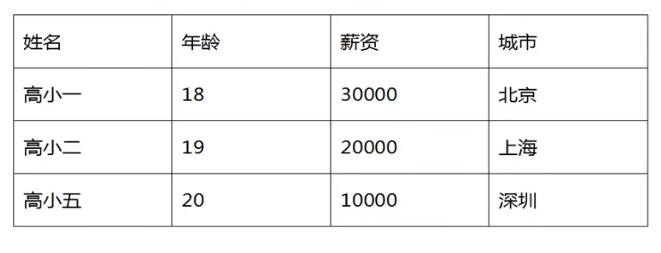
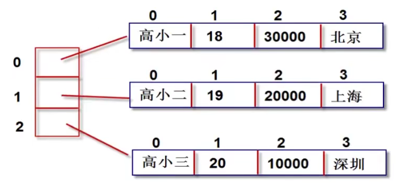
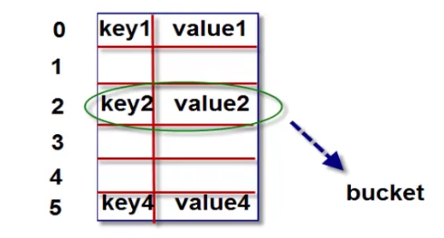
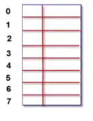
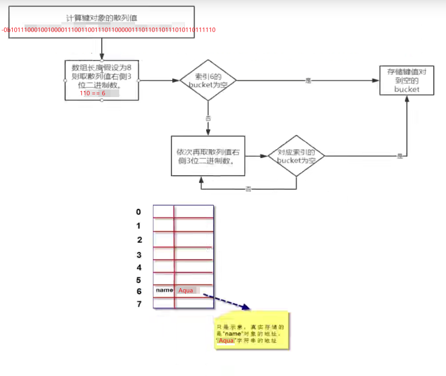
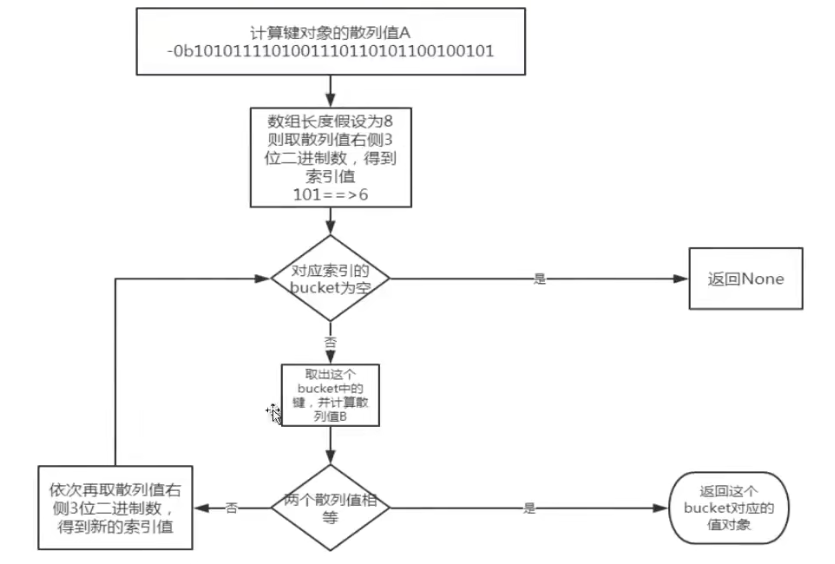

## day04 - Python 序列

一种存储方式，用来存储一系列的数据。

在内存中，粗劣就是一块用来存放多个值的连续内存空间。比如一个整数学列 [10,20,30,40] ：


存储方式：

```python
list = [10,20,30,40]
```

序列有：字符串，列表，元组，字典，集合


### 列表（code：01.list.py）

用于存储任意数量、任意类型的数据集合

列表是内置可变序列，任何包含多干元素的有序连续的内存空间。列表定义的标准语法格式：

```python
list = [1，2，3，4，5，6]
```

其中 1，2，3，4，5，6 称之为，list 的元素。

并且列表的元素可以为不同类型的

**列表的常用方法**：

| **序号** | **函数**                                           | **描述**                                                               |
| -------- | -------------------------------------------------- | ---------------------------------------------------------------------- |
| **1**    | **list.append(self,p_object)**                     | **给列表后面追加新的对象**                                             |
| **2**    | **list.clear(self)**                               | **清空列表中的元素**                                                   |
| **3**    | **list.copy(self)**                                | **浅复制列表**                                                         |
| **4**    | **list.count(self,value)**                         | **统计某个元素在列表中出现的次数**                                     |
| **5**    | **list.extend(self,iterable)**                     | **在列表末尾一次性追加另一个序列中的多个值（用新列表扩展原来的列表）** |
| **6**    | **list.index(self, value, start=None, stop=None)** | **从列表中找出某个值第一个匹配项的索引位置**                           |
| **7**    | **list.insert(self,index,start=None,stop=None)**   | **将对象插入列表**                                                     |
| **8**    | **list.pop(self,index=None)**                      | **移除列表中的一个元素（默认最后一个），并返回该元素的值**             |
| **9**    | **list.remove(self,value)**                        | **移除列表中某个值的第一个匹配项，从左找到第一个指定元素**             |
| **10**   | **list.reverse(self,value)**                       | **反向列表中的元素**                                                   |
| **11**   | **list.sort(self,key=None,reverse=False)**         | **对原列表进行排序**                                                   |
| **12**   | **len(list)**                                      | **返回列表中包含元素个数**                                             |

`Python` 的列表大小可变，根据需求增加或减少

#### 列表创建

1. 字面量创建

```python
list = [1,2,3,4,5,true,false,"string"]
```

2. 使用 list( ) 创建

使用 list（） 可以将任何可迭代的数据转化为列表

```python
list = list()  # []
list = list(range(10))  # [0, 1, 2, 3, 4, 5, 6, 7, 8, 9]
list = list("full stack")  # ['f', 'u', 'l', 'l', ' ', 's', 't', 'a', 'c', 'k']
print(list)
```

3. 使用 range() 创建整数序列

range（） 可以创建出证书列表，语法格式为：range（[start],end[,step]）;

start 参数：可选，表示起始数字。默认为 0
end 参数：必选，表示结尾数字。
step 参数：可选，表示步长，默认为 1

`Python` 中 range() 返回的是一个 range 对象，而不是列表。我们通过 list()
方法将其转换为列表对象。

```python
num1 = list(range(3, 15, 2))
num2 = list(range(15, 20, 2))
num3 = list(range(15, 3, -2))
num4 = list(range(20, 15, -1))
print(num1)  # [3, 5, 7, 9, 11, 13]
print(num2)  # [15, 17, 19]
print(num3)  # [15, 13, 11, 9, 7, 5]
print(num4)  # [20, 19, 18, 17, 16]
```

4. 推导式生成列表

通过使用 for 循环和 if 语句进行创建所需的列表

```python
a1 = [x * 2 for x in range(5)]
a2 = [x * 2 for x in range(100) if x % 9 == 0]
print(a1)  # [0, 2, 4, 6, 8]
print(a2)  # [0, 18, 36, 54, 72, 90, 108, 126, 144, 162, 180, 198]
```

#### 列表添加

1. append() 方法
   原地修改列表对象，是真正的列表尾部添加新元素，速度快。

```python
add1 = [1, 2, 3]
add1.append(4)
print(add1) # [1, 2, 3, 4]
```

2. +号运算符
   并不是真正的尾部添加，而是创建新的列表对象；将原列表的元素和 i 性能列表的有还俗一次复制到新的列表中。
   这样会设计大量的复制操作，对于擦欧总大量元素时不建议。

```python
add2 = [1, 2, 3, 4]
add2 = add2 + [5]  # [1, 2, 3, 4, 5]
print(add2)
```

注：add2 的变量产生了新的地址

3. extend() 方法
   安静目标列表的所有元素添加到本列表的尾部，处于原地操作，不创建新的列表对象。

```python
add3 = [5, 6, 7]
add3.extend([1, 2, 3])  # [5, 6, 7, 1, 2, 3]
print(add3)
```

4. insert() 插入元素
   可以将指定元素插入到列表对象的任意指定位置。这样会让插入位置后面的所有元素进行移动，会影响速度。

语法: insert（索引，要插入的值）

```python
add4 = [1, 2, 3, 4]
add4.insert(2, 100)
print(add4)  # [1, 2, 100, 3, 4]
```

5. 乘法扩展
   会生成一个新的列表，新列表元素是原列表元素的多次重复

```python
add5 = ["ss", 6]
add6 = add5 * 3
print(add6)  # ['ss', 6, 'ss', 6, 'ss', 6]
```

#### 列表删除

1. del[索引] 删除
   删除列表指定位置的元素

```python
del1 = [10, 20, 30, 40, 50]
del del1[1]
print(del1)  # [10, 30, 40, 50]
```

注：当删除中间的元素时，删除的当前元素后面所有元素都会往前进一个内存位置

2. pop(索引) 方法
   pop()删除并返回指定位置元素，如果未指定位置则默认操作列表最后一个元素

```python
del2 = [10, 20, 30, 40, 50, 60]
a = del2.pop()
print(del2, a)  # [10, 20, 30, 40, 50]  60
b = del2.pop(0)
print(del2, b)  # [20, 30, 40, 50]  10
```

3. remove(值) 方法
   删除首次出现的指定元素，若不存在该元素则抛出异常

```python
del3 = [1, 2, 3, 4, 5, 6, 7, 8, 9, 0]
del3.remove(0)
print(del3)  # [1, 2, 3, 4, 5, 6, 7, 8, 9]
print(del3.remove(100))  # 报错
```

#### 列表访问

1. 通过索引直接访问
   通过索引直接访问元素。元素的区间在[0,列表长度-1]的范围。超过则抛出异常，返回当前访问值

```python
visit1 = [1, 2, 3, 4, 5, 6, 7, 8, 9, 0]
print(visit1[0])  # 1
```

2. index() 获取指定元素在列表首次出现的索引
   通过 index() 可以获取指定元素首次出现的索引位置。
   语法： index(value,[start,[end]])。
   返回索引值。

```python
visit2 = ["sss", "a", "b", "c"]
print(visit2.index("sss"))  # 0
print(visit2.index("b", 2))  # 2
```

#### 元素出现次数

1. count() 获取指定元素在列表中出现的次数
   返回指定元素在列表中出现的次数

```python
total1 = [1, 1, 2, 23, 43, 5, 6576, 65, 5, 5, 7, 98, 9]
print(total1.count(1))  # 2
```

2. len() 返回列表长度
   返回指定列表中包含的元素个数

```python
total1 = [1, 1, 2, 23, 43, 5, 6576, 65, 5, 5, 7, 98, 9]
print(len(total1))
```

3. 成员资格判断
   判断列表中是否存在指定的元素，通过 in 关键字及逆行判断。
   直接返回 True 和 False

```python
total1 = [11, 2, 2, 3, 44, 55, 66, 77, 88]
print(20 in total1)  # False
print(44 in total1)  # True
```

#### 列表切片

切片 通过 slice 操作可以快速的提取子列表或修改
语法格式：[起始偏移量 start：种植偏移量 end：[步长 step]]

操作说明：

```python
# 提取整个列表
s = [10, 20, 30, 40, 50, 60, 70]
print(s[:])  # [10, 20, 30, 40, 50, 60, 70]

# [start:] 从 start 索引开始到结尾
print(s[1:])  # [20, 30, 40, 50, 60, 70]

# [:end] 从头开始直到 end-1
print(s[:4])  # [10, 20, 30, 40]

# [start:end] 从 start 到 end-1
print(s[0:5])  # [10, 20, 30, 40, 50]

# [start:end:step] 从 start 提取到 end-1，步长为step
print(s[1:6:2])  # [20, 40, 60]
```

操作（量为负数）时：

```python
y = [10, 20, 30, 40, 50, 60, 70]

# 倒数三位数
print(y[-3:])  # [50, 60, 70]

# 倒数第五到倒数第三
print(y[-5:-3])  # [30, 40]

# 步长为负，从右到左依次提取
print(y[::-1])  # [70, 60, 50, 40, 30, 20, 10]
```

#### 列表排序

**不通过创建新的列表进行排序的方法：**

1. sort() 排序
   默认是为升序排列，通过 sort(reverse=True)进行降序排列

```python
lie = [100, 20, 32, 543, 32, 1, 0]
# 升序
lie.sort()
print(lie)  # [0, 1, 20, 32, 32, 100, 543]
# 降序
lie.sort(reverse=True)
print(lie)  # [543, 100, 32, 32, 20, 1, 0]
```

2. 随机排序
   通过导入随机数 random ,在使用 shuffle(列表) 即可

```python
import random

lie = [100, 20, 32, 543, 32, 1, 0]
# 每次执行结果都是随机的
random.shuffle(lie)
print(lie)  # [0, 543, 100, 20, 32, 1, 32]
```

**通过创建新的列表进行排序的方法：**

1. sorted() 排序
   返回一个新的列表，不对原列表及逆行修改。默认升序同 sort

```python
lie2 = [100, 23, 432, 54, 213, 76, 0, 4, 66, 76]
# 升序
lie3 = sorted(lie2)
print(lie3)  # [0, 4, 23, 54, 66, 76, 76, 100, 213, 432]
# 降序
lie3 = sorted(lie2, reverse=True)
print(lie3)  # [432, 213, 100, 76, 76, 66, 54, 23, 4, 0]
```

2. reversed() 返回迭代器
   此函数支持逆序排列，与列表对象 reverse() 不同，其不对原列表进行任何修改，只是返回一个逆序排列的迭代器对象

```python
lie4 = [20, 10, 30, 50, 40]
lie5 = reversed(lie4)
print(lie5)  # <list_reverseiterator object at 0x00000184C1E20508>
# 通过lise进行转换
print(list(lie5))  # [40, 50, 30, 10, 20]
# 第二次即为空
print(list(lie5))  # []
```

迭代器是一种对象，它能够用来遍历标准模板库容器中的部分或全部元素，每个迭代器对象代表容器中的确定的地址。迭代器修改了常规指针的接口，所谓迭代器是一种概念上的抽象：那些行为上像迭代器的东西都可以叫做迭代器。然而迭代器有很多不同的能力，它可以把抽象容器和通用算法有机的统一起来。

#### 列表其他内置函数汇总

1. max 与 min
   返回列表中的最大值和最小值

```python
lie6 = [10, 40, 90, 30, 44, 70]
print(max(lie6))  # 90
print(min(lie6))  # 10
```

2. sum
   对数值列表的所有元素进行求和操作，对非数值列表运算则会报错

```python
lie7 = [1, 6, 2, 4, 9, 4, 4, 87]
print(sum(lie7))  # 117
```

#### 多维列表

所谓的多维数组就是在数组中嵌套数组，用于更加方便的存储数据。

**二维数组**



```python
info = [
  ["高小一",18,30000,"北京"],
  ["高小2",19,20000,"上海"],
  ["高小5",20,10000,"深圳"],
]
print(info)
```



获取对应的多维数组元素:

```python
# 第一个中括号代表着所选的最外层数组的索引
# 第二个中括号代表所选的在该索引处的数组中的元素
print(info[0][1])  # 18
```

### 元组（code：02.tuple.py）

列表属于课表序列，可以任意修改列表中的元素。

但是元组属于不可变序列，不能修改元组中的元素。因此元组没有增、删、改等相关方法。

只支持一下操作：
1. 索引访问
2. 切片操作
3. 连接操作
4. 成员关系操作
5. 比较远算操作
6. 计数：元组长度len()、最大值max()、最小值min()、求和sum()等

#### 元组的创建

1. 通过 “()” 创建元组，小括号也可以省略

~~~python
tuple1 = (1,2,3,4,5)
tuple2 = 1,2,3,4,5,6
print(tuple1,tuple2) # (1, 2, 3, 4, 5) (1, 2, 3, 4, 5, 6)
~~~

如果元组只用一个元素，则必须后面加都好。因为解释器会把 (1) 解释为整数1，(1,) 则解释为元组 

~~~python
tuple3 = 123,
print(tuple3)  # (123,)
~~~

2. 通过 tuple() 创建元组
   tuple 可迭代的对象

~~~python
tuple4 = tuple()
tuple5 = tuple("!23")
tuple6 = tuple(range(4))
tuple7 = tuple([2,3,4,5])
print(tuple4)  # ()
print(tuple5)  # ('!', '2', '3')
print(tuple6)  # (0, 1, 2, 3)
print(tuple7)  # (2, 3, 4, 5)
~~~

总结：
tuple() 可以接受列表、字符串、其他序列类型、迭代器等生成元组。
list() 可以接受列表、字符串、其他序列类型、迭代器等生成列表。

#### 元组的访问

1. 通过索引访问

~~~python
visit1 = tuple("abcdefg")
print(visit1[0]) # 
~~~

2. sorted() 元组的排序

~~~python
visit2 = tuple([10,30,40,21,12,87,90])
sorted(visit2)
print(visit2)  # (10, 30, 40, 21, 12, 87, 90)
~~~

#### Zip

zip(列表1.列表2...)将多个列表对应位置的元素组合成为元组，并返回一个zip对象。

```python
first = [1,2,3]
second = [4,5,6]
third = [7,8,9]
last = zip(first,second,third)
print(last) # <zip object at 0x000001C1FB4CDD88>
print(list(last))  # [(1, 4, 7), (2, 5, 8), (3, 6, 9)]
```

#### 生成器推导式创建元组

生成器推导式与列表推导式类似，只是生成器推导式包括小括号。列表推导式直接生成列表对象，生成器推导式的不是列表也不是元组，而是一个生成器对象。

通过生成器对象，转化成列表或者元组。也可以使用生成器对象的 __next__() 方法及进行遍历，或直接作为迭代器对象使用。

不管什么方式使用，元素范文结束后，如需重新访问其中的元素，必须重新创建生成器对象。


~~~python
s = (x*2 for x in range(5))

print(s.__next__())  # 0
print(s.__next__())  # 2
print(s.__next__())  # 4
~~~


#### 总结

1. 元组的核心特点：不可变序列
2. 元组的访问和处理速度比列表快
3. 与整数和字符串一样，元组可以作为字典的键，列表则永远不能作为字典的键使用。

### 字典（code：03.dictionary.py）

字典是 “键值对” 的无序可变序列，字典中的每个元素都是一个 “键值对” 。包含了：“键对象” 和 “值对象”。

通过 “键对象” 实现快速获取、删除、更新对应的 “值对象”

“键” 是任意的不可变数据，如：整数、浮点数、字符串、元组。

但是：列表、字典、集合这些可变对象不能作为 “键”。并且 “键” 不可重复

Ex：

~~~python
dic = {
  "name":"sue",
  "age":21,
  "gender":"male"
}
print(dic) # {'name': 'sue', 'age': 21, 'gender': 'male'}
~~~

#### 字典的创建

1. 使用 {} 创建
   字面量创建字典

~~~python
dic = {
  "name":"sue",
  "age":21,
  "gender":"male"
}
~~~

2. 使用 dict() 创建

~~~python
dic1 = dict(name="hhh",age=22)
print(dic1)
~~~

3. 使用 zip() 创建

~~~python
a = ["name","age","gender"]
b = ["zyc",21,"student"]
dic3 = dict(zip(a,b))
print(dic3)  # {'name': 'zyc', 'age': 21, 'gender': 'student'}
~~~

4. 通过 fromkeys 创建值为空的字典

~~~python
dic4 = dic.fromkeys(["name","age","job"])
print(dic4)  # {'name': None, 'age': None, 'job': None}
~~~

#### 字典的访问

1. 通过 [键] 获取 “值” 。若键不存在，则抛出异常

~~~python
getDic1 = dict(name="sue",age=26,job="programmer")
print(getDic1["name"])  # sue
# print(getDic1["gender"]) # 报错
~~~

2. 通过 get() 获取 “值”
   推荐使用。
   优点：指定键不存在，返回None
   也可以设定指定键不存在时默认返回的对象，

~~~python
print(getDic1.get("name"))  # sue
print(getDic1.get("gender", "male"))  # male
~~~

3. items() 列出所有的键值对

~~~python
print(getDic1.items()) 
# dict_items([('name', 'sue'), ('age', 26), ('job', 'programmer')])
~~~

4. keys() 获取所有的键

~~~python
print(getDic1.keys())  # dict_keys(['name', 'age', 'job'])
~~~

5. values() 获取所有的值

~~~python
print(getDic1.values())  # dict_values(['sue', 26, 'programmer'])
~~~

6. len() 获取键值对的个数

~~~python
print(len(getDic1))  # 3
~~~

6. in 检查一个 “键” 是否在字典中

~~~python
print("name" in getDic1)  # True
print("gender" in getDic1)  # False
~~~

#### 字典的添加

1. 通过键 = 值的方式进行添加
   如果键存在，则会将旧的值进行覆盖；如果不存在则添加

~~~python
addDic1 = {
  "name":"jyc",
  "age":21,
  "gender":"famale",
  "job":"student"
}
addDic1["age"]=22;
addDic1["address"] = "上海市xxx"
print(
    addDic1
)  # {'name': 'jyc', 'age': 22, 'gender': 'famale', 'job': 'student', 'address': '上海市xxx'}
~~~

2. 使用 update() 添加
   将新字典中所有的键值对全部添加到旧字典对象上。如果 key 重复，则覆盖

~~~python
a = {
  "name":"sue",
  "Age":33
}
b = {
  "Age":22
}
a.update(b)
print(a) # {'name': 'sue', 'Age': 22}
~~~

通过 b 覆盖 a 的键值对

#### 字典的删除

1. 通过 del(xx["键"]) 方法

~~~python
delDic1 = {
  "name":"Jason",
  "age":22,
  "gender":"male",
  "hobby":"basketball"
}

del(delDic1["age"])
print(delDic1)  # {'name': 'Jason', 'gender': 'male', 'hobby': 'basketball'}
~~~

2. 通过 clear() 删除所有的键值对

~~~python
delDic1.clear()
print(delDic1)  # {}
~~~

3. 通过 pop()删除指定键值对
   并返回对应的 “值对象”

~~~python
delDic2 = delDic1.pop("gender")
print(delDic2)  # male  
~~~

4. 通过 popitem() 随机删除和返回该键值对
   字典是“戊戌科扁序列”，因此没有第一个元素、最后一个元素的概念；popitem 弹出随机的项，因为字典并没有“最后的元素”或者其他顺序的概念。乳香一个接一个地一处并处理项，这个方法有效


~~~python
delDic3 = {
  "name":"Jason",
  "age":22,
  "gender":"male",
  "hobby":"basketball"
}
delDic3.popitem()
print(delDic3)  # {'name': 'Jason', 'age': 22, 'gender': 'male'}
~~~

#### 序列的解包

序列解包可以用于元组、列表、字典。序列解包可以让我们更加方便的给多个变量赋值。

序列解包用于字典时，默认是对 “键” 进行操作；如果需要对键值对操作，则需要使用 items() 如果需要对 “值” 进行操作，则使用 value()

~~~python
pak = {
  "name":"sue",
  "age":22,
  "hobby":"frisbee"
}
a,b,c = pak
print(a, b, c)  # name age hobby
a,b,c = pak.items()
print(a, b, c)  # ('name', 'sue') ('age', 22) ('hobby', 'frisbee')
a,b,c = pak.values()
print(a, b, c)  # sue 22 frisbee
~~~

#### 字典核心底层原理（!important）

字典对象的核心时散列表。散列表是一个稀疏数组（总是有空白元素的数组），数组的每个单元叫做 bucket 。每个 bucket 由两部分：一个是键对象的引用，一个是值对象的引用。

由于，所有 bucket 结构和大小一致，我们可以通过便一辆来读取指定 bucket



**将一个键值对放进字典的底层过程:**

~~~python
a = {}
a["name"]="Aqua"
~~~

假设字典 a 对象创建完后，数组长度为8：



我们把 “name”=“Aqua” 这个键值对放到字典对象A中，首先第一步徐奥计算键 “name” 的散列值。Python 中通过 hash() 进行计算。

~~~python
print(bin(hash("name")))  # -0b1011100010010000111001100111011000001110110110111010110111110
~~~

由于数组长度为 8，我们可以那计算出来的散列值的最右边 3 位数字作为偏移量，即 110 ，十进制的数字为 6 。 我们查看偏移量 6，对应的bucket是否为空，如果为空，则将键值对放入。如果不为空依次取 右边 3 位作为偏移量，既 “111” ,十进制数字为：7



**扩容：**

Python 会根据散列表的拥挤程度扩张。“扩张”指的是：创建更大的数组，将原有内容拷贝到新数组中。接近 2/3 时，数组扩容。

**根据键查找“键值对”的底层过程**

~~~python
a.get("name")
~~~

python 依旧是根据通过计算该对象的散列值查找：
过程：

1. 假设数组长度为8.
2. 通过计算出来的散列值获取最右边3位数字
3. 通过转换获取十进制的数值
4. 查看该数值所对应的索引，如果为空则返回 None；如果不为空则返回键对象计算对应散列值，进行比较如果相等返回 “值对象”。不等则则再取重新计算。



总结：
1. 键必须可散列
   1. 数字、字符串、元组，都可以散列
   2. 自定义对象需要支持一下三点：
      1. 支持 hash() 函数
      2. 支持通过 __eq__() 方法检测相等性
      3. 若 a == b 为 True， 则 hash(a) == hash(b) 也为 True
2. 字典在内存中开销巨大，典型的空间换时间
3. 键查询速度快
4. 往字典李米娜添加新建可能导致扩张，导致散列表中键的次序变化，因此不要在遍历字典的同时及逆行字典的修改。


### 集合（code：04.set.py）

集合是无序可变的，元素不能重读。实际上，集合底层是兹迪纳实现，集合的所有元素都是字典中的 “键对象”，因此是不能重复的唯一的。

#### 集合的创建

1. 字面量创建 {}

~~~python
set1 = {1,2,3,4,5}
print(set1)  # {1, 2, 3, 4, 5}
~~~

1. 通过 set() 进行迭代对象的转换成集合
   如果原来数据存储存在重复数据，则只保留一个

~~~python
set2 = ["a","b","c",12,34]
set3 = set(set2)
print(set3)  # {'b', 34, 'c', 12, 'a'}
~~~


#### 集合的添加

1. 使用 add() 方法

~~~python
set1 = {1,2,3,4,5,True}
set1.add(20)
print(set1)  # {1, 2, 3, 4, 5, 20}
~~~

#### 集合的删除

1. 通过 remove() 方法删除指定有元素

~~~python
set3.remove("a")
print(set3)  # {34, 'c', 12, 'b'}
~~~

2. 通过 clear() 清空整个集合

~~~python
set3.clear()
print(set3)  # set()
~~~

#### 集合的相关操作

并集、交集、差集

~~~python
a = {1,2,3,"six"}
b = {4,5,"six",7}
print(a | b)  # 并集 {1, 2, 3, 4, 5, 7, 'six'}
print(a & b)  # 交集 {'six'}
print(a - b)  # 差集 {1, 2, 3}
print(a.union(b))  # 并集 {1, 2, 3, 4, 5, 7, 'six'}
print(a.intersection(b))  # 交集 {'six'}
print(a.difference(b))  # 差集 {1, 2, 3}
~~~


### 代码

**代码：[code1](./code/01.list.py)**
**代码：[code1](./code/02.tuple.py)**
**代码：[code1](./code/03.dictionary.py)**
**代码：[code1](./code/04.set.py)**