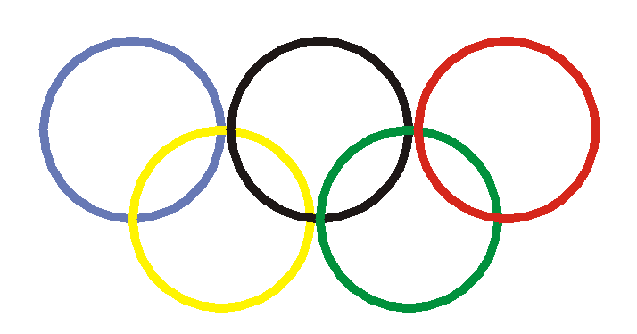
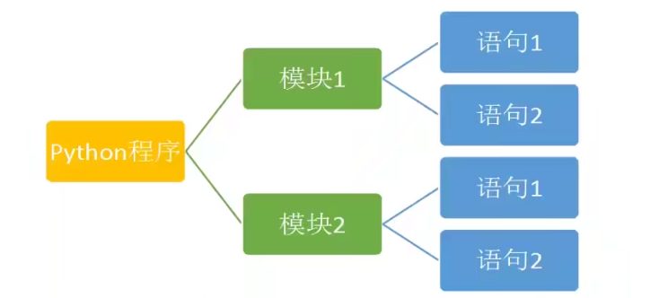
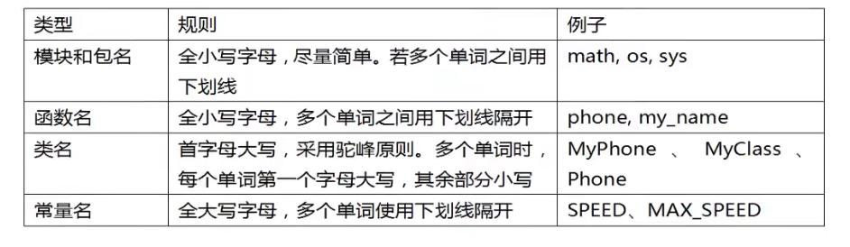

## Python 学习第一天

### 介绍

`Python`是一种解释性、面向对象的语言。

### 特点

1. 可读性强
2. 简洁

`Python` 是由 C 语言开发，但是不再有 C 语言中指针等复杂数据类型，`Python` 的间接性让开发难度和代码幅度大幅度降低，开发任务大大简化，不用关注于复杂的语法，而是关注于任务本身

```python
import turtle

t = turtle.Pen()
for x in range(360):
    t.forward(x)
    t.left(59)

```

3. 面向对象
4. 免费和开源
5. 可移植性和跨平台
   `Python` 会被编译成与操作系统相关的二进制代码，然后再解释执行。这种方式和 java 类似，实现了跨平台
6. 丰富的库
7. 可扩展性。 可嵌入 `C` 和 `C++` 语言。胶水式语言。

### 应用范围

1. 科学计算
2. 人工智能
3. Web 服务器和大型网站后端
   Youtube、gmail 等应用基于`Python`开发
4. GUI 开发（图形化用户界面开发）
5. 游戏开发
6. 移动设备
7. 嵌入式设备
8. 系统运维
9. 大数据
10. 云计算

### 第一个 Python 文件

```python
print("Hello World!!")
```

**缩进、注释：**

`#` 单行注释；
`'''` 多行注释；
` ` 4 个空格为缩进；

### 学习图像化程序设计

使用库`turlte`进行一些简单的操作：

```python
import turtle

turtle.showturtle()  # 显示箭头
turtle.write("Edmond")  ## 写字符串
turtle.forward(300)  # 前进300px
turtle.color("red")  # 颜色红色
turtle.left(90)  # 箭头向左
turtle.forward(300)
turtle.goto(0, 50)  # 去坐标（0，50）
turtle.goto(0, 0)
turtle.penup()
turtle.goto(0, 300)
turtle.pendown()
turtle.circle(100)
```

**制作奥运五环**

```python
import turtle

turtle.showturtle()
turtle.width(10)
# 第一个圆
turtle.penup()
turtle.goto(-200, 50)
turtle.pendown()
turtle.color("#6779b5")
turtle.circle(100)
# 第二个圆
turtle.penup()
turtle.goto(-100, -50)
turtle.pendown()
turtle.color("#fff402")
turtle.circle(100)
# 第三个圆
turtle.penup()
turtle.goto(10, 50)
turtle.pendown()
turtle.color("#1e1817")
turtle.circle(100)
# 第四个圆
turtle.penup()
turtle.goto(110, -50)
turtle.pendown()
turtle.color("#01913c")
turtle.circle(100)
# 第五个圆
turtle.penup()
turtle.goto(220, 50)
turtle.pendown()
turtle.color("#d6261b")
turtle.circle(100)
```



### 程序的构成

1. `Python` 程序是由模块组成的，一个木哦快对应一个 python 源文件，一般后缀名是：.py
2. 模块由语句组成。运行`Python`程序时，按照模块语句的顺序依次执行。
3. 语句是`Python`程序的构造单元，用于创建对象，变量赋值，调用函数，控制语句等。



### 对象的基本组成

`Python`中，**一切皆对象**。每个对象由：标识（identity）、类型（type）、值（value）组成。

1. 标识用于唯一标识对象，通常对应于对象在计算机内存中的地址。使用内置函数 id（obj）可返回对象 obj 的标识。
2. 类型用于标识对象的存储 “数据” 的类型。类型可以限制对象的取值范围以及可执行的操作。可以使用 type（obj） 获得对象的所属类型。
3. 值标识对象所存储的数据的信息。使用 print（obj）可以直接打印出值。

**对象的被指就是：一个内存块，拥有特定的值，支持特定类型的相关操作**

### 引用

在`Python`中，变量也成为：对象的引用。因为，变量存储的就是对象的地址。
变量通过地址引用了 “对象”

变量位于：栈内存
对象位于：堆内存

**Python 是动态类型语言**
变量不需要显式声明类型。根据变量引用的独享，`Python` 计时器自动确认数据类型

**Python 强类型语言**
每个对象都有数据类型，只支持该类熊支持的操作。

### 标识符

标识符：用于变量、函数、类、模块等的名称。规则如下：

1. 区分大小写。
2. 第一个字符必须是字母、下划线。
3. 不能使用关键字
4. 以双下划线开头和结尾的名称通常有特殊的含义，尽量避免这种写法。

遵守规则：


