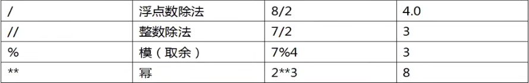

## day02 - Python 基础学习

### 变量的声明和赋值

变量的声明和赋值用于将一个变量绑定到一个对象上，格式如下：
变量名 = 表达式（字面量）

在与逆行过程中，解释器先运行右边的表达式，生成一个代表表达式运算结果的对象，然后将这个对象的地址赋值给左边的变量。

【操作】变量在使用前必须被初始化（先被赋值）

### 删除变量和垃圾回收机制

可以通过 `del` 语句删除不再使用的变量

```python
del str
print(str)
```

如果对象没有变量引用，就会被垃圾回收器回收，清空内存空间。

### 链式赋值

用于同一个对象赋值给多个变量

```python
x = y = z = 100
print(x, y, z) # 100 100 100
```

### 系列解包赋值

赋值给对应相同个数的变量（个数必须保持一致）

```python
a, b, c = 1, 2, 3
print(a, b, c)  #1, 2, 3
```

【操作】使用系列解包赋值实现变量的交换

```python
a, b = 1, 2
a, b = b, a
print(a, b) # 2, 1
```

### 常量

`Python` 不支持常量，即没有语法规则限制改变一个长俩个的值。我们只能预定常量的命名规范，以及在程序的逻辑上不对常量的值作出修改。

```python
MAX_VALUE = 100
print(MAX_VALUE)
```

### 基本的内置数据类型介绍

每一个对象都有类型，python 中基本的数据类型：

1. 整型：整数

2. 浮点型：小数

3. 布尔型：true，false

4. 字符串型：由字符组成的序列

### 数字

数字的运算：




我们也可以通过 函数：divmod() 同时得到商和余数：

```python
print(divmod(12, 5))  # (2, 2)
```
