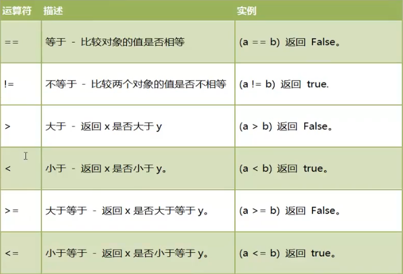

## day02 - Python 基础学习

### 变量的声明和赋值

变量的声明和赋值用于将一个变量绑定到一个对象上，格式如下：
变量名 = 表达式（字面量）

在与逆行过程中，解释器先运行右边的表达式，生成一个代表表达式运算结果的对象，然后将这个对象的地址赋值给左边的变量。

【操作】变量在使用前必须被初始化（先被赋值）

### 删除变量和垃圾回收机制

可以通过 `del` 语句删除不再使用的变量

```python
del str
print(str)
```

如果对象没有变量引用，就会被垃圾回收器回收，清空内存空间。

### 链式赋值

用于同一个对象赋值给多个变量

```python
x = y = z = 100
print(x, y, z) # 100 100 100
```

### 系列解包赋值

赋值给对应相同个数的变量（个数必须保持一致）

```python
a, b, c = 1, 2, 3
print(a, b, c)  #1, 2, 3
```

【操作】使用系列解包赋值实现变量的交换

```python
a, b = 1, 2
a, b = b, a
print(a, b) # 2, 1
```

### 常量

`Python` 不支持常量，即没有语法规则限制改变一个长俩个的值。我们只能预定常量的命名规范，以及在程序的逻辑上不对常量的值作出修改。

```python
MAX_VALUE = 100
print(MAX_VALUE)
```

### 基本的内置数据类型介绍

每一个对象都有类型，python 中基本的数据类型：

1. 整型：整数

2. 浮点型：小数

3. 布尔型：true，false

4. 字符串型：由字符组成的序列

### 数字

数字的运算：


我们也可以通过 函数：divmod() 同时得到商和余数：

```python
print(divmod(12, 5))  # (2, 2)
```

### 整数

`Python` 中，出了 10 进制，还有其他三种进制：

- 0b 或 0B，二进制：0，1
- 0o 或 0O，八进制：0，1，2，3，4，5，6，7
- 0x 或 0X，十六进制：0，1，2，3，4，5，6，7，8，9，a，b，c，d，e，f

**使用 int()实现类型转换：**

1. 浮点数直接舍去小数部分。
2. 布尔值：true=1，false=0。
3. 字符串符合整数格式（浮点数个数不行）则直接转换成对应的整数。

### 浮点数

浮点数。称为：float
弗蒂纳树用 a×b 的 10 次方 的形式的科学计数法标识。如：3.14，表示成：314E-2 或 314e-2.

**类型转换和四舍五入：**

1. 类似于 int（），我们也使用 float()将其类型自动转化为浮点数。
2. 整数和浮点数混合运算时，表达式结果自动转换成浮点数。
3. round（value）可以返回四舍五入的值。


### 时间表示

计算机中时间的表示是从 “1970 年 1 月 1 日 00：00：00” 开始，以毫秒（1/1000 s）进行计算，我们也罢 1970 年这个时刻称为 “unix 时间点”

在 Python 中可以通过 time.time() 获取当前时刻 。

### 布尔值

Python，把 true 和 false 定义成了关键字，但他们本质还是 1 和 0，甚至可以和数字相加。

**比较运算符**

所有比较运算符返回 1 时为 true，返回 0 时为 false。


