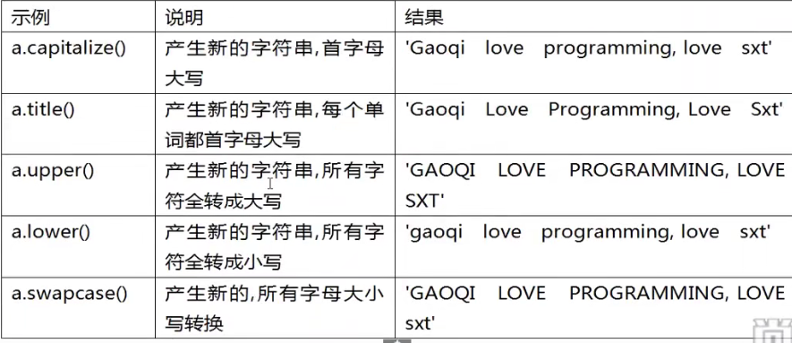
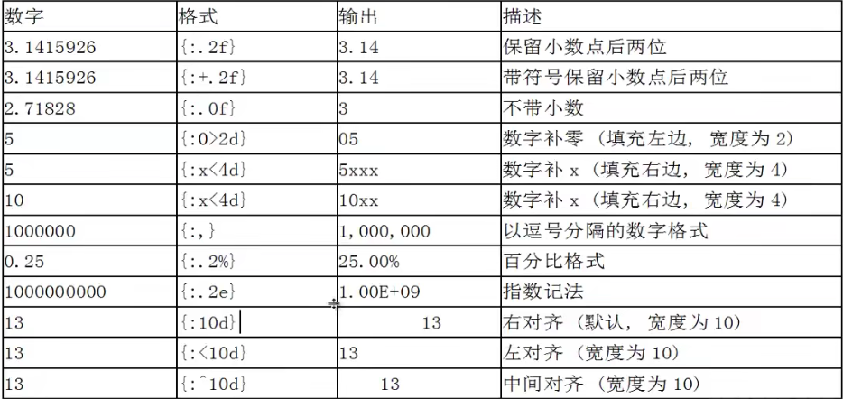

## Day03 - Python 笔记

### 字符串

**基本特点：**

字符串的本质是：字符序列。Python 的字符串是不可变的，我们无法对原字符串做任何修改。但是可以将字符串的一部分复制到新创建的字符串，达到 “看起来修改” 的效果。

Python 不支持单字符类型，单字符也是作为一个字符串使用的。

**字符串的编码：**

Python3 直接支持 Unicode，可以标识世界上任何书面语言的字符。Python3 的字符默认就是 16 位 Unicode 编码。ASCII 码是 Unicode 编码的子集。

使用内置函数 ord() 可以吧字符串转换成对应的 Unicode 码。
使用内置函数 chr() 可以吧十进制数字转换成对应的字符。

```python
print(ord("A")) # 65
print(chr(66)) # B
```

**创建字符串：**

通过单引号或双引号创建字符串。（两者都可以创建字符串）

```python
str1 = 'sease'
str1 = "sdgfsad"
```

使用三个单引号或者三个双引号创建多行字符串。

```python
str3 = ''' name="sue" age="21" gender="male" '''
print(str3) # name="sue" age="21" gender="male"
```

**空字符串和 len()函数**

Python 允许空字符串的存在，不包含任何字符且长度为 0 。

```python
str4="  "
print(len(str4))  # 2
```

len() 用于计算字符串含有多少字符：

```python
str5="asdfsdf"
print(len(str5)) # 7
```

**转义字符：**

通过使用 “\+特殊字符” ，实现某些难以用字符表示的效果。


**字符串拼接：**

通过使用多个 + 将多个字符串进行拼接

1. 如果 + 的两边都是字符串，则拼接
2. 如果 + 的两边都是数字，则进行运算
3. 如果 + 的两边类型不同，则抛出异常

也可以通过将多个字符放在一起进行拼接

```python
str6= '123''456';
print(str6)
```

**字符串复制：**

通过使用 \* 实现字符串复制

```python
str7 = "123"*3
print(str7)
```

**不换行输出：**

在使用 print 时会自动打印一个换行符。当我们不需要换行，不想要自动换行符时，使用参数 end="任意字符串"，实现末尾台南佳任何内容

```python
print("Hello",end=" ");
print("World")
# Hello World
```

**获取控制台内容：input()**

通过使用 input() 获取控制台读取键盘输入内容

```python
name=input("请输入姓名：")
print(name)
# 请输入姓名：苏澳
# 苏澳
```

**str() 转换为字符串类型**

str() 可以将其他数据类型转换为字符串。

```python
num = 123123
print(str(num))
```

**使用 [] 提取字符串**

字符串的本质就是字符序列，通过在字符串后面添加[],在[]里面指定偏移量，就可以提取该位置的打个字符。

正向搜索：最左侧第一个字符为 0，依次递增。

反向搜索：最右侧第一个字符为-1，依次递减

```python
str8 = "abcdefg"
print(str8[1]) # b
```

**使用 replace() 实现字符串替换**

通过 replace() 我们并没有在原基础上的字符串做修改，而是重新创建出了新的字符串并将该位置进行替换

```python
str9 = "1,2,3,4,5,6,7"
str10 = str9.replace("1","8")
print(str9) # 1,2,3,4,5,6,7
print(str10) # 8,2,3,4,5,6,7
```

**使用 slice() 字符串切片**

切片 slice 操作可以让我们开苏的提取子字符串。
标准格式为：
[起始偏移量 start：终止偏移量 end：步长 step]

```python
str11 = "abcdefghijklmn"
print(str11[0:1:1]) # a
print(str11[1:]) # bcdefghijklmn
print(str11[:1]) # a
```

【操作】 倒叙输出 “to be or not to be”

```python
str12 = "to be or not to be"
print(str12[::-1]) # eb ot ton ro eb ot
```

**使用 split() 切割字符串**

split() 可以基于指定分隔符将字符串分隔成多个子字符串(存储到列表中)。如果不指定分隔符，则默认使用空白字符（换行符、空格、制表符）。

返回一个数组

```python
str13 = "life is terrible"
print(str13.split()) # ['life', 'is', 'terrible']
print(str13.split("is")) # ['life ', ' terrible']
```

**使用 join() 拼接字符串**

用于将一系列的子字符串连接起来。

```python
str14 = ["123","456","789"];
print("+".join(str14)) # 123+456+789
```

要点：

- 使用字符串拼接符+，会生成新的字符串对象，因此不推荐使用 + 来拼接字符串。
- 使用 join() 函数，因为 join 函数在拼接字符串之前会计算所有字符串的长度，然后逐一拷贝
  。仅创建一次对象

```python

import time

time01 = time.time()
a = ""
for i in range(1000000):
    a+="sxt"

time02 = time.time()
print("运算时间："+str(time02-time01)) # 运算时间：0.4503052234649658

# 使用
time03 = time.time()
li = []
for i in range(1000000):
    li.append("xxx")

time04 = time.time()
print("运算时间："+str(time04-time03)) # 运算时间：0.18450689315795898

```

**字符串驻留机制**

字符串驻留：仅保存一份相同且不可变字符串的方法，不同的值被存放在字符串驻留池中。

Python 支持字符串驻留机制，对于符合标识符贵的字符串（仅包含下划线、字母和数字） 会启用字符串驻留机制。

**字符串比较**

使用 == 、 ！= 对字符串的值进行比较

使用 is、not is 对字符串的地址进行比较

使用 in、not in 判断某个字符（子字符串）是否窜在与字符串中。

**字符串方法（其他）**





**字符串的格式化**

一种格式化字符串的函数 str.format(). 它增强了字符串格式化的功能。
基本语法时通过 {}

```python
#                0           1
str15 = "姓名：{name},年龄：{age}"
str16 = str15.format(name="Sue",age=18)
print(str16) # 姓名：Sue,年龄：18
```



**可变字符串**

可使用 io.StringIO(字符串);
