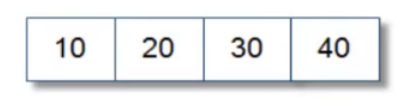
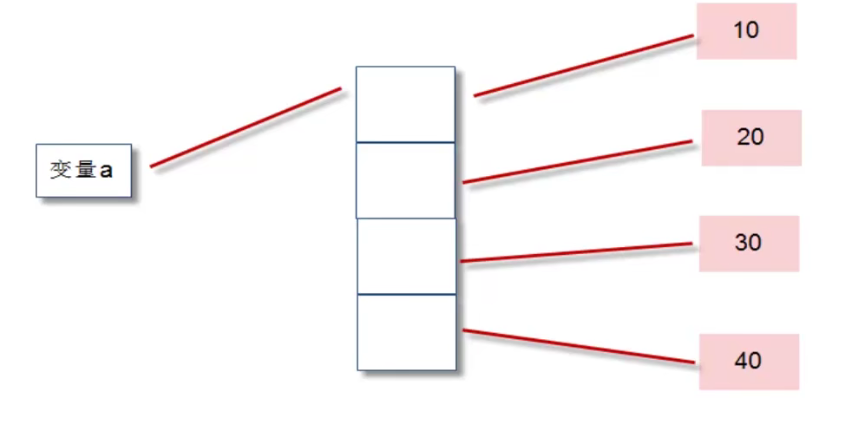

## day04 - Python 序列

一种存储方式，用来存储一系列的数据。

在内存中，粗劣就是一块用来存放多个值的连续内存空间。比如一个整数学列 [10,20,30,40] ：



存储方式：

```python
list = [10,20,30,40]
```

序列有：字符串，列表，元组，字典，集合



### 列表

用于存储任意数量、任意类型的数据集合

列表是内置可变序列，任何包含多干元素的有序连续的内存空间。列表定义的标准语法格式：

```python
list = [1，2，3，4，5，6]
```

其中 1，2，3，4，5，6 称之为，list 的元素。

并且列表的元素可以为不同类型的

**列表的常用方法**：

| **序号** | **函数**                                           | **描述**                                                               |
| -------- | -------------------------------------------------- | ---------------------------------------------------------------------- |
| **1**    | **list.append(self,p_object)**                     | **给列表后面追加新的对象**                                             |
| **2**    | **list.clear(self)**                               | **清空列表中的元素**                                                   |
| **3**    | **list.copy(self)**                                | **浅复制列表**                                                         |
| **4**    | **list.count(self,value)**                         | **统计某个元素在列表中出现的次数**                                     |
| **5**    | **list.extend(self,iterable)**                     | **在列表末尾一次性追加另一个序列中的多个值（用新列表扩展原来的列表）** |
| **6**    | **list.index(self, value, start=None, stop=None)** | **从列表中找出某个值第一个匹配项的索引位置**                           |
| **7**    | **list.insert(self,index,start=None,stop=None)**   | **将对象插入列表**                                                     |
| **8**    | **list.pop(self,index=None)**                      | **移除列表中的一个元素（默认最后一个），并返回该元素的值**             |
| **9**    | **list.remove(self,value)**                        | **移除列表中某个值的第一个匹配项，从左找到第一个指定元素**             |
| **10**   | **list.reverse(self,value)**                       | **反向列表中的元素**                                                   |
| **11**   | **list.sort(self,key=None,reverse=False)**         | **对原列表进行排序**                                                   |
| **12**   | **len(list)**                                      | **返回列表中包含元素个数**                                             |

`Python` 的列表大小可变，根据需求增加或减少

#### 列表创建

1. 字面量创建

```python
list = [1,2,3,4,5,true,false,"string"]
```

2. 使用 list( ) 创建

使用 list（） 可以将任何可迭代的数据转化为列表

```python
list = list()  # []
list = list(range(10))  # [0, 1, 2, 3, 4, 5, 6, 7, 8, 9]
list = list("full stack")  # ['f', 'u', 'l', 'l', ' ', 's', 't', 'a', 'c', 'k']
print(list)
```

3. 使用 range() 创建整数序列

range（） 可以创建出证书列表，语法格式为：range（[start],end[,step]）;

start 参数：可选，表示起始数字。默认为 0
end 参数：必选，表示结尾数字。
step 参数：可选，表示步长，默认为 1

`Python` 中 range() 返回的是一个 range 对象，而不是列表。我们通过 list()
方法将其转换为列表对象。

```python
num1 = list(range(3, 15, 2))
num2 = list(range(15, 20, 2))
num3 = list(range(15, 3, -2))
num4 = list(range(20, 15, -1))
print(num1)  # [3, 5, 7, 9, 11, 13]
print(num2)  # [15, 17, 19]
print(num3)  # [15, 13, 11, 9, 7, 5]
print(num4)  # [20, 19, 18, 17, 16]
```

4. 推导式生成列表

通过使用 for 循环和 if 语句进行创建所需的列表

```python
a1 = [x * 2 for x in range(5)]
a2 = [x * 2 for x in range(100) if x % 9 == 0]
print(a1)  # [0, 2, 4, 6, 8]
print(a2)  # [0, 18, 36, 54, 72, 90, 108, 126, 144, 162, 180, 198]
```

#### 列表添加

1. append() 方法
   原地修改列表对象，是真正的列表尾部添加新元素，速度快。

```python
add1 = [1, 2, 3]
add1.append(4)
print(add1) # [1, 2, 3, 4]
```

2. +号运算符
   并不是真正的尾部添加，而是创建新的列表对象；将原列表的元素和 i 性能列表的有还俗一次复制到新的列表中。
   这样会设计大量的复制操作，对于擦欧总大量元素时不建议。

```python
add2 = [1, 2, 3, 4]
add2 = add2 + [5]  # [1, 2, 3, 4, 5]
print(add2)
```

注：add2 的变量产生了新的地址

3. extend() 方法
   安静目标列表的所有元素添加到本列表的尾部，处于原地操作，不创建新的列表对象。

```python
add3 = [5, 6, 7]
add3.extend([1, 2, 3])  # [5, 6, 7, 1, 2, 3]
print(add3)
```

4. insert() 插入元素
   可以将指定元素插入到列表对象的任意指定位置。这样会让插入位置后面的所有元素进行移动，会影响速度。

语法: insert（索引，要插入的值）

```python
add4 = [1, 2, 3, 4]
add4.insert(2, 100)
print(add4)  # [1, 2, 100, 3, 4]
```

5. 乘法扩展
   会生成一个新的列表，新列表元素是原列表元素的多次重复

```python
add5 = ["ss", 6]
add6 = add5 * 3
print(add6)  # ['ss', 6, 'ss', 6, 'ss', 6]
```

#### 列表删除

1. del[索引] 删除
   删除列表指定位置的元素

```python
del1 = [10, 20, 30, 40, 50]
del del1[1]
print(del1)  # [10, 30, 40, 50]
```

注：当删除中间的元素时，删除的当前元素后面所有元素都会往前进一个内存位置

2. pop(索引) 方法
   pop()删除并返回指定位置元素，如果未指定位置则默认操作列表最后一个元素

```python
del2 = [10, 20, 30, 40, 50, 60]
a = del2.pop()
print(del2, a)  # [10, 20, 30, 40, 50]  60
b = del2.pop(0)
print(del2, b)  # [20, 30, 40, 50]  10
```

3. remove(值) 方法
   删除首次出现的指定元素，若不存在该元素则抛出异常

```python
del3 = [1, 2, 3, 4, 5, 6, 7, 8, 9, 0]
del3.remove(0)
print(del3)  # [1, 2, 3, 4, 5, 6, 7, 8, 9]
print(del3.remove(100))  # 报错
```

#### 列表访问

1. 通过索引直接访问
   通过索引直接访问元素。元素的区间在[0,列表长度-1]的范围。超过则抛出异常，返回当前访问值

```python
visit1 = [1, 2, 3, 4, 5, 6, 7, 8, 9, 0]
print(visit1[0])  # 1
```

2. index() 获取指定元素在列表首次出现的索引
   通过 index() 可以获取指定元素首次出现的索引位置。
   语法： index(value,[start,[end]])。
   返回索引值。

```python
visit2 = ["sss", "a", "b", "c"]
print(visit2.index("sss"))  # 0
print(visit2.index("b", 2))  # 2
```

#### 元素出现次数

1. count() 获取指定元素在列表中出现的次数
   返回指定元素在列表中出现的次数

```python
total1 = [1, 1, 2, 23, 43, 5, 6576, 65, 5, 5, 7, 98, 9]
print(total1.count(1))  # 2
```

2. len() 返回列表长度
   返回指定列表中包含的元素个数

```python
total1 = [1, 1, 2, 23, 43, 5, 6576, 65, 5, 5, 7, 98, 9]
print(len(total1))
```

3. 成员资格判断
   判断列表中是否存在指定的元素，通过 in 关键字及逆行判断。
   直接返回 True 和 False

```python
total1 = [11, 2, 2, 3, 44, 55, 66, 77, 88]
print(20 in total1)  # False
print(44 in total1)  # True
```

#### 列表切片

切片 通过 slice 操作可以快速的提取子列表或修改
语法格式：[起始偏移量 start：种植偏移量 end：[步长 step]]

操作说明：

```python
# 提取整个列表
s = [10, 20, 30, 40, 50, 60, 70]
print(s[:])  # [10, 20, 30, 40, 50, 60, 70]

# [start:] 从 start 索引开始到结尾
print(s[1:])  # [20, 30, 40, 50, 60, 70]

# [:end] 从头开始直到 end-1
print(s[:4])  # [10, 20, 30, 40]

# [start:end] 从 start 到 end-1
print(s[0:5])  # [10, 20, 30, 40, 50]

# [start:end:step] 从 start 提取到 end-1，步长为step
print(s[1:6:2])  # [20, 40, 60]
```

操作（量为负数）时：

```python
y = [10, 20, 30, 40, 50, 60, 70]

# 倒数三位数
print(y[-3:])  # [50, 60, 70]

# 倒数第五到倒数第三
print(y[-5:-3])  # [30, 40]

# 步长为负，从右到左依次提取
print(y[::-1])  # [70, 60, 50, 40, 30, 20, 10]
```

#### 列表排序

**不通过创建新的列表进行排序的方法：**

1. sort() 排序
   默认是为升序排列，通过 sort(reverse=True)进行降序排列

```python
lie = [100, 20, 32, 543, 32, 1, 0]
# 升序
lie.sort()
print(lie)  # [0, 1, 20, 32, 32, 100, 543]
# 降序
lie.sort(reverse=True)
print(lie)  # [543, 100, 32, 32, 20, 1, 0]
```

2. 随机排序
   通过导入随机数 random ,在使用 shuffle(列表) 即可

```python
import random

lie = [100, 20, 32, 543, 32, 1, 0]
# 每次执行结果都是随机的
random.shuffle(lie)
print(lie)  # [0, 543, 100, 20, 32, 1, 32]
```

**通过创建新的列表进行排序的方法：**

1. sorted() 排序
   返回一个新的列表，不对原列表及逆行修改。默认升序同 sort

```python
lie2 = [100, 23, 432, 54, 213, 76, 0, 4, 66, 76]
# 升序
lie3 = sorted(lie2)
print(lie3)  # [0, 4, 23, 54, 66, 76, 76, 100, 213, 432]
# 降序
lie3 = sorted(lie2, reverse=True)
print(lie3)  # [432, 213, 100, 76, 76, 66, 54, 23, 4, 0]
```

2. reversed() 返回迭代器
   此函数支持逆序排列，与列表对象 reverse() 不同，其不对原列表进行任何修改，只是返回一个逆序排列的迭代器对象

```python
lie4 = [20, 10, 30, 50, 40]
lie5 = reversed(lie4)
print(lie5)  # <list_reverseiterator object at 0x00000184C1E20508>
# 通过lise进行转换
print(list(lie5))  # [40, 50, 30, 10, 20]
# 第二次即为空
print(list(lie5))  # []
```

迭代器是一种对象，它能够用来遍历标准模板库容器中的部分或全部元素，每个迭代器对象代表容器中的确定的地址。迭代器修改了常规指针的接口，所谓迭代器是一种概念上的抽象：那些行为上像迭代器的东西都可以叫做迭代器。然而迭代器有很多不同的能力，它可以把抽象容器和通用算法有机的统一起来。

#### 列表其他内置函数汇总

1. max 与 min
   返回列表中的最大值和最小值

```python
lie6 = [10, 40, 90, 30, 44, 70]
print(max(lie6))  # 90
print(min(lie6))  # 10
```

2. sum
   对数值列表的所有元素进行求和操作，对非数值列表运算则会报错

```python
lie7 = [1, 6, 2, 4, 9, 4, 4, 87]
print(sum(lie7))  # 117
```

#### 多维列表
