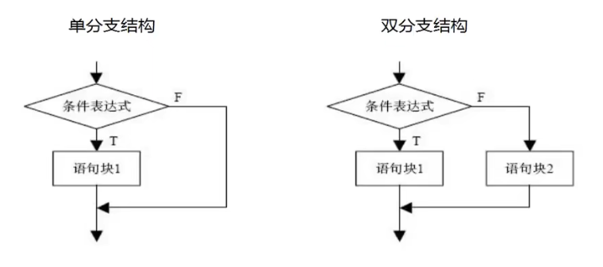
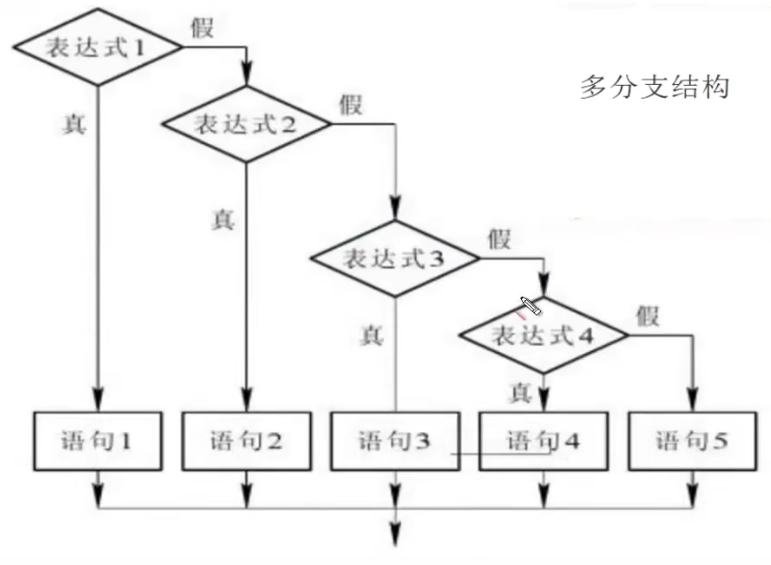
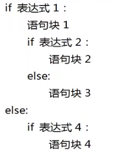
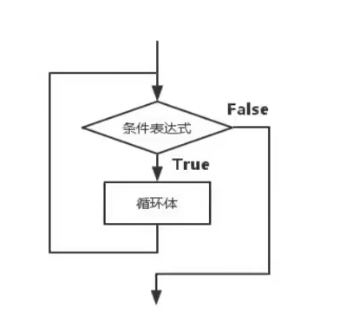

## day04 - 控制语句

### 选择结构（01.judge.py）

选择结构通过判断条件是否成立，来决定执行哪个分支。选择结构又多种形式，分为：单分支、双分支、多分支。

#### 单分支选择结构

if 语句单分支结构语法：
  if 条件表达式：
    语句/语句块

其中：
1. 条件表达式：可以逻辑表达式、关系表达式、算术表达式等。
2. 语句/语句块：可以是一条语句，也可以是多条，但是必须缩进一致。

~~~python
num = input("请输入数字：")  
if int(num) <= 10:
    print(num) 
~~~

#### 条件表达式详解

在选择和循环结构中，条件表达式的值为 False 的情况下：
  False、0、0.0、空置None、空序列对象（空列表、空元组、空集合、空字典、空字符串）、空 range 对象、 空迭代对象

其他情况均为 True. 

Python 所有合法表达式都可以看作条件表达式，甚至不哦阔函数调用的表达式。

**条件表达式中，不能又赋值操作 “=”**

#### 双分支选择结构

双分支结构的语法：

~~~
if 条件表达式：
    语句 1 / 语句块 1
else：
    语句 2 / 语句块 2
~~~

【操作练习】通过input输入数字如果大于10则返回数字，小于则返回一段文字
~~~python
num = input("请输入数字：")  
if int(num) <= 10:
    print("数字太小了") 
else:
    print(num)
~~~

#### 三元条件运算符

三元运算符语法格式：

~~~python
条件为 True 时的值  if  （条件表达式） else 条件为假时的值
~~~

【操作】通过input输入数字如果大于10则返回数字，小于则返回一段文字

~~~python
print("数字小于10" if int(num) <= 10 else "数字大于10")
~~~

#### 多分支选择结构

语法：

~~~
if 条件表达式 1：
    语句 1 / 语句块 1
elif 条件表达式 2：
    语句 2 / 语句块 2
...
[else:
    语句 n+1 / 语句块 n+1]
~~~

多分支结构，几个分支之间是有逻辑关系的，不能随意颠倒顺序

~~~python
score = int(input("请输入分数："))
grade = ""
if score < 60:
    grade="不及格"
elif score <70:
    grade="及格"
elif score < 80:
    grade="良"
elif score < 90:
    grade="优秀"
else:
    grade="完美"

print("分数是{0}，等级是{1}".format(score,grade))
~~~

每个分支都使用了独立的、完整的额判断，顺序可以随意挪动，而不影响程序运行。

#### 选择结构的嵌套

选择结构可以嵌套，使用时一定要注意控制好不同级别代码开的缩进量，因为缩进量据欸的那个了代码的从属关系。

### 循环结构（02,circulation.py）

循环结构用来重复执行一条或多条语句。表达这样的逻辑：如果符合条件，则反复执行循环体里的语句。在每次执行完后都会判断一次条件是否为 True，如果为 True 则重复执行循环体中的语句。Ex：

循环体里面的语句至少应该包含改变条件表达式的语句，以使循环趋于结束；否则就会成为一个死循环

#### while 循环

语法格式：

~~~
while 条件表达式：
  循环体语句
~~~

【操作】：循环输出 0 - 10

~~~python
num = 0
while num<10:
    num+=1
    print(num)
~~~

【操作】：求 1-100 的总和、奇数和、偶数和

~~~python
num = 0
sum_all = 0 # 总和
sum_even = 0 # 偶数和
sum_odd = 0 # 奇数和
while num <=100:
    sum_all+=num
    if(num % 2 ==0):
        sum_even+=num
    else:
        sum_odd+=num
    num+=1

print("总数是：{0}，偶数和是：{1}，奇数和是：{2}".format(sum_all, sum_even, sum_odd))
~~~

#### for 循环

for 循环通常用于迭代对象的遍历。语法格式：

~~~
for  变量  in  可迭代对象：
    循环体语句
~~~

【操作】遍历一个元组、列表

~~~python
for x in (1,2,3,4,5,6,7):
    print(x,end="\t")
~~~

**可迭代对象：**

1. 序列。包括：字符串、列表、元组
2. 字典
3. 迭代器对象（iterator）
4. 生成器函数（generator）
5. 文件对象

**range 对象：**

range 对象是一个迭代器对象，用来产生指定范围的数字序列。格式：

`range(start,end,[step])`

生成的数字序列从 start 开始到 end 结束（不包括 end）。 若没有填写 start 则默认从 0 开始。 step 是可选的步长，默认为 1 。

ex：

~~~
for x in range(10):  # 0 ~ 9
for x in range(3,10):  # 3 ~ 9
for x in range(3,10,2):  # 3,5,7,9
~~~

#### 嵌套循环

【操作】九九乘法表

~~~python
for x in range(1,10): # 遍历列
    sum = ""
    for y in range(1,x+1): # 遍历行
        sum+=str.format("{0}*{1}={2}\t",x,y,x*y)
    print(sum)
~~~

#### break 语句

break 可以用 while 循环和 for 循环，用来结束整个循环。当又嵌套循环时，break只能跳出最近一层的循环。

~~~python
while True:
    a = input("请输入Q或q")
    if(a.upper()=="Q"):
        print("结束")
        break
    else:
        print(a)
~~~

#### continue 语句

用于结束本次循环，继续下一次。多个循环嵌套时，continue 也用于最近的一层循环

【操作】求员工的薪资和、平均值

~~~python
empNum = 0
salarySum = 0
salarys = []

while True:
    s = input("请输入员工的薪资：（输入Q、q）")
    if(s.upper()=="Q"):
        print("ok")
        break
    if(float(s)<0):
        continue
    empNum+=1
    salarys.append[float(s)]
    salarySum += float(s)

print("员工数{0}".format(empNum))
print("录入薪资：",salarys)
print("平均薪资{0}".format(salarySum/empNum))
~~~

#### else 语句

while、for 循环可以附带一个 else 语句（可选）。如果 for、while 语句没有被 break 语句结束，则会执行 else 语句，否则不执行。
语法：

~~~
while 条件表达式：
    循环体
else：
    语句块

for 变量 in 可迭代对象：
    循环体
else：
    语句块
~~~

#### 循环优化技巧

1. 尽量减少循环内部不必要的计算
2. 嵌套循环中，尽量减少内层循环的计算，尽可能向外提
3. 局部变量查询较快，尽量使用局部变量
4. 联系多个字符串，使用 join() 而不使用 +
5. 列表元素插入和删除，尽量在列表尾部操作

#### 使用 zip() 并行迭代

通过使用 zip() 函数对多个序列及逆行并行迭代，zip() 函数在最短序列 “用完” 时就会停止。

【操作】测试 zip() 并行迭代

~~~python
names = ("Jason","Eason","Forrest","Sue")
ages = (20,22,23,21)

for names,ages in zip(names,ages):
    print("{0}--{1}".format(names,ages))

# Jason--20
# Eason--22
# Forrest--23
# Sue--21
~~~

### 推导式
#### 推导式创建序列

推导式是从一个或者多个迭代器快速创建序列的一种方法。它可以将循环和条件判断结合，从而避免冗余的代码。推导式时典型的 Python 风格。

**列表推导式：**

语法格式：

~~~
[表达式 for item in 可迭代对象]
或
{表达式 for item in 可迭代对象 if 条件判断}
~~~

案例：

~~~python
print([x for x in range(0, 10)])  # [0, 1, 2, 3, 4, 5, 6, 7, 8, 9]
print([x * 2 for x in range(0, 10)])  # [0, 2, 4, 6, 8, 10, 12, 14, 16, 18]
print([x * 2 for x in range(0, 10) if x % 5 == 0])  # [0, 10]
print([x for x in "abcde"])  # ['a', 'b', 'c', 'd', 'e']
cell = [(row,col) for row in range(1,10)for col in range(1,10)]
print(cell)
~~~
#### 字典推导式

格式如下：

~~~
{key_expression : value_expression for 表达式 in 可迭代对象}
~~~

其也可以i俺家 if 条件判断、多个循环等

~~~python
content = "I love JYC before I give up"
count = {c:content.count(c) for c in content}
print(count)
~~~

正常写法：
 
~~~python
total = {}
for x in content:
    total[x]=content.count(x)

print(total)
~~~

#### 集合推导式

和列表推导式类似：

~~~
{表达式 for item in 可迭代对象}
或
{表达式 for item in 可迭代对象 if 条件判断}
~~~

~~~python
text = {x for x in range(1,100) if x % 8 == 0}
print(text)  # {32, 64, 96, 8, 40, 72, 16, 48, 80, 24, 56, 88}
~~~

#### 生成器推导式（生成元组）

因为最后我们所获得的是一个 “生成器对象”。显然，元组并没有推导式

一个生成器只能运行一次。第一次迭代可以获得数据，第二次迭代发现数据就已经没了。（所控制的是指针，当所需表达式走完后，指针也跟着走完了）

~~~python
gnt = (x for x in range(1,100) if x % 9 == 0)
print(tuple(gnt))  # (9, 18, 27, 36, 45, 54, 63, 72, 81, 90, 99)
print(tuple(gnt))  # ()
~~~