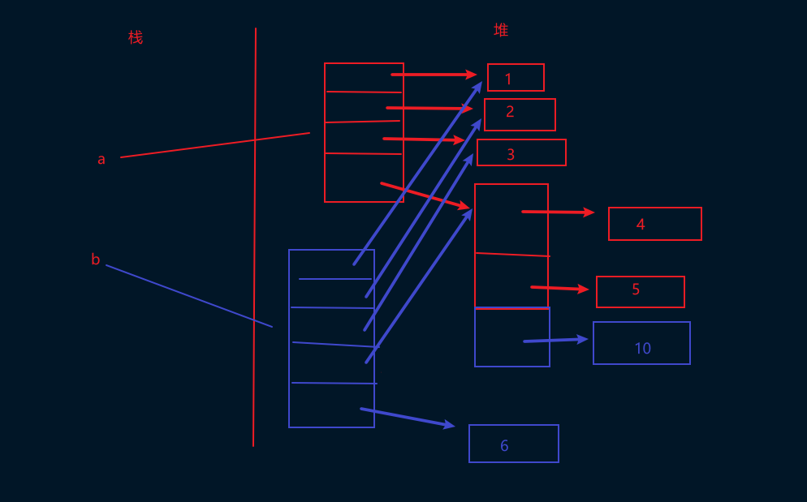
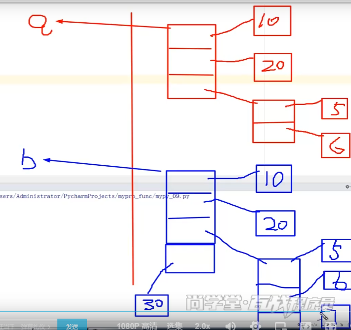

## day 06 - 函数

函数是可重用的程序代码块。函数的作用，不仅仅可以实现代码的复用，更能实现代码的一致性。一致性指的是，只要修改函数的代码，则所有调用的该函数的地方都能体验。

编写函数只是对某种功能代码的封装，并增加了函数调用、传递参数、返回计算结果等内容

### 函数 - 简介 

1. 一个程序又一个个任务组曾；函数就是代表一个任务或者功能
2. 函数是代码服用的通用机制。

### 函数分类

1. 内置函数：使用的str()、list()、len()等都属于内置函数
2. 标准库函数：通过 import 语句导入的库
3. 第三方库函数：Python 社区提供的库，通过 import 导入并使用
4. 用户自定义函数：自己定义的函数，并只适用于自身需求所开发的函数

### 函数的定义和调用

语法格式：

~~~
def 函数名 ([参数列表]):
    '''文档字符串'''
    函数体、若干语句
~~~

要点：
1. 通过使用 def 来定义函数，然后就是一个空格和函数名
   1. Python 执行 def 时，会创建一个函数对象，并绑定到函数名变量上
2. 参数列表
   1. （）时形式参数列表。用多个参数则使用 ， 隔开
   2. 形式参数不需要声明类型，也不许哟啊指定函数返回值类型
   3. 无参数，也不许保留括号
   4. 实参列表必须与形参列表一一对应
3. return 返回值
   1. 如果函数体中包含 return 语句，则结束函数执行并返回值
   2. 如果函数体不包含 return 语句， 则返回 None 值
4. 调用函数之前，必须要先定义函数，既先调用 def 常见函数对象
   1. 内置函数对象会自动常见
   2. 标准库和第三方库函数，通过 import 导入模块时，会执行模块中的def语句

~~~python
def addNum():
  print("函数测试")
addNum()
~~~

#### 形参 & 实参

形参：代表的数据并不是真是的实际的参数、者、数据等，相当于一种变量
实参：输入的实际参数，将其赋给形参，形参在通过函数体中的语句进行一些列的操作

【操作】比较数字大小

~~~python
def compMax(a,b):
    if(a<b):
        print(b,"--b--打")
    else:
        print(a,"--a--打")

compMax(1, 21)  #2 1 --b--打
compMax(19, 8)  # 19 --a--打
~~~

#### 文档字符串（函数的注释）

通过使用 三个单引号或者三个双引号来实现。中间加入多行文字进行说明

【操作】测试

~~~python
def test():
  """测试注释"""
  print("Hello Function")
test()
~~~

可以使用 help() 函数输出函数中的文档字符串

~~~python
help(test)

# Help on function test in module __main__:
# test()

help(test.__doc__)

# No Python documentation found for '测试注释'.
# Use help() to get the interactive help utility.
# Use help(str) for help on the str class.
~~~

#### 函数返回值

return 返回值要点：

  1. 如果函数体中包含 return 语句，则结束函数执行并返回
  2. 如果函数体中不包含 return 语句，则返回 None
  3. 要返回多个返回值，使用列表、元组、字典、集合等存储起来

【操作】返回两数之和

~~~python
def fnAdd(a,b):
    return a+b

c = fnAdd(1,5)
print(c)  # 6
~~~

#### 函数也是对象

实际上，执行 def 所定义的函数后，系统就创建了相应的函数对象。

~~~python
def fnAdd(a,b):
    return a+b

print(fnAdd)  # <function fnAdd at 0x0000022B30DCD8B8>
print(id(fnAdd))  # 2115667351736
~~~

在执行 def 时，系统中会创建函数对象，并通过 fnAdd 这个变量进行引用

### 变量的作用域（全局变量和局部变量）

变量起作用的范围称之为变量的作用域，不同作用域内同名的变量之间互不影响。变量分为：全局变量、局部变量

**全局变量：**

1. 在函数和类定义之外声明的变量。作用域为定义的模块，从定义的位置直到模块
2. 全局变量降低了函数的通用性和可读性。应尽力避免全局变量的使用。
3. 全局变量一般做常数使用
4. 函数内要改变全局变量的值，使用 global 声名

**局部变量：**

1. 在函数体（包含形式参数）声明的变量
2. 局部变量的引用比全局变量快，优先
3. 如果局部变量和全局变量同同名，则在函数内隐藏全局变量，只是用同名的局部变量

【操作】作用域测试

~~~python
a = 100 # 全局变量
def f1():
    global a # 使用全局变量
    print(a)
    a = 300 # 修改了全局变量

f1()
print(a)
~~~

【操作】全局变量和局部变量同名

~~~python
a = 100
def f1():
    a = 200
    print(a) # 200

f1()
print(a) # 100
~~~

**使用 global() 输出全局变量**

【操作】全局变量和局部变量的效率差异

~~~python
import math
import time

def test01():
    start = time.time()
    for i in range(1000000):
        math.sqrt(30)
    end = time.time()
    print("耗时：{0}".format((end-start)))

def test02():
    b = math.sqrt
    start = time.time()
    for i in range(1000000):
        b(30)
    end = time.time()
    print("耗时：{0}".format((end-start)))

test01()  # 耗时：0.1767582893371582
test02()  # 耗时：0.14059734344482422
~~~

### 函数的传参

函数的参数传递本质上就是：从实参到形参的赋值操作。

所有的赋值操作都是 “引用的赋值” 。所以，Python 中参数的传递都是 “引用传递” ，不是 “值传递” 。

1. 对 “可变对象” 进行 “写操作”，直接作用于元年本对象的本身。
2. 对 “不可变对象” 进行 “写操作”，或产生一个新的 “对象空间” ，并用新的值填充这块空间（起到作用的语言的“值传递”效果，但不是“值传递”）

> 可变对象：字典、列表、集合、自定义的对象等
> 不可变对象：数字、字符串、元组、function

#### 传递可变对象的引用

传递参数时可变对象（Ex：列表、字自定义的其他可变对象），实际传递的还是对象的引用。在函数体中并不创建新的对象拷贝，二十可以直接修改所传递的对象。

【操作】参数传递：传递可变对象的引用

~~~python
a = [1,2,3,4,5]

def fn01(b): # b、m是同一个对象
    print(id(b)) # 2423060581192
    a.append(6) # 由于a为可变的对象，不创建对象拷贝可以直接进行修改
    print(id(b)) # 2423060581192

fn01(a)
print(id(a)) # 2423060581192
print(a) # [1, 2, 3, 4, 5, 6]
~~~

#### 传递不可变对象的引用

传递参数是不可变对象（Ex：int、float、字符串、元组、布尔值），实际传递的还是对象的引用。在“赋值操作”时，由于不可变对象无法修改，系统会新创建一个对象。

在调用时参数所处的地址永远是相同的，但是在进行赋值操作时就会改变其地址。

【操作】参数传递：不可变对象的引用

~~~python
a = 100
def fn01(b):
    print("b:", id(b))  # b: 140732072099168
    b += 100
    print("b:", id(b))  # b: 140732072102368
    print(b)  # 200

fn01(a)
print("a:", id(a))  # a: 140732072099168
~~~

显然，通过 id 值我们可以看到 b 和 a 已开始是同一个对象。给 b 赋值后，b 是新的对象。

#### 浅拷贝和深拷贝

内置函数为：copy() 浅拷贝、deepcopy() 深拷贝

浅拷贝：不拷贝子对象的内容，只拷贝子对象的引用。
深拷贝：会连子对象的内存也全部拷贝一份，对子对象的修改不会影响源对象。

【操作】浅拷贝

~~~python
import copy

a = [1,2,3,[4,5]]
b = copy.copy(a)
print("a:", id(a))  # a: 2261211812168
print("b:", id(b))  # b: 2261211769160
print("---------------")
b.append(6)
b[3].append(10)
print(a)  # [1, 2, 3, [4, 5, 10]]
print(b)  # [1, 2, 3, [4, 5, 10], 6]

~~~

【操作】深拷贝

~~~python
def deepCopy():
    a = [1, 2, 3, [4, 5]]
    b = copy.deepcopy(a)
    print("a:", id(a))  # a: 2261211812168
    print("b:", id(b))  # b: 2261211769160
    print("---------------")
    b.append(6)
    b[3].append(10)
    print(a)  # [1, 2, 3, [4, 5]]
    print(b)  # [1, 2, 3, [4, 5, 10], 6]

deepCopy()
~~~

#### 不可变对象含可变子对象

可以进行修改，并且地址不变

#### 参数的类型

