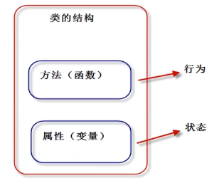
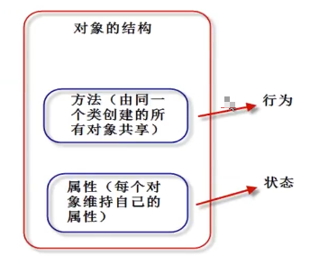
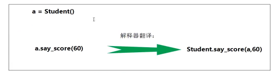
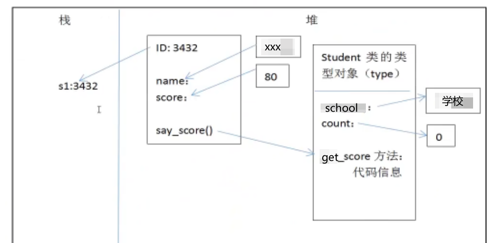

## 面向对象编程

面向对象（Object oriented Programming，OOP）编程的思想主要是针对大型软件设计而来的。面向对象编程使程序的扩展性更强、可读性更好。

面向对象编程将数据和操作数据相关的方法封装到对象中，组织代码和数据的方式更加接近人的思维，大大提高了效率。

Python 采用了面共享对象的思想，完全支持面向对象的基本功能，例如：继承、堕胎、封装等

Python 支持了面向过程、面向对象、函数式编程等

### 面向对象和面向过程的区别

**面向过程（Procedure Oriented）思维：**

面向过程编程更加注重 “程序的逻辑流程”，是一种`执行者`思维，适合编写小规模的程序。

面向过程思想，思考问题时，首先思考 “怎么按步骤实现？”，并一步一步完成。
Ex：如何开车？
 发动车 -- 挂挡 -- 踩油门
面向过程适合简单、不需要协作的事务。

**面向对象（Object Oriented）思维：**

面向对现象更加关注的是 “软件中对象之间的关系” ，以一种 “设计者” 思维，适合编写大规模程序。

面向对象（Object）思想更契合人的思维模式。

总结：

- 都是接问题的思维方式，代码组织的方式
- 解决简单问题可以使用面向过程
- 解决复杂问题：宏观上使用面向对象把握，微观上处理任然是面向过程

### 类的定义

通过类帝国一数据类型的属性（数据）和方法（行为），也就是说，“类将行为和状态打包在一起”。

对象是类的具体实体，一般称为 “类的实例”。 
类看作 “饼干摸具” ，对象就是根据这个摸具制造出来的物品

从一个类创建对象时，每个对象会共享这个类的行为（类中定义的方法），但会有自己的属性值（不共享状态）。具体是：“方法代码是共享的，属性数据不共享”。

Python 中，一切皆对象。类也成为类对象，类的实例也称为“实例对象”

语法格式：

~~~
class 类名：
  类体
~~~

注意事项：

1. 类名必须符合“标识符规则”；一般首字母大写，多个单词使用“驼峰原则”
2. 类体中我们可以定义属性和方法
3. 属性用来描述数据，方法（既函数）用来描述这些数据相关的操作。

【操作】测试

~~~python
class Student:
    # 属性定义到构造方法中（固定写法）: __init__
    def __init__(self,name,score):
        self.name = name
        self.score = score

    def say_score(self):
        print(id(self))  # 2008779276616
        print(self.name,"分数是：",self.score)
s1 = Student("张三",93)
print(id(s1))  # 2008779276616
s1.say_score()
~~~

**类是抽象的模板**

#### 构造函数 `__init__`

类是抽象的，也称之为 “对象的模板” 。我们需要通过类这个模板，创建类的实例对象，然后参能使用类定义的功能。

Python 对象的三个部分：

- Id（identity）识别码
- type（对象类型）
- value（对象的值）

进一步的说法：

1. Id（identity）识别码
2. type（对象类型）
3. value（对象的值）
   1. 属性（attribute）
   2. 方法（method）

创建对象，我们需要定义构造函数 `__init__`() 方法。构造方法用于执行“实例对象的初始化工作”，既对象创建后，初始化当前对象的相关属性，无返回值。

`__init__()` 要点：

1. 名称固定，必须为`__init__()`
2. 第一个参数固定，必须为：self，self指的就是当前创建好的实例对象
3. 构造函数通常用来初始化对象的实例属性
4. 通过 “类名（参数列表）” 用来调用构造函数。调用后，将窗机安好的对象返回给相应的变量
5. `__init__()` 方法：初始化创建好的对象，初始化指的是：给实例属性赋值
6. `__new__()` 方法：用于创建对象，但是一般无序重定义该方法。

注意：

- Python 中的 self 相当于 C++ 中的 self 指针，Java 和 C# 中的this关键字(指当前对象的作用域)。Python 中 self 必须为构造参数的第一个参数，名字可以任意修改，但是一般遵守管理，都叫做 self。

#### 实例属性

实例属性是从属于实例对象的属性，也成为 “实例变量” 。要点：

1. 实例属性一般在 `__init__(self)` 方法中通过一下代码定义
    - slef.实例属性名 = 初始值
2. 在本类的其他实例方法中，也可以通过 self 进行访问：
    - self.实例属性名
3. 创建实例对象后，通过实例对象访问：
    - obj01 = 类名（xx,xxx,xxx） # 实例化对象，调用`__init__()`初始化属性
    - obj01.实例属性名 = 值 # 可以给已有属性赋值，也可以新加

#### 实例方法

实例方法是从属于实例对象的方法。定义格式如下“

~~~
def 方法名（self [,形参列表]）：
    函数体
~~~

方法调用格式如下：

~~~
对象.方法名（[实参列表]）
~~~

注意点：

- 定义实例方法时，第一个参数必须为 self。self 指当前的实例对象
- 调用实例方法是，不需要也不能给 self 传值，self 由解释器自动传参

**函数和方法的区别：**

1. 都是用来完成一个功能的语句块，本质一样。
2. 方法调用时，通过对象来调用。方法从属于特定实例对象，普通函数没有这个特点。
3. 直观上，方法定义时需要传递self，函数不需要

**实例对象的方法调用本质：**

**其他操作：**

1. dir(obj) 可以获取对象的所有属性、方法
2. obj.\_\_dict\_\_ 对象的属性自建
3. pass 空语句
4. isinstance（对象，类型）判断 “对象” 是不是之定类型

#### 类对象

定义类的格式中“class 类名：”实际上当解释器执行 class 语句时，就会创建一个类对象。

【操作】测试

~~~python
class Person:
    pass

print(type(Person))  # <class 'type'> 类型
print(id(Person))  # 1599475085048

stu01 = Person()
# s1 = stu01
print(stu01)  # <__main__.Person object at 0x000002B454EC9E08>
~~~

pass 相当于占位符

#### 类属性

类属性是从属于“类对象”的属性，也成为“类变量”。
由于类属性从属于类对象，可以被所有实例对象使用。

定义方法：

~~~
class 类名：
    类名变量 = 初始值
~~~

在类中或者类外，通过：类名.类名变量 使用。

【操作】测试

~~~python
class Person:

    # 类属性
    school = "中加枫华国际学校"
    tuition = 100000
    count = 0

    # 实例属性
    def __init__(self,name,age,gender):
        self.name = name
        self.age = age
        self.gender = gender
        Person.count = Person.count+1

    # 实例方法
    def get_score(self):
        print("姓名：{0}；年龄：{1}；性别：{2}".format(self.name,self.age,self.gender))

stu1 = Person("sue",22,"male")
stu2 = Person("Jason",22,"male")
stu3 = Person("Allen",22,"female")
stu1.get_score()
stu2.get_score()
stu3.get_score()
print("学校：{0}；学费：{1}".format(Person.school,Person.tuition))
print("创建了{0}次实例".format(Person.count))
~~~

#### 类方法

类方法是从属于“类对象”的方法。类方法通过装饰器`@classmethod`来定义的，格式：

~~~
@classmethod
def 类方法名（cls[,形参列表]）：
    函数体
~~~

注意点：

- `@classmethod` 必须位于方法上面
- 第一个 cls 必须有： cls 指的是 “类对象” 本身
- 调用类方法格式：“类名.类方法名（参数列表）”。参数列表中不与要也不能 cls 传值。
- 类方法中访问实例属性和实例方法会导致错误
- 子类继承父类方法时，传入 cls 是子类对象，而非父类对象

【操作】测试：

~~~python
class Person:

    # 类属性
    school = "中加枫华国际学校"
    tuition = 100000
    count = 0

    # 实例属性
    def __init__(self,name,age,gender):
        self.name = name
        self.age = age
        self.gender = gender
        Person.count = Person.count+1

    @classmethod
    def printSchool(cls):
        print(cls)
        print(cls.school)

    # 实例方法
    def get_score(self):
        print("姓名：{0}；年龄：{1}；性别：{2}".format(self.name,self.age,self.gender))

stu1 = Person("sue", 22, "male")
stu1.get_score()
Person.printSchool()
~~~

**类方法操作类属性，实例方法操作实例属性**

#### 静态方法

Python 中允许定义与 “类对象” 无关的方法，称为“静态方法”

静态方法和模块中定义普通函数没有区别，只不过“静态方法”放到了“类的名字空间中”，需要通过“类调用”

静态方法通过装饰器`@staticmethod`来定义，格式如下：

~~~
@staticmethod
def 静态方法名([形参列表])：
    函数体
~~~

注意点：

1. `@staticmethod` 必须写在方法上面
2. 调用格式：“类名.静态方法名(参数列表)”
3. 静态方法中访问实例属性和实例方法会导致错误

【操作】测试

~~~python
class Person:

    # 类属性
    school = "中加枫华国际学校"
    tuition = 100000
    count = 0

    # 实例属性
    def __init__(self,name,age):
        self.name = name
        self.age = age
        Person.count = Person.count+1

    # 静态实例
    @staticmethod
    def addNum(a,b):
      print("{0}+{1}={2}".format(a,b,a+b))
      return a+b

    # 实例方法
    def get_score(self):
        print("姓名：{0}；年龄：{1}".format(self.name,self.age))

stu1 = Person("sue", 22)
stu1.get_score()
Person.addNum(1,2)
~~~

#### `__del__` 方法（分析函数）和垃圾回收机制

`__del__` 方法称为：“析构方法”，用于实现对象被销毁时所需的操作。Ex：释放对象占用的资源，打开的文件资源、网络连接等。

Python 实现自动的垃圾回收，当对象没有被引用时（引用计数为0），由垃圾回收器调用 `__del__` 方法。

通过使用 del 语句删除对象，从而保证调用 `__del__` 方法
系统会自动提供 `__del__` 方法，一般不需要自定义析构方法

【操作】测试

~~~python
class Person:

    def __del__(self):
        print("销毁对象：{0}".format(self))

p1 = Person()  # 5. 销毁对象：<__main__.Person object at 0x000001DFCD279FC8>
print(id(p1))  # 1. 2060731260872
p2 = Person()  # 3. 销毁对象：<__main__.Person object at 0x000001DFCD284088>
print(id(p2))  # 2. 2060731302024
del p2
print("over")  # 4. over
# print(id(p2))  # name 'p2' is not defined
~~~

#### `__call__` 方法和可调用对象

定义了 `__call__` 方法的对象，称为“可调用的对象”，即该对象可以像函数一样被调用。

该方法的功能类似于在类中重载 () 运算符，使得类实例对象可以像调用普通函数那样，以“对象名()”的形式使用。

【操作】测试

~~~python
class Get_Salary:

    def __call__(self, salary):
        yearSalary = salary*12
        daySalary = salary//22.5
        hourSalary = daySalary//12

        return dict(年薪=yearSalary,月薪=salary,日薪=daySalary,小时工=hourSalary)
p1 = Get_Salary()
print(p1(8000)) # 无需在添加类名来用使用
~~~

